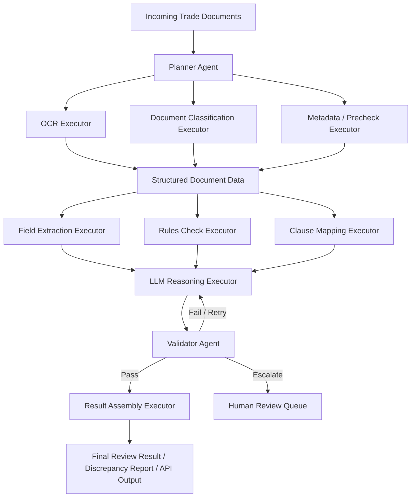

# ✅ 核心結論

👉 **不是只找瓶頸，而是要做兩件事：**

- 1️⃣ 找出 12 分鐘的「真正瓶頸在哪裡」
- 2️⃣ 把能並行的全部並行化（尤其是非 LLM 部分）

---

🔥 更精準的說法（專業版）

你現在的問題本質是：

> **LLM 並發受限（5 threads） → 必須用「降低單筆耗時 + 提高並行度」來提升吞吐**

---

## 🧠 一、先拆解 12 分鐘（這一步最關鍵）

你現在看到的是：

```text
1 transaction = 12 分鐘
```

👉 這是**黑盒指標**，沒有價值

你要變成：

```text
1 transaction =
  OCR            2 min
  Parsing        1 min
  Rule Engine    1 min
  LLM call       6 min   ← 🔥 通常在這
  Post-process   1 min
  DB/IO          1 min
```

---

### 🎯 你要找的是： 👉 **哪一段是“不可並行 + 最耗時”的**

通常會是：

- LLM 推理（最大機率）
- 或某些同步 I/O / DB lock

---

## 🚀 二、並行優化（真正提升吞吐的關鍵）

### ❌ 現在（大多數系統）

```text
Step1 → Step2 → Step3 → Step4 → Step5
（全部串行）
```

---

### ✅ 目標（你應該做到）

```text
        ┌─ OCR ─┐
Input ──┼─ Parse ┼──→ LLM → Result
        └─ Rule ─┘
```

👉 非 LLM 步驟全部並行

---

### 🔥 三、最重要的優化原則（你這個場景）

#### 原則 1️⃣：LLM 只能做「必要的事」

👉 不要讓 LLM 做：

- 格式轉換
- 固定規則判斷
- 簡單欄位抽取

👉 這些全部前移（Rule Engine / Code）

---

### 原則 2️⃣：減少 LLM 次數（比優化 prompt 更重要）

```text
❌ 3 次 LLM call × 2 分鐘 = 6 分鐘
✅ 1 次 LLM call × 3 分鐘 = 3 分鐘
```

👉 直接砍一半時間

---

## 原則 3️⃣：把 LLM 從「整單」變「分塊」

如果現在是：

```text
整份文件 → 1 次 LLM（6 分鐘）
```

可以改成：

```text
頁面1 → LLM（2 分鐘）
頁面2 → LLM（2 分鐘）
頁面3 → LLM（2 分鐘）
（並行）
```

👉 雖然總 token 一樣，但**時間下降**

⚠️ 前提：你的 LLM 允許並行請求（這裡受 5 threads 限制，要設計）

---

## ⚠️ 四、關鍵現實（你現在的限制）

👉 你有一個硬限制：

```text
LLM max concurrency = 5
```

所以：

### ❗你不能無限並行 LLM

👉 但你可以：

### ✅ 讓 LLM「永遠滿載 5 threads」

---

## 🎯 五、最佳策略（你這個場景）

### 1️⃣ 非 LLM 全並行（一定要做）

- OCR → parallel
- parsing → parallel
- rule check → parallel

---

### 2️⃣ LLM 做「最少 + 最快」

- 合併 prompt
- 減少上下文
- 只做關鍵判斷

---

### 3️⃣ 建立「LLM 任務隊列 + semaphore」

```text
Queue → [5 slots LLM] → Done
```

👉 永遠保持：

```text
LLM utilization ≈ 100%
```

---

### 4️⃣ 用 pipeline 提升吞吐（很重要）

不是：

```text
一筆做完才下一筆
```

而是：

```text
T1: OCR
T2: LLM
T3: Post

多筆同時流動（pipeline）
```

---

## 📊 六、優化前後對比（你可以用來報告）

### Before

- 12 分鐘 / 單
- 串行流程
- LLM 多次調用
- 非 LLM 阻塞

## After（目標）

- 6~8 分鐘 / 單（甚至更低）
- 非 LLM 並行
- LLM 次數減少
- pipeline execution

👉 吞吐提升 1.5x～2x（很常見）

---

## 🧠 七、給你一句最關鍵的判斷標準

👉 你每一個步驟都問：

> **「這一步一定要等前一步完成嗎？」**

如果答案是：

❌ 不需要 → **改成並行**

---

## ✅ 最終結論

✔ 對，你說的是正確方向
但完整應該是：

> **找出瓶頸 + 消除不必要的串行 + 把非 LLM 全部並行 + 減少 LLM 次數**

---

## *Architecture*


