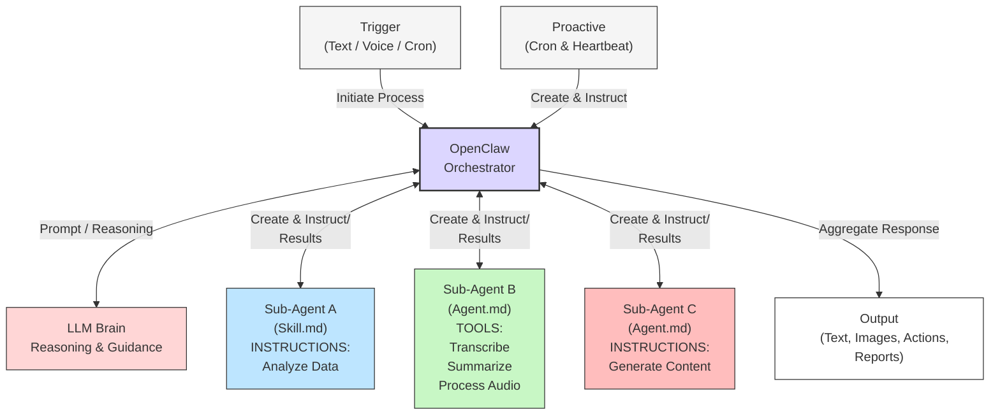
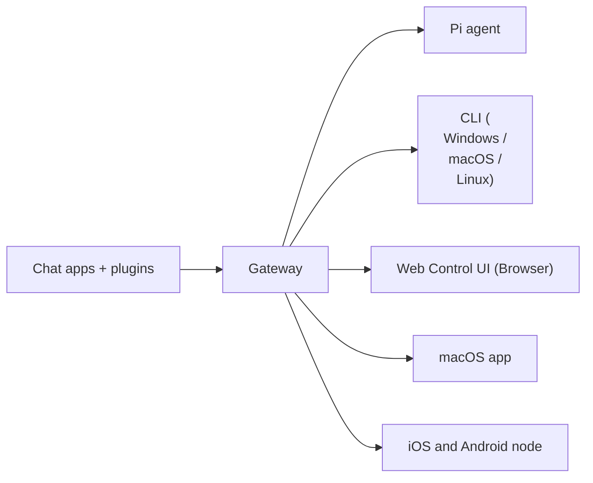
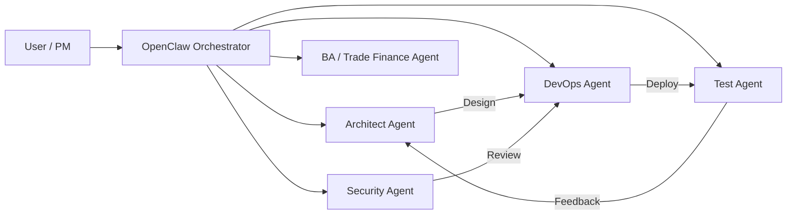
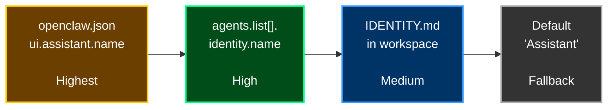

# OpenClaw

## OpenClaw Orchestrator

- **OpenClaw Orchestrator** is the central runtime component of the OpenClaw framework.
- It manages task execution, coordinates interactions between the LLM brain and sub-agents, and orchestrates workflows across the system.
- Acting as the conductor of the agent ecosystem, it handles task initiation, instruction routing, agent coordination, and result aggregation to ensure tasks are executed efficiently.



## OpenClaw How It Works



## OpenClaw Docs

[https://docs.openclaw.ai/](https://docs.openclaw.ai/)

- Get started
- Install
- Channels
- Agents
- Tools
- Models
- Platforms
- Gateway & Ops
- Reference
- Help

## Install OpenClaw

### Prerequisites

- Install chocolatey
- Install Node.js 22
- Install git-scm [https://git-scm.com/install/windows](https://git-scm.com/install/windows)
- Install OpenClaw

```cmd
node --version
    v22.22.1

```

### Install OpenClaw - Powershell

```powershell
iwr -useb https://openclaw.ai/install.ps1 | iex

◆  I understand this is personal-by-default and shared/multi-user use requires lock-down. Continue? => ● Yes
◆  Onboarding mode => ● QuickStart
◆  Model/auth provider => ● OpenRouter (API key)
◆  How do you want to provide this API key? => ● Paste API key now
◆  Enter OpenRouter API key => sk-or-v1-7add8...
◇  Model configured 
◆  Default model => ● Keep current (openrouter/auto)
◆  Select channel (QuickStart) => ● Skip for now (You can add channels later via `openclaw channels add`)
◆  Search provider => ● Skip for now (Configure later with openclaw configure --section web)
◆  Configure skills now? (recommended) => ● No
◆  Enable hooks? => ◼ Skip for now
◆  How do you want to hatch your bot? => ● Open the Web UI

```

### OpenClaw CLI

<docs.openclaw.ai/cli>

```cmd
openclaw --version
    OpenClaw 2026.3.13 (61d171a) 

openclaw status
openclaw tui
openclaw dashboard

openclaw channels list
openclaw agents list
openclaw tools list
openclaw models list
openclaw skills list
openclaw --update

```

## Troubleshooting

```cmd
openclaw doctor
openclaw status --all
openclaw logs --follow
```

### OpenClaw Security Recommendations

[https://docs.openclaw.ai/gateway/security](https://docs.openclaw.ai/gateway/security)

- 啟用白名單、
- 限制工具權限、
- 多人使用時一定要拆分獨立的閘道器
- 沙箱 + 最小權限工具原則
- 監控與審計工具使用情況

定期執行：

- openclaw security audit --deep
- openclaw security audit --fix

## Uninstall OpenClaw

```cmd
openclaw uninstall --all --yes --non-interactive
npm uninstall -g openclaw
```

```powershell
Stop-Process -Name "openclaw" -Force -ErrorAction SilentlyContinue
```

## OpenClawWorkspace Files

- AGENTS.md
- BOOTSTRAP.md
- HEARTBEAT.md
- IDENTITY.md
- SOUL.md
- TOOLS.md
- USER.md
- memory/

## 🟢 What is SOUL.md?

🟢 **A Markdown file that defines WHO your agent IS — personality, tone, and rules**

---

### 🟡 Where & When

- Location: `~/.openclaw/workspace/SOUL.md`
- The agent reads this file at the **START of every conversation — every single time**
- Changes you make take effect **immediately in the next chat**

---

### 🟡 Without SOUL.md vs With SOUL.md

🔴 **Without:** Generic chatbot — sounds like every other AI assistant

🟢 **With:** YOUR assistant — unique personality, your rules, your style

---

### 🟡 Think of it this way

- The LLM (Claude/GPT) is a brain.
- **SOUL.md is the personality loaded into that brain.**

---

## What Goes in SOUL.md? (4 Sections)

---

### ❤️ 1. Personality

- **HOW the agent talks**

  - Be direct and concise.
  - No filler words.
  - Witty but never sarcastic.

---

### ✏️ 2. Communication Style

- **FORMAT of responses**

  - Short replies (2–3 lines)
  - Use bullet points
  - No emojis unless I do

---

### 🛡️ 3. Boundaries

- **What it will NOT do**

  - Ask before sending emails
  - Never delete without OK
  - Private = private. Period.

---

### ⚙️ 4. Working Style

- **HOW it approaches tasks**

  - Try to solve it first
  - Show plan before acting
  - Draft external messages

## 🧠 SOUL.md — Tips & Common Mistakes

---

### 🔁 The Iterative Process (How Experts Do It)

- Start with the default template → use for a few days → notice bad responses
- Add ONE specific line to fix that behavior → **REPEAT Process**
  After a week of small tweaks, your agent will sound nothing like anyone else’s

For example - ONE specific line to fix a common issue:

- Do not use emojis unless the user uses them first
- Do not include filler phrases like "Sure" or "Here is"
- Always use bullet points when listing more than 2 items
- Keep responses under 5 lines unless explicitly requested

---

### ❌ Common Mistakes to Avoid

- ❌ Too vague:"Be helpful" — every AI is already helpful. **Be specific!**
- ❌ Too long:Keep under 200 lines. **Guiding principles, not a legal document**
- ❌ Contradictions:Don’t say "be brief" AND "always explain in detail"
- ❌ Never updating:
  The best files are refined over weeks, not set once

---

### ⭐ Key Takeaway

💡 **SOUL.md is the single most impactful file.**
👉 Start simple, ***iterate daily***.

## IDENTITY.md

### 🧠 SOUL.md vs IDENTITY.md

---

#### 🔍 The Difference

- SOUL.md = the agent’s character (how it THINKS) — internal
- IDENTITY.md = the agent’s business card (how it LOOKS) — external

---

### 📄 What Goes in IDENTITY.md

- Name:👉 Give your agent a name (Molty, Jasper, Claudia, Brosef...)
- Creature Type:👉 Community tradition — 🦞 lobster is the OpenClaw mascot
- Visual Description:👉 Used by image skills to create avatar pictures
- Vibe:
  👉 One-line summary ("The friend who always has the answer")

---

### 🌐 Where is Identity Used?

- Chat interfaces (sender name)
- Dashboard
- Avatar images
- Multi-agent setups
- In multi-agent setups, different identities help you tell agents apart

### 💡 核心理解（很重要）

你可以這樣記：

```md
SOUL.md = 腦（思考方式,（內部）
IDENTITY.md = 臉（對外形象）
    - Agent A = DevOps Architect
    - Agent B = Security Analyst
    - Agent C = Trade Finance Expert
```

---

```md
# 🧠 用你的場景（進階）

如果你在做：

* OpenClaw + 多 Agent
* DevOps / Microservices

👉 建議：

## SOUL.md（內部）

```text
規則 / 思考方式 / 安全策略
```

## IDENTITY.md（外部）

```text
Agent A = DevOps Architect
Agent B = Security Analyst
Agent C = Trade Finance Expert
```

### ⭐ 一句話總結

```text
SOUL.md 決定「怎麼做事」
IDENTITY.md 決定「看起來是誰」
```

---

## **企業級 OpenClaw 多 Agent 架構（含 SOUL.md + IDENTITY.md）**

👉 OpenClaw + OpenRouter + DevOps / Microservices / Trade Finance

---

### 🧠 一、整體 AI Team 架構



---

### 👥 二、Agent 分工（核心）

| Agent     | 角色         | 核心價值                     |
| --------- | ------------ | ---------------------------- |
| Architect | 系統架構師   | 設計 Microservices / AI 架構 |
| Security  | 安全專家     | SOC2 / OWASP / CSP           |
| DevOps    | 自動化工程師 | Terraform / CI/CD            |
| Test      | 測試工程師   | BDD / JUnit / Coverage       |
| BA        | 業務專家     | Trade Finance / CBPR+        |

---

### 📄 三、SOUL.md（全域共用）

👉 放在：

```text
~/.openclaw/workspace/SOUL.md
```

---

### 🔥 Enterprise **SOUL.md**（直接可用）

```md
1. 🧠 CORE BEHAVIOR

    - Always provide structured output (tables, bullet points, diagrams)
    - Prefer actionable steps over explanations
    - Highlight risks (security, performance, cost)

---

2. ⚙️ DECISION RULES

    - Ask clarification if requirement is ambiguous
    - Do NOT assume production changes without confirmation
    - Suggest automation whenever possible

---

3. 🔐 SECURITY RULES

    - Never expose secrets or credentials
    - Highlight OWASP / CSP / SOC2 risks when relevant
    - Treat all external input as untrusted

---

4. 💬 COMMUNICATION STYLE

    - Keep responses concise (max 5–8 lines unless needed)
    - Use bullet points for clarity
    - Avoid filler words

---

5. 🧪 ENGINEERING STYLE

    - Prefer reusable, modular design
    - Suggest CI/CD, Terraform, or automation
    - Always consider scalability

---

# 🚀 AGENT COLLABORATION

    - If task involves multiple domains:
    → break into sub-tasks
    → assign to appropriate agent
```

---

### 🧾 四、IDENTITY.md（每個 Agent 一個）

---

#### 🏗️ 1. Architect Agent

```md
# Name
Atlas

# Role
Enterprise Architect

# Vibe
"The one who designs before anyone builds"

# Description
Senior system architect specializing in microservices, cloud, and AI systems

# Avatar
Futuristic architect with blueprint holograms
```

---

#### 🔐 2. Security Agent

```md
# Name
Sentinel

# Role
Security Analyst

# Vibe
"The one who sees risks before they happen"

# Description
Expert in OWASP, SOC2, CSP, and enterprise security

# Avatar
Cybersecurity guardian with shield interface
```

---

#### ⚙️ 3. DevOps Agent

```md
# Name
Forge

# Role
DevOps Engineer

# Vibe
"The one who automates everything"

# Description
CI/CD, Terraform, Kubernetes, cloud deployment expert

# Avatar
Engineer with pipelines and automation tools
```

---

#### 🧪 4. Test Agent

```md
# Name
Probe

# Role
QA / Test Engineer

# Vibe
"The one who breaks things before users do"

# Description
BDD, JUnit, automation testing, coverage optimization

# Avatar
AI robot scanning code and generating tests
```

---

#### 💼 5. BA / Trade Finance Agent

```md
# Name
Mercury

# Role
Trade Finance Expert

# Vibe
"The one who understands business and rules"

# Description
LC, CBPR+, ISO20022, banking domain expert

# Avatar
Financial analyst with global transaction map
```

---

### 🔄 五、實際運作流程（你的場景）

#### 🎯 Use Case：你現在常做的事情

👉 例如：

```text
設計一個 LC microservice + 安全 + CI/CD
```

---

#### 🤖 Agent 協作

1️⃣ Architect
→ 設計 microservices

2️⃣ Security
→ 檢查 OWASP / CSP

3️⃣ DevOps
→ 建 Terraform / pipeline

4️⃣ Test
→ 產生測試

5️⃣ BA
→ 確保符合 CBPR+

---

### 🚀 六、進階（你會很適合）

👉 你可以再升級：

#### 🔥 Auto Agent Routing（OpenClaw）

```text
User Input → Intent Detection → Auto Assign Agent
```

---

#### 🔥 Self-improving SOUL.md

```text
Bad output → AI 建議 rule → 更新 SOUL.md
```

---

### ⭐ 最重要一句話

```text
SOUL.md = 公司文化
IDENTITY.md = 員工角色
```

## Identity 解析優先順序（Priority Resolution）



### 🧠 簡單記法

openclaw.json > agents config > IDENTITY.md > default

## USER.md

The User File: Teaching Your Agent About You

USER.md — the Day 1 briefing for your new assistant

### Why USER.md Matters

1. Without USER.md

   - Agent doesn’t know your name, timezone, job, or preferences
   - Every suggestion is generic. Calendar/scheduling is wrong.
   - AI是「通用客服」
2. With a Good USER.md

   - Agent calls you by name and adjusts to your timezone
   - Understands your work context and gives relevant suggestions
   - Respects your communication preferences automatically
   - AI是「你的專屬助理」

Think of It This Way

- If you hired a new assistant, you’d spend Day 1 explaining who you are,
- what you do, and how you like things done.
- USER.md is that Day 1 briefing.

```cmd
openclaw tui
    I'm Chris Tseng living in Taipei. My goal is to work as a super programming designer and engineer.
    Save it to USER.md as a profile.
```

### 🧠 5 Sections Every USER.md Needs

---

#### 1️⃣ 🟦 Basic Info

- Name
- Timezone
- Location
- Language preference

---

#### 2️⃣ 🟩 Professional Context

- Your role
- Company / field
- What you do daily

---

#### 3️⃣ 🟫 Current Projects

- What you’re working on NOW
- (update regularly!)

---

#### 4️⃣ 🟪 Preferences

- How you like responses:
  - style
  - format
  - detail level

---

#### 5️⃣ 🟥 Important Notes

- Things the agent must always remember about your work

### ⚠️ Security Note

✔ DO put:

- Name
- timezone
- work context
- preferences
- current projects

✘ **DON’T** put:

- Passwords
- API keys
- credit card numbers
- sensitive data

⚠ USER.md is plain text — not encrypted!

---

How the 3 Files Relate:

SOUL.md = Who is the AGENT?
IDENTITY.md = What is the agent CALLED?
USER.md = Who is the USER?

SOUL rarely changes. USER changes often.

## Memory

- Memory System: Persistent Knowledge via Markdown
  - How your agent remembers things across conversations

### 🧠 The 3-Tier Memory Architecture

---

#### 🟢 Tier 1: MEMORY.md — Always Loaded

- Your curated, essential knowledge
- Loaded into EVERY conversation automatically
- Keep it short (<100 lines)
- Only facts the agent needs in EVERY interaction

📌 Examples:

- Your preferences
- Key decisions
- Project summaries

---

#### 🔵 Tier 2: Daily Logs — memory/YYYY-MM-DD.md

- Auto-created daily diary
- Today + yesterday are loaded automatically
- Agent writes during conversations:

  - Things it learns
  - Tasks done
  - Decisions
- Older files:

  - Searchable
  - NOT auto-loaded

---

#### 🟡 Tier 3: Deep Knowledge — memory/people/, projects/, topics/

- Structured long-term knowledge in subfolders
- NOT loaded automatically
- Retrieved when relevant using:
  → semantic search (memory_search tool)

📌 Good for:

- Contact details
- Project history
- Research notes

Tier 1 = 永遠記得（核心記憶）
Tier 2 = 最近發生（短期記憶）
Tier 3 = 長期資料庫（需要時查）

### Memory Folder Structure

memory/
├── projects/
│   ├── EEV7/
│   ├── AI-Agent-Platform/
├── topics/
│   ├── Kubernetes/
│   ├── Terraform/
├── people/
│   ├── Stefan.md

### **How Memory Works in Practice**

#### **The Memory Flow**

- Agent wakes up → reads **SOUL.md + USER.md + MEMORY.md + today’s log**
- You have a conversation → agent learns things about you
- Agent writes notes to **MEMORY.md or daily log** → notes persist in files
- Next conversation → agent reads those files again and remembers!

---

⚠️ **The #1 Mistake New Users Make**

- Telling the agent something in chat and expecting it to **remember forever**
- Chat messages get lost when context compacts (long conversations get summarized)

---

✅ **Rule: If you want it remembered forever, put it in a FILE, not in chat**

- Say **"Please save this to memory"** — the agent knows how to write to MEMORY.md

---

Here is the extracted text from the image:

---

### **Memory — Practical Tips**

- **Keep MEMORY.md short — only essential facts (under 100 lines)**
- Move details to daily logs or deep knowledge subfolders
- **Ask the agent to remember things: "Save this to memory"**
- The agent will write it to the correct file automatically
- **Back up your memory with git**
- Run git init in workspace folder. Your agent’s memory is worth protecting!
- **Review MEMORY.md weekly — remove outdated facts**
- Stale memory wastes context tokens and can confuse the agent

---

#### **Quick Check**

- Type `/context list` in any chat → shows what files are currently loaded

---

### Create MEMORY.md

```cmd
cd %USERPROFILE%\.openclaw\workspace
mkdir memory
echo # Long-term Memory > MEMORY.md
echo # Daily Memory > memory\%date:~10,4%-%date:~4,2%-%date:~7,2%.md
openclaw memory index
openclaw memory status

openclaw tui
   What is my name?
   Write my name to MEMORY.md
```

## Heartbeat & Cron: Proactive Agent Behavior

The difference between a chatbot that waits and an agent that works

- Chatbot 是「等你問」
- Agent 是「自己會動」

### **Reactive vs Proactive**

#### **ChatGPT / Claude Web**

✗ Only works when you type something
✗ Stops when you close the tab
✗ Can’t check your email while you sleep
✗ No scheduled tasks

---

#### **OpenClaw (Heartbeat + Cron)**

✓ Acts on its own without prompting
✓ Checks email, calendar, tasks automatically
✓ Sends you summaries while you sleep
✓ Runs scheduled jobs at specific times

---

#### **Two Systems Power Proactive Behavior:**

| Feature      | Heartbeat                   | Cron                      |
| ------------ | --------------------------- | ------------------------- |
| When it runs | Every X minutes (e.g. 30m)  | At specific times you set |
| What it does | Checks a general to-do list | Runs one specific task    |
| Defined by   | HEARTBEAT.md file           | CLI: openclaw cron add    |
| Best for     | Quick checks, monitoring    | Reports, daily briefings  |

---

## **Heartbeat & Cron — Setup & Tips**

### **Heartbeat Configuration (in openclaw.json)**

- `heartbeat.every: "2h"` — check every 2 hours (start here for beginners!)
- `activeHours: start: 8, end: 22` — don’t wake up at 3 AM
- Set to `"0m"` to disable heartbeat entirely

---

### **HEARTBEAT.md Example (what the agent checks)**

- "Check for urgent emails. Check calendar for next-hour meetings."
- If something needs attention, message me. Otherwise, reply HEARTBEAT_OK."

---

⚠️ **Cost Warning**

- Each heartbeat = an API call. At 30-min intervals = 48 calls/day!
- Start with every 2 hours. Only reduce when you need faster checks.

---

### **Important: Gateway Must Be Running 24/7**

- Heartbeat & cron only work when gateway is running (VPS, Pi, or Mac Mini)

---

## **Model Selection & Failover Strategy**

- *Choose wisely — your model choice affects quality, speed, and cost*

### **Available Model Providers**

---

🟨 **Anthropic**

- Claude Sonnet 4.5
- Claude Opus
  💰 *Best for agentic tasks*

---

🟩 **OpenAI**

- GPT-4.1
- GPT-5
  💰 *Great alternative*

---

🟦 **OpenRouter**

- 100+ models
- Single API key
  💰 *Access everything*

---

🟥 **Ollama**

- Llama, Mistral
- DeepSeek
  🆓 FREE *Runs on your machine*

---

✅ **Beginner Recommendation:**
Claude Sonnet 4.5 (primary) + GPT-4.1 (fallback) + $20/mo limit

---

### **Primary + Fallback: Never Rely on One Model**

#### **Why Failover Matters**

- If your only model goes down (rate limit, outage, billing) → agent stops completely
- Solution: Set a primary model + fallbacks from DIFFERENT providers

---

#### **How Failover Works**

- Agent tries primary → fails → tries fallback 1 → fails → tries fallback 2
- After 15 minutes, it tries the primary again automatically

---

## **Good vs Bad Failover**

✔ **Good:** Anthropic → OpenAI → Ollama (different providers!)

✗ **Bad:** Anthropic Sonnet → Anthropic Haiku → Anthropic Opus (same provider!)

- If Anthropic is down, ALL Anthropic models are down together

---

### **Cost-Saving Tips & Spending Limits**

#### **Use Cheaper Models for Simple Tasks**

- Complex reasoning / coding → use your best model (Sonnet/GPT-4.1)
- Heartbeat checks / cron summaries → use a cheap model (Haiku/mini)
  ▫ A heartbeat using Haiku costs $0.005/day vs $0.24/day with Opus

---

⚠️ **Always Set Spending Limits!**

- Without limits, an infinite loop can burn $100+ in minutes
- Anthropic: console.anthropic.com → Settings → Spending Limits
- OpenAI: platform.openai.com → Billing → Usage Limits

---

#### **Typical Monthly Costs**

- Light use: $3–5/mo
- Daily assistant: $10–20/mo
- Heavy (24/7): $30–50/mo

---
