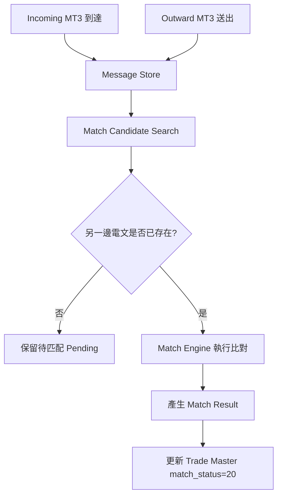
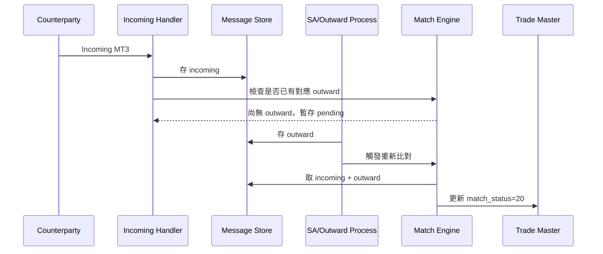
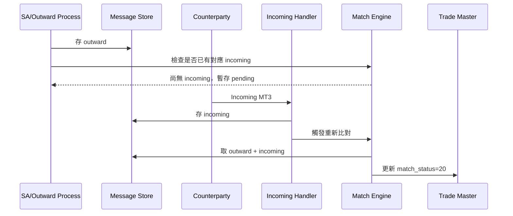
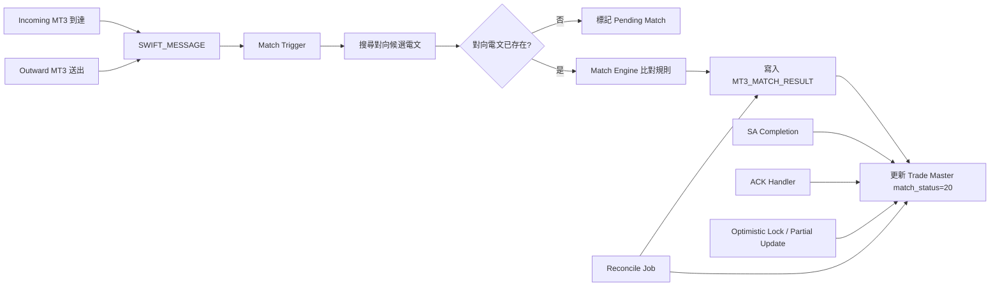

# MT3 Match Engine 的正確架構理解

## 一、兩種真實場景

**Match Engine 不能假設固定先後順序**，而必須支援兩種情況：

### 場景 1：先收到 Incoming，再送 Outward

```text
Incoming SWIFT 先到
→ 系統先收下 incoming message
→ 之後銀行才送 outward SWIFT
→ Match Engine 發現兩邊已齊
→ 進行 match
```

這種情況常見於：

* 對手行先發 confirmation
* 本行交易正在內部審核 / SA 放行中
* 本行稍後才正式送出 outward

---

### 場景 2：先送 Outward，再收到 Incoming

```text
Outward SWIFT 先送出
→ 系統先有 outward message
→ 之後收到對手 incoming SWIFT
→ Match Engine 發現兩邊已齊
→ 進行 match
```

這是更常見的標準情境：

* 本行先送出 confirmation
* 對手回送對應 confirmation
* 系統完成比對

---

## 二、這代表什麼

這代表 **MT3 match 是「雙向等待、誰先到都可以」的非同步配對模型**。

也就是：

> Match Engine 的本質，不是「收到 incoming 就立刻比對」
> 也不是「送出 outward 才能比對」
> 而是
> **只要 incoming / outward 任一方先到，就先暫存；待另一方到齊後再觸發 match。**

---

## 三、正確的架構理解

應該改成這樣：



---

## 四、兩種時序圖

### 1. Incoming 先到，Outward 後到



---

### 2. Outward 先送，Incoming 後到



---

## 五、所以你們的系統設計重點要改成

不是：

```text
Incoming 驅動 Match
```

也不是：

```text
Outward 驅動 Match
```

而是：

```text
Incoming / Outward 任一事件到達
→ 都要觸發候選查找
→ 若另一邊已存在則比對
→ 否則先保留 Pending
```

---

## 六、資料模型應該長什麼樣

至少要有三層：

### 1. Message Store

存原始電文

#### `SWIFT_MESSAGE`

| 欄位           | 說明                      |
| ------------ | ----------------------- |
| MSG_ID       | 電文ID                    |
| DIRECTION    | IN / OUT                |
| MSG_TYPE     | MT300 / MT320 / MT330   |
| TRADE_REF    | 比對參考欄位                  |
| COUNTERPARTY | 對手行                     |
| AMOUNT       | 金額                      |
| CCY          | 幣別                      |
| VALUE_DATE   | 起息 / 交割日                |
| STATUS       | PENDING_MATCH / MATCHED |

---

### 2. Match Result

存比對結果

#### `MT3_MATCH_RESULT`

| 欄位           | 說明                             |
| ------------ | ------------------------------ |
| MATCH_ID     | 比對ID                           |
| IN_MSG_ID    | Incoming message               |
| OUT_MSG_ID   | Outward message                |
| MATCH_STATUS | MATCHED / UNMATCHED / POSSIBLE |
| MATCH_TIME   | 比對時間                           |
| MATCH_RULE   | 用哪一組規則配對成功                     |

---

### 3. Trade Master

只存顯示性狀態

#### `TRADE_MASTER`

| 欄位              | 說明        |
| --------------- | --------- |
| TRADE_ID        | 交易ID      |
| MATCH_STATUS    | 20 / null |
| ACK_STATUS      | ACK_OK    |
| APPROVAL_STATUS | SA done   |
| ROW_VERSION     | 版本號       |

---

## 七、這對你們現在的 Bug 有什麼影響？

影響很大，因為現在要把問題講得更完整：

---

### 真正問題不是單一路徑失敗

而是：

> 不論是
>
> 1. Incoming 先、Outward 後
>    或
> 2. Outward 先、Incoming 後
>    只要 Match Engine 最終已完成配對，主檔就應顯示 matched。
>    目前異常是：配對成功後，交易主檔狀態在後續 SA 長交易提交時被覆蓋，導致 match 結果未呈現。

---

## 八、V1 修復方案要補上的關鍵規則

### 規則 1：兩邊事件都可觸發 match

* incoming insert 後要查 outward
* outward insert 後也要查 incoming

### 規則 2：先到者要能 pending

不可假設順序。

### 規則 3：match result 獨立落表

不可只靠主檔一個 `match_status`

### 規則 4：trade master 只能反映結果

不是唯一事實來源。

### 規則 5：SA 不可覆蓋 match result projection

即使 SA 最後提交，也不能把 `match_status=20` 寫回 null。

---

## 九、我建議你內部可以這樣描述

> MT3 matching 業務上存在兩種正常情況：
> (1) 先收到對手 Incoming SWIFT，再由本行送出 Outward SWIFT；
> (2) 先由本行送出 Outward SWIFT，再收到對手 Incoming SWIFT。
> 因此 Match Engine 必須支援雙向非同步匹配，任何一方先到都應先暫存，待另一方到達後完成比對。
> 目前問題不在於 matching 順序，而在於 matching 成功後，交易主檔的顯示狀態於 SA 長交易完成時遭舊資料覆蓋，導致主檔未呈現已 match 結果。

---

## 十、最終版架構圖



---

接下來我可以直接幫你整理成一份 **《修復方案 V1.1》正式文件版**，內容包含：

* 問題定義
* 兩種業務時序
* Mermaid 架構圖
* DB 表設計
* SQL 範例
* Java pseudo code
* 測試案例 matrix
