# RAG (Retrieval-Augmented Generation) Flow Diagram

This diagram illustrates the complete pipeline of a RAG system, showing how user queries are processed, relevant context is retrieved from a vector database, and responses are generated using an LLM with grounded information.

## RAG Pipeline Architecture

```mermaid
flowchart TD
    Start([User Submits Query]) --> QueryInput[/"User Query: 'What is RAG?'"/]

    QueryInput --> PreProcess[Query Preprocessing]
    PreProcess --> |Clean & Normalize| Embed[Generate Query Embedding]

    Embed --> |Vector Representation| VectorDB[(Vector Database<br/>Embeddings Store)]

    VectorDB --> Similarity[Similarity Search<br/>Cosine/Dot Product]
    Similarity --> TopK{Retrieve Top-K<br/>Most Relevant<br/>Documents}

    TopK --> |k=3-5 chunks| Context[Retrieved Context Chunks]

    Context --> Rerank[Optional: Reranking<br/>by Relevance Score]
    Rerank --> Filter{Quality<br/>Threshold<br/>Met?}

    Filter --> |Yes| PromptBuild[Construct Augmented Prompt]
    Filter --> |No| Fallback[Use Generic Context<br/>or Clarify Query]

    Fallback --> PromptBuild

    PromptBuild --> Template["Prompt Template:<br/>System: You are a helpful assistant<br/>Context: [Retrieved Chunks]<br/>Query: [User Question]"]

    Template --> LLM[Large Language Model<br/>GPT-4, Claude, etc.]

    LLM --> Generate[Generate Response<br/>Using Retrieved Context]

    Generate --> Validate{Response<br/>Quality Check}

    Validate --> |Pass| Format[Format Response]
    Validate --> |Fail| Retry[Retry with<br/>Different Context]

    Retry --> PromptBuild

    Format --> Citations[Add Source Citations<br/>& Metadata]

    Citations --> Response[/"Final Response with<br/>Grounded Information"/]

    Response --> End([Return to User])

    %% Styling
    classDef processClass fill:#4A90E2,stroke:#2E5C8A,stroke-width:2px,color:#fff
    classDef dataClass fill:#50C878,stroke:#2D7A4A,stroke-width:2px,color:#fff
    classDef decisionClass fill:#F39C12,stroke:#C87F0A,stroke-width:2px,color:#fff
    classDef llmClass fill:#9B59B6,stroke:#6C3483,stroke-width:3px,color:#fff
    classDef ioClass fill:#E74C3C,stroke:#A93226,stroke-width:2px,color:#fff

    class PreProcess,Embed,Similarity,Rerank,PromptBuild,Generate,Format,Citations processClass
    class VectorDB,Context,Template,Response dataClass
    class TopK,Filter,Validate decisionClass
    class LLM llmClass
    class Start,End,QueryInput ioClass
```

## Key Components

### 1. Query Processing Pipeline (Blue)
- **Query Preprocessing**: Cleans and normalizes user input
- **Embedding Generation**: Converts text to vector representation
- **Similarity Search**: Finds semantically similar content in vector database

### 2. Context Retrieval (Green)
- **Vector Database**: Stores pre-computed embeddings of knowledge base
- **Top-K Retrieval**: Selects most relevant documents (typically 3-5 chunks)
- **Retrieved Context**: Chunks of relevant information from knowledge base

### 3. Decision Points (Orange)
- **Quality Threshold**: Validates relevance of retrieved context
- **Response Validation**: Ensures generated response meets quality standards
- **Fallback Logic**: Handles cases where retrieved context is insufficient

### 4. LLM Processing (Purple)
- **Prompt Construction**: Combines system instructions, retrieved context, and user query
- **Response Generation**: LLM generates answer using augmented context
- **Quality Checks**: Validates output before returning to user

### 5. Input/Output Flow (Red)
- **User Query**: Entry point for user questions
- **Final Response**: Grounded answer with source citations

## Production Best Practices

1. **Reranking**: Optional step to improve relevance scoring of retrieved documents
2. **Quality Thresholds**: Prevent low-quality responses by validating context relevance
3. **Citation Tracking**: Include source attribution for transparency and verification
4. **Retry Logic**: Adaptive mechanism to improve responses when initial attempt fails
5. **Response Validation**: Quality checks before delivering answers to users

## Use Cases

- Customer support chatbots with knowledge base
- Document Q&A systems
- Research assistants
- Technical documentation helpers
- Enterprise search and discovery

---

*Generated with Claude Code's mermaid-diagram-generator agent*
