# RAG (Retrieval-Augmented Generation) Architecture

This diagram illustrates the complete RAG pipeline, showing how documents are indexed, retrieved, and used to generate contextually-grounded responses.

```mermaid
flowchart TB
    subgraph "INDEXING PHASE (Offline/Preparation)"
        A[📄 Document Collection] --> B[Document Chunking<br/>Split into manageable segments]
        B --> C[Embedding Model<br/>Convert text to vectors]
        C --> D[(Vector Database<br/>Store embeddings + metadata)]
    end

    subgraph "RETRIEVAL PHASE (Real-time)"
        E[👤 User Query] --> F[Query Processing<br/>Normalize & clean]
        F --> G[Query Embedding<br/>Convert to vector]
        G --> H{Similarity Search<br/>Cosine/Euclidean distance}
        D --> H
        H --> I[Top-K Relevant Documents<br/>Retrieved chunks]
    end

    subgraph "GENERATION PHASE (Real-time)"
        I --> J[Context Augmentation<br/>Combine query + retrieved docs]
        E --> J
        J --> K[Prompt Construction<br/>Format for LLM]
        K --> L[🤖 Large Language Model<br/>GPT-4, Claude, etc.]
        L --> M[Response Generation<br/>Grounded in context]
        M --> N[Post-processing<br/>Filter & format]
        N --> O[✅ Final Answer to User]
    end

    style A fill:#e1f5ff
    style E fill:#ffe1e1
    style D fill:#fff4e1
    style L fill:#f0e1ff
    style O fill:#e1ffe1

    classDef phaseIndexing fill:#e8f4f8,stroke:#0066cc,stroke-width:2px
    classDef phaseRetrieval fill:#fff9e6,stroke:#ff9900,stroke-width:2px
    classDef phaseGeneration fill:#f0e6ff,stroke:#9933cc,stroke-width:2px

    class A,B,C,D phaseIndexing
    class E,F,G,H,I phaseRetrieval
    class J,K,L,M,N,O phaseGeneration
```

## Key Components

### 1. Indexing Phase (Blue)
**Happens offline before queries**
- **Document Collection**: Raw documents are gathered from various sources
- **Document Chunking**: Documents are split into smaller, manageable segments
- **Embedding Model**: Each chunk is converted to a vector embedding
- **Vector Database**: Embeddings are stored with metadata for fast retrieval

### 2. Retrieval Phase (Yellow/Orange)
**Triggered by user query in real-time**
- **User Query**: User submits a question or request
- **Query Processing**: Query is normalized and cleaned
- **Query Embedding**: Query is converted to the same vector space as documents
- **Similarity Search**: Uses cosine or Euclidean distance to find relevant chunks
- **Top-K Retrieval**: Most similar document chunks are retrieved

### 3. Generation Phase (Purple)
**Creates the final response**
- **Context Augmentation**: Retrieved documents are combined with the original query
- **Prompt Construction**: Context is formatted into a prompt for the LLM
- **Large Language Model**: LLM processes the augmented prompt
- **Response Generation**: LLM generates a response grounded in retrieved information
- **Post-processing**: Response is filtered and formatted
- **Final Answer**: Returned to the user

## How RAG Works

1. **Offline**: Documents are processed, embedded, and stored in a vector database
2. **Query Time**: User query is embedded and similar documents are retrieved via similarity search
3. **Generation**: Retrieved context + original query are sent to an LLM to generate a grounded response

## Benefits of RAG

- ✅ Reduces hallucinations by grounding responses in real documents
- ✅ Enables LLMs to access up-to-date or domain-specific information
- ✅ More cost-effective than fine-tuning for knowledge updates
- ✅ Provides transparency through source citations
- ✅ Scalable to large document collections
