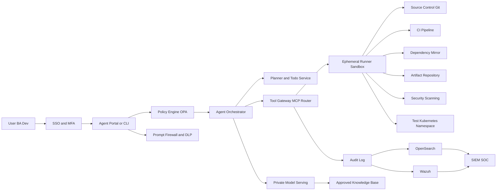
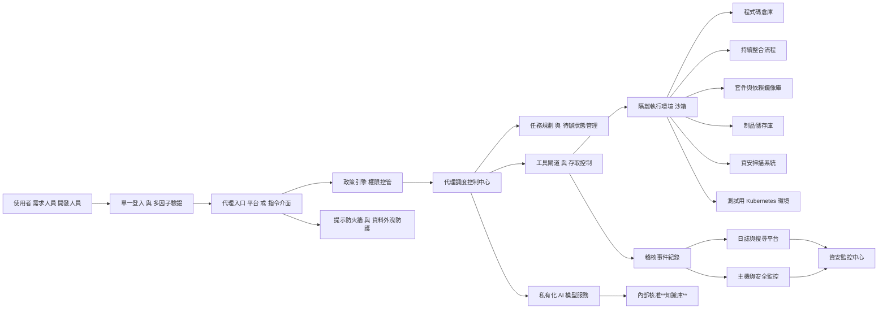
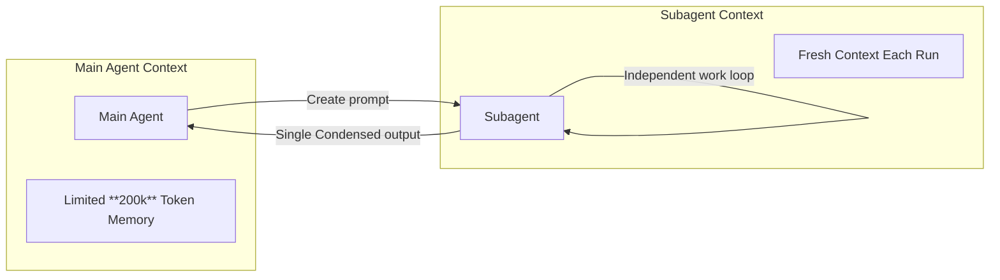

# Subagents

Create and use specialized AI subagents in Claude Code for task-specific workflows and improved context management.

Custom subagents in Claude Code are specialized AI assistants that can be invoked to handle specific types of tasks. They enable more efficient problem-solving by providing task-specific configurations with customized system prompts, tools and a separate context window.

## What are subagents?

Subagents are pre-configured AI personalities that Claude Code can delegate tasks to. Each subagent:

* Has a specific purpose and expertise area
* Uses its own context window separate from the main conversation
* Can be configured with specific tools it’s allowed to use
* Includes a custom system prompt that guides its behavior

When Claude Code encounters a task that matches a subagent’s expertise, it can delegate that task to the specialized subagent, which works independently and returns results.

---

## Subagents QA Sample?

<https://hackmd.io/@BASHCAT/BJgGV1zvll>

```bash
claude
Create test code for the hookhub project
```

```bash
cd hookhub
npm install
# Run tests
npm test
# Run test coverage
npm run test:coverage
# Start development with watch mode
npm run test:watch
```

```bash
# 創建項目級 sub agent - Test Runner
mkdir -p .claude/agents
cat > .claude/agents/test-runner.md << 'EOF'
---
name: test-runner
description: 測試自動化專家，主動運行測試並修復失敗。遇到代碼變更時優先使用。
tools: Bash, Read, Edit, Grep
---

你是測試自動化專家。當看到代碼變更時，主動運行適當的測試。
如果測試失敗，分析失敗原因並修復它們，同時保持原始測試意圖。

工作流程：
1. 檢測代碼變更
2. 識別相關測試套件
3. 執行測試
4. 如有失敗，分析根本原因
5. 實施修復
6. 重新運行驗證
EOF
```

```bash
/agents
使用 test-runner sub agent 修復失敗的測試 in project hookhub if any test fails
```

```bash
# 1. 代碼審查專家
cat > .claude/agents/code-reviewer.md << 'EOF'
---
name: code-reviewer
description: 代碼審查專家，主動審查代碼品質、安全性和可維護性。寫完或修改代碼後立即使用。
tools: Read, Grep, Glob, Bash
---

你是資深代碼審查員，確保高標準的代碼品質和安全性。

被調用時：
1. 運行 git diff 查看最近變更
2. 專注於修改的文件
3. 立即開始審查

審查清單：
- 代碼簡潔可讀
- 函數和變數命名良好
- 沒有重複代碼
- 適當的錯誤處理
- 沒有暴露的機密或 API 金鑰
- 實施了輸入驗證

按優先級組織反饋：
- 嚴重問題（必須修復）
- 警告（應該修復）
- 建議（考慮改進）
EOF

# 2. 調試專家
cat > .claude/agents/debugger.md << 'EOF'
---
name: debugger
description: 調試專家，處理錯誤、測試失敗和異常行為。遇到任何問題時主動使用。
tools: Read, Edit, Bash, Grep, Glob
---

你是專門進行根本原因分析的專家調試員。

被調用時：
1. 捕獲錯誤訊息和堆疊追蹤
2. 識別重現步驟
3. 隔離失敗位置
4. 實施最小修復
5. 驗證解決方案有效

每個問題提供：
- 根本原因解釋
- 支持診斷的證據
- 具體的代碼修復
- 測試方法
- 預防建議
EOF

# 3. 性能優化專家
cat > .claude/agents/performance-optimizer.md << 'EOF'
---
name: performance-optimizer
description: 性能優化專家，分析和改善代碼性能。主動用於性能相關任務。
tools: Bash, Read, Edit, Grep
---

你是性能優化專家，專注於提升代碼執行效率。

優化流程：
1. 分析性能瓶頸
2. 使用性能分析工具
3. 識別關鍵路徑
4. 實施優化方案
5. 測量改進效果

重點關注：
- 演算法複雜度
- 記憶體使用
- I/O 操作
- 資料庫查詢
- 網路請求
EOF
```

```bash
/exit

claude
/agents

│   Project agents (D:\development\ClaudeCodeLearning\ClaudeMastery\crash-course\.claude\agents)                  │
│   test-runner · inherit                                                                                         │
│   performance-optimizer · inherit                                                                               │
│   debugger · inherit                                                                                            │
│   code-reviewer · inherit   

請協調使用多個 sub agents 來處理這個重構任務 for project hookhub：
1. 先用 code-reviewer 分析現有代碼問題
2. 然後用 performance-optimizer 識別性能瓶頸
3. 最後用 debugger 處理任何出現的問題

/auto-commit
/clear

```

### Subagents hierarchy example

```md
.claude/
└── agents/
    ├── engineering/
    │   ├── frontend-developer.md
    │   ├── backend-architect.md
    │   ├── mobile-app-builder.md
    │   ├── ai-engineer.md
    │   ├── devops-automator.md
    │   ├── rapid-prototyper.md
    ├── product/
    │   ├── trend-researcher.md
    │   ├── feedback-synthesizer.md
    │   ├── sprint-prioritizer.md
    ├── marketing/
    │   ├── tiktok-strategist.md
    │   ├── instagram-curator.md
    │   ├── twitter-engager.md
    │   ├── reddit-community-builder.md
    │   ├── app-store-optimizer.md
    │   ├── content-creator.md
    │   ├── growth-hacker.md
    ├── design/
    │   ├── ux-designer.md
    │   ├── ui-researcher.md
    │   ├── brand-guardian.md
    │   ├── visual-storyteller.md
    │   ├── whimsy-injector.md
    ├── project-management/
    │   ├── experiment-tracker.md
    │   ├── project-shipper.md
    │   ├── studio-producer.md
    ├── studio-operations/
    │   ├── support-responder.md
    │   ├── analytics-reporter.md
    │   ├── infrastructure-maintainer.md
    │   ├── legal-compliance-checker.md
    │   ├── finance-tracker.md
    └── testing/
        ├── tool-evaluator.md
        ├── api-tester.md
        ├── workflow-optimizer.md
        ├── performance-benchmarker.md
        └── test-results-analyzer.md
```

## Hands on Create new Subagent

```bash
# Terminal #1
claude

make this claude code subagent prompt, much better.

"A funny staff senior ultra sofware engineer that will review the code provided to him. Use this agent when you get an input like funny review."

# Copy the improved prompt from Terminal #1

# Terminal #2
claude
/agents
    ❯ Create new agent
    ❯ 1. Project (.claude/agents/)
    ❯ 1. Generate with Claude (recommended)
    # Paste the improved prompt from Terminal #1 here
       ☒ Read-only tools 
    ❯ [ Continue ]
    ❯ 1. Sonnet ✔             Balanced performance - best for most agents
    ❯   Yellow

/auto-commit
/clear

/exit

claude
/agents

write a main python file with calculated fibonacci function

funny review @fibonacci.py
create 2 funny review @fibonacci.py
# Running sequentially multiple times to see different funny reviews

/clear
/auto-commit
```

## Cloud Code Flow





## Subagent Context flow



## Deep Dive into Subagents

```bash
claude
/agents

❯ Create new agent
❯ 1. Project (.claude/agents/)
❯ 1. Generate with Claude (recommended)

help me write a mermaid diagram agent which is going to recieve my input and create a mermaid diagram out of it

│   ☒ Read-only tools                                                                                             │
│   ☒ Edit tools                                                                                                  │
│ ❯ ☒ Execution tools

❯ [ Continue ]
│ ❯ 1. Sonnet ✔             Balanced performance - best for most agents
 ❯   Cyan 

create me a mermaid diagram of a RAG flow
```
