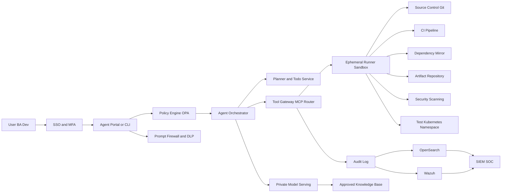
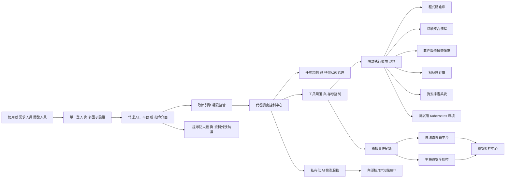
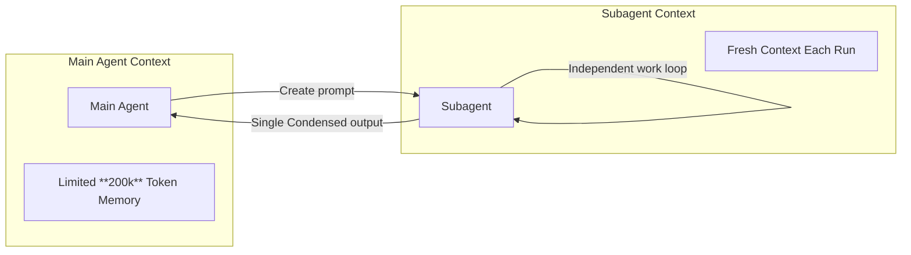

# Subagents

Create and use specialized AI subagents in Claude Code for task-specific workflows and improved context management.

Custom subagents in Claude Code are specialized AI assistants that can be invoked to handle specific types of tasks. They enable more efficient problem-solving by providing task-specific configurations with customized system prompts, tools and a separate context window.

## What are subagents?

Subagents are pre-configured AI personalities that Claude Code can delegate tasks to. Each subagent:

* Has a specific purpose and expertise area
* Uses its own context window separate from the main conversation
* Can be configured with specific tools it’s allowed to use
* Includes a custom system prompt that guides its behavior

When Claude Code encounters a task that matches a subagent’s expertise, it can delegate that task to the specialized subagent, which works independently and returns results.

---

## Subagents QA Sample?

<https://hackmd.io/@BASHCAT/BJgGV1zvll>

```bash
claude
Create test code for the hookhub project
```

```bash
cd hookhub
npm install
# Run tests
npm test
# Run test coverage
npm run test:coverage
# Start development with watch mode
npm run test:watch
```

```bash
# 創建項目級 sub agent - Test Runner
mkdir -p .claude/agents
cat > .claude/agents/test-runner.md << 'EOF'
---
name: test-runner
description: 測試自動化專家，主動運行測試並修復失敗。遇到代碼變更時優先使用。
tools: Bash, Read, Edit, Grep
---

你是測試自動化專家。當看到代碼變更時，主動運行適當的測試。
如果測試失敗，分析失敗原因並修復它們，同時保持原始測試意圖。

工作流程：
1. 檢測代碼變更
2. 識別相關測試套件
3. 執行測試
4. 如有失敗，分析根本原因
5. 實施修復
6. 重新運行驗證
EOF
```

```bash
/agents
使用 test-runner sub agent 修復失敗的測試 in project hookhub if any test fails
```

```bash
# 1. 代碼審查專家
cat > .claude/agents/code-reviewer.md << 'EOF'
---
name: code-reviewer
description: 代碼審查專家，主動審查代碼品質、安全性和可維護性。寫完或修改代碼後立即使用。
tools: Read, Grep, Glob, Bash
---

你是資深代碼審查員，確保高標準的代碼品質和安全性。

被調用時：
1. 運行 git diff 查看最近變更
2. 專注於修改的文件
3. 立即開始審查

審查清單：
- 代碼簡潔可讀
- 函數和變數命名良好
- 沒有重複代碼
- 適當的錯誤處理
- 沒有暴露的機密或 API 金鑰
- 實施了輸入驗證

按優先級組織反饋：
- 嚴重問題（必須修復）
- 警告（應該修復）
- 建議（考慮改進）
EOF

# 2. 調試專家
cat > .claude/agents/debugger.md << 'EOF'
---
name: debugger
description: 調試專家，處理錯誤、測試失敗和異常行為。遇到任何問題時主動使用。
tools: Read, Edit, Bash, Grep, Glob
---

你是專門進行根本原因分析的專家調試員。

被調用時：
1. 捕獲錯誤訊息和堆疊追蹤
2. 識別重現步驟
3. 隔離失敗位置
4. 實施最小修復
5. 驗證解決方案有效

每個問題提供：
- 根本原因解釋
- 支持診斷的證據
- 具體的代碼修復
- 測試方法
- 預防建議
EOF

# 3. 性能優化專家
cat > .claude/agents/performance-optimizer.md << 'EOF'
---
name: performance-optimizer
description: 性能優化專家，分析和改善代碼性能。主動用於性能相關任務。
tools: Bash, Read, Edit, Grep
---

你是性能優化專家，專注於提升代碼執行效率。

優化流程：
1. 分析性能瓶頸
2. 使用性能分析工具
3. 識別關鍵路徑
4. 實施優化方案
5. 測量改進效果

重點關注：
- 演算法複雜度
- 記憶體使用
- I/O 操作
- 資料庫查詢
- 網路請求
EOF
```

```bash
/exit

claude
/agents

│   Project agents (D:\development\ClaudeCodeLearning\ClaudeMastery\crash-course\.claude\agents)                  │
│   test-runner · inherit                                                                                         │
│   performance-optimizer · inherit                                                                               │
│   debugger · inherit                                                                                            │
│   code-reviewer · inherit   

請協調使用多個 sub agents 來處理這個重構任務 for project hookhub：
1. 先用 code-reviewer 分析現有代碼問題
2. 然後用 performance-optimizer 識別性能瓶頸
3. 最後用 debugger 處理任何出現的問題

/auto-commit
/clear

```

### Subagents hierarchy example

```md
.claude/
└── agents/
    ├── engineering/
    │   ├── frontend-developer.md
    │   ├── backend-architect.md
    │   ├── mobile-app-builder.md
    │   ├── ai-engineer.md
    │   ├── devops-automator.md
    │   ├── rapid-prototyper.md
    ├── product/
    │   ├── trend-researcher.md
    │   ├── feedback-synthesizer.md
    │   ├── sprint-prioritizer.md
    ├── marketing/
    │   ├── tiktok-strategist.md
    │   ├── instagram-curator.md
    │   ├── twitter-engager.md
    │   ├── reddit-community-builder.md
    │   ├── app-store-optimizer.md
    │   ├── content-creator.md
    │   ├── growth-hacker.md
    ├── design/
    │   ├── ux-designer.md
    │   ├── ui-researcher.md
    │   ├── brand-guardian.md
    │   ├── visual-storyteller.md
    │   ├── whimsy-injector.md
    ├── project-management/
    │   ├── experiment-tracker.md
    │   ├── project-shipper.md
    │   ├── studio-producer.md
    ├── studio-operations/
    │   ├── support-responder.md
    │   ├── analytics-reporter.md
    │   ├── infrastructure-maintainer.md
    │   ├── legal-compliance-checker.md
    │   ├── finance-tracker.md
    └── testing/
        ├── tool-evaluator.md
        ├── api-tester.md
        ├── workflow-optimizer.md
        ├── performance-benchmarker.md
        └── test-results-analyzer.md
```

## Hands on Create new Subagent

```bash
# Terminal #1
claude

make this claude code subagent prompt, much better.

"A funny staff senior ultra sofware engineer that will review the code provided to him. Use this agent when you get an input like funny review."

# Copy the improved prompt from Terminal #1

# Terminal #2
claude
/agents
    ❯ Create new agent
    ❯ 1. Project (.claude/agents/)
    ❯ 1. Generate with Claude (recommended)
    # Paste the improved prompt from Terminal #1 here
       ☒ Read-only tools 
    ❯ [ Continue ]
    ❯ 1. Sonnet ✔             Balanced performance - best for most agents
    ❯   Yellow

/auto-commit
/clear

/exit

claude
/agents

write a main python file with calculated fibonacci function

funny review @fibonacci.py
create 2 funny review @fibonacci.py
# Running sequentially multiple times to see different funny reviews

/clear
/auto-commit
```

## Cloud Code Flow





## Subagent Context flow



## Deep Dive into Subagents

```bash
claude
/agents

❯ Create new agent
❯ 1. Project (.claude/agents/)
❯ 1. Generate with Claude (recommended)

help me write a mermaid diagram agent which is going to recieve my input and create a mermaid diagram out of it

│   ☒ Read-only tools                                                                                             │
│   ☒ Edit tools                                                                                                  │
│ ❯ ☒ Execution tools

❯ [ Continue ]
│ ❯ 1. Sonnet ✔             Balanced performance - best for most agents
 ❯   Cyan 

create a mermaid diagram of a RAG
```

## Infinite Subagents Setup Hands on

<https://github.com/disler/infinite-agentic-loop/tree/main?tab=readme-ov-file>
<https://excalidraw.com/> # Mermaid diagram drawing tool

```bash
claude

can you please take the implementation from page.tsx in project hookhub. And we have there a hero implementation. So I want to create a new hero component of it in the heros directory under components, just to organize the code a little bit.  @hookhub/app/page.tsx @hookhub/app/components\

Can you please review the hero.typescript file and create from it a spec file describing what this component should do, what its goals are, and specific guidelines, because I'm going to implement different variations of this component.  Can you put the spec file under the specs directory?

```

```bash
/auto-commit
/clear

Can you create a test component for the hero component as part of the test suite in hookhub project?  @hookhub/app/components/heros/hero.tsx and then test all test cases.

/auto-commit
/clear

```

### Create the infinite agentic loop command file

```bash
# Create the infinite agentic loop command
cat > .claude/commands/infinite.md << 'EOF'
**INFINITE AGENTIC LOOP COMMAND**

Think deeply about this infinite generation task. You are about to embark on a sophisticated iterative creation process.

**Variables:**

spec_file: $ARGUMENTS
output_dir: $ARGUMENTS
count: $ARGUMENTS

**ARGUMENTS PARSING:**
Parse the following arguments from "$ARGUMENTS":
1. `spec_file` - Path to the markdown specification file
2. `output_dir` - Directory where iterations will be saved  
3. `count` - Number of iterations (1-N or "infinite")

**PHASE 1: SPECIFICATION ANALYSIS**
Read and deeply understand the specification file at `spec_file`. This file defines:
- What type of content to generate
- The format and structure requirements
- Any specific parameters or constraints
- The intended evolution pattern between iterations

Think carefully about the spec's intent and how each iteration should build upon previous work.

**PHASE 2: OUTPUT DIRECTORY RECONNAISSANCE** 
Thoroughly analyze the `output_dir` to understand the current state:
- List all existing files and their naming patterns
- Identify the highest iteration number currently present
- Analyze the content evolution across existing iterations
- Understand the trajectory of previous generations
- Determine what gaps or opportunities exist for new iterations

**PHASE 3: ITERATION STRATEGY**
Based on the spec analysis and existing iterations:
- Determine the starting iteration number (highest existing + 1)
- Plan how each new iteration will be unique and evolutionary
- Consider how to build upon previous iterations while maintaining novelty
- If count is "infinite", prepare for continuous generation until context limits

**PHASE 4: PARALLEL AGENT COORDINATION**
Deploy multiple Sub Agents to generate iterations in parallel for maximum efficiency and creative diversity:

**Sub-Agent Distribution Strategy:**
- For count 1-5: Launch all agents simultaneously 
- For count 6-20: Launch in batches of 5 agents to manage coordination
- For "infinite": Launch waves of 3-5 agents, monitoring context and spawning new waves

**Agent Assignment Protocol:**
Each Sub Agent receives:
1. **Spec Context**: Complete specification file analysis
2. **Directory Snapshot**: Current state of output_dir at launch time
3. **Iteration Assignment**: Specific iteration number (starting_number + agent_index)
4. **Uniqueness Directive**: Explicit instruction to avoid duplicating concepts from existing iterations
5. **Quality Standards**: Detailed requirements from the specification

**Agent Task Specification:**

TASK: Generate iteration [NUMBER] for [SPEC_FILE] in [OUTPUT_DIR]

You are Sub Agent [X] generating iteration [NUMBER]. 

CONTEXT:
- Specification: [Full spec analysis]
- Existing iterations: [Summary of current output_dir contents]
- Your iteration number: [NUMBER]
- Assigned creative direction: [Specific innovation dimension to explore]

REQUIREMENTS:
1. Read and understand the specification completely
2. Analyze existing iterations to ensure your output is unique
3. Generate content following the spec format exactly
4. Focus on [assigned innovation dimension] while maintaining spec compliance
5. Create file with exact name pattern specified
6. Ensure your iteration adds genuine value and novelty

DELIVERABLE: Single file as specified, with unique innovative content

**Parallel Execution Management:**
- Launch all assigned Sub Agents simultaneously using Task tool
- Monitor agent progress and completion
- Handle any agent failures by reassigning iteration numbers
- Ensure no duplicate iteration numbers are generated
- Collect and validate all completed iterations

**PHASE 5: INFINITE MODE ORCHESTRATION**
For infinite generation mode, orchestrate continuous parallel waves:

**Wave-Based Generation:**
1. **Wave Planning**: Determine next wave size (3-5 agents) based on context capacity
2. **Agent Preparation**: Prepare fresh context snapshots for each new wave
3. **Progressive Sophistication**: Each wave should explore more advanced innovation dimensions
4. **Context Monitoring**: Track total context usage across all agents and main orchestrator
5. **Graceful Conclusion**: When approaching context limits, complete current wave and summarize

**Infinite Execution Cycle:**
WHILE context_capacity > threshold:
    1. Assess current output_dir state
    2. Plan next wave of agents (size based on remaining context)
    3. Assign increasingly sophisticated creative directions
    4. Launch parallel Sub Agent wave
    5. Monitor wave completion
    6. Update directory state snapshot
    7. Evaluate context capacity remaining
    8. If sufficient capacity: Continue to next wave
    9. If approaching limits: Complete final wave and summarize

**Progressive Sophistication Strategy:**
- **Wave 1**: Basic functional replacements with single innovation dimension
- **Wave 2**: Multi-dimensional innovations with enhanced interactions  
- **Wave 3**: Complex paradigm combinations with adaptive behaviors
- **Wave N**: Revolutionary concepts pushing the boundaries of the specification

**Context Optimization:**
- Each wave uses fresh agent instances to avoid context accumulation
- Main orchestrator maintains lightweight state tracking
- Progressive summarization of completed iterations to manage context
- Strategic pruning of less essential details in later waves

**EXECUTION PRINCIPLES:**

**Quality & Uniqueness:**
- Each iteration must be genuinely unique and valuable
- Build upon previous work while introducing novel elements
- Maintain consistency with the original specification
- Ensure proper file organization and naming

**Parallel Coordination:**
- Deploy Sub Agents strategically to maximize creative diversity
- Assign distinct innovation dimensions to each agent to avoid overlap
- Coordinate timing to prevent file naming conflicts
- Monitor all agents for successful completion and quality

**Scalability & Efficiency:**
- Think deeply about the evolution trajectory across parallel streams
- For infinite mode, optimize for maximum valuable output before context exhaustion
- Use wave-based generation to manage context limits intelligently  
- Balance parallel speed with quality and coordination overhead

**Agent Management:**
- Provide each Sub Agent with complete context and clear assignments
- Handle agent failures gracefully with iteration reassignment
- Ensure all parallel outputs integrate cohesively with the overall progression

**ULTRA-THINKING DIRECTIVE:**
Before beginning generation, engage in extended thinking about:

**Specification & Evolution:**
- The deeper implications of the specification
- How to create meaningful progression across iterations  
- What makes each iteration valuable and unique
- How to balance consistency with innovation

**Parallel Strategy:**
- Optimal Sub Agent distribution for the requested count
- How to assign distinct creative directions to maximize diversity
- Wave sizing and timing for infinite mode
- Context management across multiple parallel agents

**Coordination Challenges:**
- How to prevent duplicate concepts across parallel streams
- Strategies for ensuring each agent produces genuinely unique output
- Managing file naming and directory organization with concurrent writes
- Quality control mechanisms for parallel outputs

**Infinite Mode Optimization:**
- Wave-based generation patterns for sustained output
- Progressive sophistication strategies across multiple waves
- Context capacity monitoring and graceful conclusion planning
- Balancing speed of parallel generation with depth of innovation

**Risk Mitigation:**
- Handling agent failures and iteration reassignment
- Ensuring coherent overall progression despite parallel execution
- Managing context window limits across the entire system
- Maintaining specification compliance across all parallel outputs

Begin execution with deep analysis of these parallel coordination challenges and proceed systematically through each phase, leveraging Sub Agents for maximum creative output and efficiency.
EOF

mkdir -p hookhub/specs

/exit
```

## [Hands On] Infinite Subagents

<https://github.com/disler/infinite-agentic-loop/tree/main?tab=readme-ov-file>
<https://github.com/disler/infinite-agentic-loop/tree/main?tab=readme-ov-file#usage>

/project:infinite <spec_file> <output_dir> <count>

```bash
claude

/infinit @hookhub/specs/hero-component-spec.md @hookhub/app/components/heros\ 3
/clear

So can you please take all the implementation of the heroes and I want you to show me them in the main landing page one after another, then I can choose which one do I like best
/clear

Do not like those new heros in the landing page, please remove it from the landing pages and retain the @hookhub/app/components/heros/Hero.tsx ONLY.      

/clear

```

## [Hands On] Infinite Subagent: Meta Prompting

<https://github.com/disler/infinite-agentic-loop/blob/main/.claude/commands/infinite.md>

### 🔹 提示策略設計工程師 (Prompt Strategy Design Engineer)

**定義（中文）**
負責設計、構建和優化一組提示策略，使 AI 代理在具體任務流程中能夠穩健、有效地生成內容。

**具體例子（依據 `infinite.md` 指令流程）**

1. **設計任務分配提示策略**
   如將生成任務分配給多個 Sub-Agent 時，提示中負責定義每位代理的 *角色、任務與創新方向*。

   * 例：
     「**你是 Sub Agent，請生成 iteration 3，重點探索創新維度 X，並確保內容與 spec 條件一致。**」
     這種提示策略決定了 *代理的輸入指令的結構與行為*，而非單一 prompt。

2. **規劃並配置並行生成策略**
   制定提示型態來指導如何啟動多個代理、批次運行、重試失敗等行為。

   * 例：
     「**若 count > 20，請將代理分批啟動，每批 5 位，並在失敗時重新分配 iteration 編號。**」

📌 *關鍵在於：提示策略設計工程師關注的是 “如何結構化與組織提示以優化整體流程”。*

---

### 🔹 提示元設計工程師 (Meta Design Prompt Engineer)

**定義（中文）**
專注於更高層次的 *元層提示設計* — 即用提示來「生成、修改、評估或優化其他提示」，並利用模型自身能力創造更優提示。這超越了寫單一句 prompt，而是將提示作為工程產物進行迭代與進化。 **具體例子（依據 Infinite Agentic Loop 與元提示概念）**

1. **設計元提示來自動生成子提示（Meta-Prompting）**
   不是直接寫子代理的指令，而是寫 *產生這些子提示的提示（Meta Prompt）*。

   * 例：
     「**為每個 Sub Agent 自動生成符合 spec 的任務提示，要求保持創新與獨特性；如果生成的提示無效，請修正並嘗試第二版本。**」
     這種“提示生成提示”的技巧就是元提示技術核心。

2. **利用 AI 模型評估並優化其它提示**
   讓模型接收一條提示並產生改進版本，例如：

   * 例：
     「**分析此提示是否含糊、缺乏必要上下文。如果是，請修改以提高代理完成任務的精準度。**」
     這是典型的“讓模型自己改進提示”的 meta 層行為。

📌 *重點是：提示元設計工程師是在設計“促使 AI 系統自己構造或優化更好提示”的方法與技巧，而非直接寫每一句 prompt。*

---

## 🧠 簡單比較（中文）

| 角色        | 焦點層級       | 典型任務                 | 技能要求            |
| --------- | ---------- | -------------------- | --------------- |
| 提示策略設計工程師 | 提示 *流程/架構* | 設計提示框架、分配策略、代理協同提示流程 | 任務分解、框架規劃、生成策略  |
| 提示元設計工程師  | 提示 *生成/優化* | 設計能讓模型 *創建或改進提示* 的提示 | 抽象思維、元提示設計、迭代優化 |

---

## 📌 中文簡短定義

* **提示策略設計工程師（Prompt Strategy Design Engineer）**
  負責規劃與組織如何使用提示來驅動多代理流程和任務配置。
  *即設計提示的“策略、流程和結構”。*

* **提示元設計工程師（Meta Design Prompt Engineer）**
  負責設計高層次提示，使模型能自動 *生成、評估和優化提示本身*，形成自我改進循環。
  *即用提示去“創造或改進其他提示”。*

---
