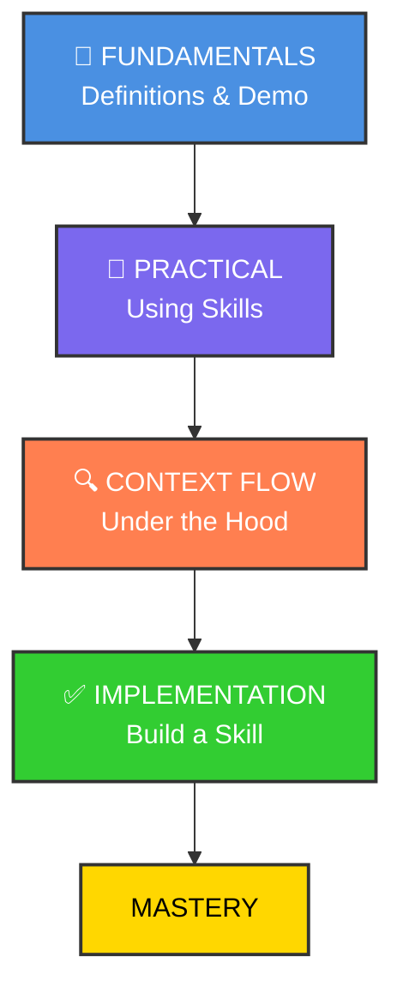

# Claude Code Skill



## Skills Overview

<https://claude.com/blog/equipping-agents-for-the-real-world-with-agent-skills>

## The GIST of skills

<https://github.com/anthropics/skills/tree/main/skills>

```bash
claude
What skills are available? 

/plugin marketplace add anthropics/skills

/plugin
 ❯ ● anthropic-agent-skills
 ❯ Browse plugins (2)
 ❯ ◯ example-skills · 0 installs
 > Install for all collaborators on this repository (project scope)

/exit

claude

which skills are available?

can u make sure that the logo is according to anthropic branding styles for project hookhub in hookhub directory?

    ...
    ● Skill(brand-guidelines)
    ⎿  Successfully loaded skill
    ...

```

### 漸進式揭露（Progressive Disclosure）

Skills 的核心設計原則，分為三個層次：

第一層：僅將每個 Skill 的名稱和描述預載入系統提示，讓 Claude 判斷何時需要使用
第二層：當 Claude 認為某個 Skill 相關時，才讀取完整的 SKILL.md
第三層：Skill 可包含額外檔案，Claude 只在需要時才進一步導航和讀取 (例如 PDF Skill 中的 forms.md)

### Skills 的設計是按需載入的，避免不必要地佔用上下文窗口的空間。

- Agent 啟動時，只會將每個已安裝 Skill 的 name 和 description 預載入系統提示中。 claude這是第一層的漸進式揭露——提供剛好足夠的資訊讓 Claude 判斷何時該使用哪個 Skill，而不會把所有內容都塞進上下文。

- 只有當 Claude 判斷某個 Skill 與當前任務相關時，才會透過 Bash 工具讀取完整的 SKILL.md 到上下文中。而如果 Skill 還包含額外的參考檔案（例如 PDF Skill 中的 forms.md），Claude 也只會在需要時才選擇導航和讀取這些額外檔案。 

- 所以整個設計是按需載入的，避免不必要地佔用上下文窗口的空間。

## Custom Skills with Auxiliary Scripts

```bash
claude

# In Claude Code - installs the entire plugin with all skills and agents
/plugin marketplace add mhattingpete/claude-skills-marketplace

