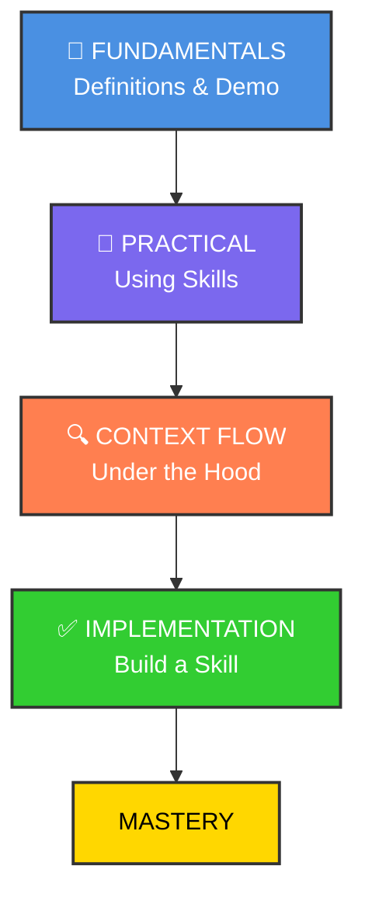

# Claude Code Skill



## Skills Overview

<https://claude.com/blog/equipping-agents-for-the-real-world-with-agent-skills>

## The GIST of skills

<https://github.com/anthropics/skills/tree/main/skills>

```bash
claude
What skills are available? 

/plugin marketplace add anthropics/skills

/plugin
 ❯ ● anthropic-agent-skills
 ❯ Browse plugins (2)
 ❯ ◯ example-skills · 0 installs
 > Install for all collaborators on this repository (project scope)

/exit

claude

which skills are available?

can u make sure that the logo is according to anthropic branding styles for project hookhub in hookhub directory?

    ...
    ● Skill(brand-guidelines)
    ⎿  Successfully loaded skill
    ...

```
