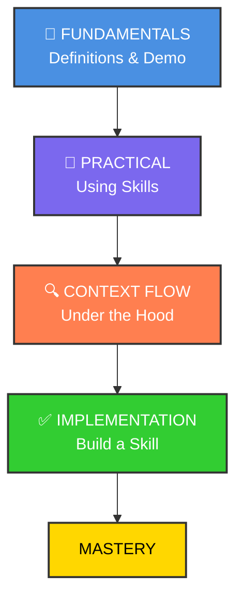

# Claude Code Skill



## Skills Overview

<https://claude.com/blog/equipping-agents-for-the-real-world-with-agent-skills>

## The GIST of skills

<https://github.com/anthropics/skills/tree/main/skills>

```bash
claude
What skills are available? 

/plugin marketplace add anthropics/skills

/plugin
 ❯ ● anthropic-agent-skills
 ❯ Browse plugins (2)
 ❯ ◯ example-skills · 0 installs
 > Install for all collaborators on this repository (project scope)

# Exit claude and check the installed skill files
/exit
ls ~/.claude/plugins/marketplaces/anthropic-agent-skills/skills
```

```bash
claude
which skills are available?

can u make sure that the logo is according to anthropic branding styles for project hookhub in hookhub directory?

    ...
    ● Skill(brand-guidelines)
    ⎿  Successfully loaded skill
    ...

```

### 漸進式揭露（Progressive Disclosure）

Skills 的核心設計原則，分為三個層次：

第一層：僅將每個 Skill 的名稱和描述預載入系統提示，讓 Claude 判斷何時需要使用
第二層：當 Claude 認為某個 Skill 相關時，才讀取完整的 SKILL.md
第三層：Skill 可包含額外檔案，Claude 只在需要時才進一步導航和讀取 (例如 PDF Skill 中的 forms.md)

### Skills 的設計是按需載入的，避免不必要地佔用上下文窗口的空間。

- Agent 啟動時，只會將每個已安裝 Skill 的 name 和 description 預載入系統提示中。 claude這是第一層的漸進式揭露——提供剛好足夠的資訊讓 Claude 判斷何時該使用哪個 Skill，而不會把所有內容都塞進上下文。

- 只有當 Claude 判斷某個 Skill 與當前任務相關時，才會透過 Bash 工具讀取完整的 SKILL.md 到上下文中。而如果 Skill 還包含額外的參考檔案（例如 PDF Skill 中的 forms.md），Claude 也只會在需要時才選擇導航和讀取這些額外檔案。 

- 所以整個設計是按需載入的，避免不必要地佔用上下文窗口的空間。

## Custom Skills with Auxiliary Scripts

<https://github.com/mhattingpete/claude-skills-marketplace/tree/main>
<https://github.com/mhattingpete/claude-skills-marketplace/tree/main/engineering-workflow-plugin/skills>

````bash
cat << 'EOF' > .claude/skills/git-pushing/SKILL.md
---
name: git-pushing
description: Stage, commit, and push git changes with conventional commit messages. Use when user wants to commit and push changes, mentions pushing to remote, or asks to save and push their work. Also activates when user says "push changes", "commit and push", "push this", "push to github", or similar git workflow requests.
---

# Git Push Workflow

Stage all changes, create a conventional commit, and push to the remote branch.

## When to Use

Automatically activate when the user:
- Explicitly asks to push changes ("push this", "commit and push", "push to remote")
- Mentions saving work to remote ("save to github", "push to remote")
- Completes a feature and wants to share it
- Says phrases like "let's push this up" or "commit these changes"

## Workflow

**ALWAYS use the script** - do NOT use manual git commands:

```bash
bash skills/git-pushing/scripts/smart_commit.sh
```

With custom message:
```bash
bash skills/git-pushing/scripts/smart_commit.sh "feat: add feature"
```

Script handles: staging, conventional commit message, Claude footer, push with -u flag.
EOF

cat << 'SCRIPT' > .claude/skills/git-pushing/scripts/smart_commit.sh
#!/bin/bash
# Smart Git Commit Script for git-pushing skill
# Handles staging, commit message generation, and pushing

set -e  # Exit on error

# Colors for output
RED='\033[0;31m'
GREEN='\033[0;32m'
YELLOW='\033[1;33m'
NC='\033[0m' # No Color

# Function to print colored messages
info() { echo -e "${GREEN}→${NC} $1"; }
warn() { echo -e "${YELLOW}⚠${NC} $1"; }
error() { echo -e "${RED}✗${NC} $1" >&2; }

# Get current branch
CURRENT_BRANCH=$(git rev-parse --abbrev-ref HEAD)
info "Current branch: $CURRENT_BRANCH"

# Check if there are changes
if git diff --quiet && git diff --cached --quiet; then
    warn "No changes to commit"
    exit 0
fi

# Stage all changes
info "Staging all changes..."
git add .

# Get staged files for commit message analysis
STAGED_FILES=$(git diff --cached --name-only)
DIFF_STAT=$(git diff --cached --stat)

# Analyze changes to determine commit type
determine_commit_type() {
    local files="$1"

    # Check for specific patterns
    if echo "$files" | grep -q "test"; then
        echo "test"
    elif echo "$files" | grep -qE "\.(md|txt|rst)$"; then
        echo "docs"
    elif echo "$files" | grep -qE "package\.json|requirements\.txt|Cargo\.toml"; then
        echo "chore"
    elif git diff --cached | grep -qE "^[\+].*fix|^[\+].*bug"; then
        echo "fix"
    elif git diff --cached | grep -qE "^[\+].*refactor"; then
        echo "refactor"
    else
        echo "feat"
    fi
}

# Analyze files to determine scope
determine_scope() {
    local files="$1"

    # Extract directory or component name
    local scope=$(echo "$files" | head -1 | cut -d'/' -f1)

    # Check for common patterns
    if echo "$files" | grep -q "plugin"; then
        echo "plugin"
    elif echo "$files" | grep -q "skill"; then
        echo "skill"
    elif echo "$files" | grep -q "agent"; then
        echo "agent"
    elif [ -n "$scope" ] && [ "$scope" != "." ]; then
        echo "$scope"
    else
        echo ""
    fi
}

# Generate commit message if not provided
if [ -z "$1" ]; then
    COMMIT_TYPE=$(determine_commit_type "$STAGED_FILES")
    SCOPE=$(determine_scope "$STAGED_FILES")

    # Get the diff for context
    DIFF_CONTENT=$(git diff --cached)

    # Use Claude CLI to generate a pirate-style commit message
    info "Arrr! Asking Claude to write a pirate commit message..."
    PIRATE_MSG=$(claude -p "You are a pirate! Based on this git diff, write a short conventional commit message (type(scope): description) but make the description sound like a pirate talking. Keep it under 72 chars. Only output the commit message, nothing else.

Commit type: $COMMIT_TYPE
Scope: $SCOPE
Files changed: $STAGED_FILES

Diff:
$DIFF_CONTENT" 2>/dev/null || echo "")

    if [ -n "$PIRATE_MSG" ]; then
        COMMIT_MSG="$PIRATE_MSG"
    else
        # Fallback if Claude CLI fails
        NUM_FILES=$(echo "$STAGED_FILES" | wc -l | xargs)
        if [ -n "$SCOPE" ]; then
            COMMIT_MSG="${COMMIT_TYPE}(${SCOPE}): ahoy! updated $NUM_FILES file(s), arr!"
        else
            COMMIT_MSG="${COMMIT_TYPE}: ahoy! updated $NUM_FILES file(s), arr!"
        fi
    fi

    info "Generated commit message: $COMMIT_MSG"
else
    COMMIT_MSG="$1"
    info "Using provided message: $COMMIT_MSG"
fi

# Create commit with Claude Code footer
git commit -m "$(cat <<EOF
${COMMIT_MSG}

🤖 Generated with [Claude Code](https://claude.com/claude-code)

Co-Authored-By: Claude <noreply@anthropic.com>
EOF
)"

COMMIT_HASH=$(git rev-parse --short HEAD)
info "Created commit: $COMMIT_HASH"

# Push to remote
info "Pushing to origin/$CURRENT_BRANCH..."

# Check if branch exists on remote
if git ls-remote --exit-code --heads origin "$CURRENT_BRANCH" >/dev/null 2>&1; then
    # Branch exists, just push
    if git push; then
        info "Successfully pushed to origin/$CURRENT_BRANCH"
        echo "$DIFF_STAT"
    else
        error "Push failed"
        exit 1
    fi
else
    # New branch, push with -u
    if git push -u origin "$CURRENT_BRANCH"; then
        info "Successfully pushed new branch to origin/$CURRENT_BRANCH"
        echo "$DIFF_STAT"

        # Check if it's GitHub and show PR link
        REMOTE_URL=$(git remote get-url origin)
        if echo "$REMOTE_URL" | grep -q "github.com"; then
            REPO=$(echo "$REMOTE_URL" | sed -E 's/.*github\.com[:/](.*)\.git/\1/')
            warn "Create PR: https://github.com/$REPO/pull/new/$CURRENT_BRANCH"
        fi
    else
        error "Push failed"
        exit 1
    fi
fi

exit 0
SCRIPT

/git-pushing
````

```bash
claude

What skills are available?  

/clear/plugin marketplace add mhattingpete/claude-skills-marketplace --scope project 
/exit
```

## Install the mhattingpete marketplace skills example

<https://github.com/mhattingpete/claude-skills-marketplace/tree/main>

Massive token savings: Process 100 files with **1K** tokens instead of 100K

- ✅ Faster operations: Local execution vs multiple API round-trips
- ✅ Stateful workflows: Resume multi-step refactoring across sessions
- ✅ Auto-secure: PII/secret masking, sandbox execution

```bash
claude 
/plugin marketplace add mhattingpete/claude-skills-marketplace

# Add just the engineering workflow plugin
/plugin install engineering-workflow-skills@mhattingpete-claude-skills

# Add just the visual documentation plugin
/plugin install visual-documentation-skills@mhattingpete-claude-skills 

/exit

claude
which skills are available from marketplace mhattingpete?
Using architecture-diagram-creator skill for the hookhub project in the hookhub directory

Use conversation-analyzer

Use code-auditor for project hookhub in hookhub directory  

    ● Skill(productivity-skills:code-auditor)                                                                      ⎿  Successfully loaded skill 
    
```

```md
...
  Engineering Workflow Skills 🔧

  - engineering-workflow-skills:pr - Create pull requests
  - engineering-workflow-skills:ensemble-solving - Generate multiple solutions in parallel
  - engineering-workflow-skills:feature-planning - Break down features into plans
  - engineering-workflow-skills:git-pushing - Stage, commit, and push changes
  - engineering-workflow-skills:review-implementing - Process code review feedback
  - engineering-workflow-skills:test-fixing - Run and fix failing tests

  ...

  Visual Documentation Skills 📊

  - visual-documentation-skills:architecture-diagram-creator - Create HTML architecture diagrams
  - visual-documentation-skills:dashboard-creator - Create KPI dashboards
  - visual-documentation-skills:flowchart-creator - Create process flowcharts
  - visual-documentation-skills:technical-doc-creator - Create technical documentation
  - visual-documentation-skills:timeline-creator - Create timelines and Gantt charts

  Code Operations Skills 💻

  - code-operations-skills:code-execution - Execute Python code locally with API access
  - code-operations-skills:code-refactor - Bulk code refactoring operations
  - code-operations-skills:code-transfer - Transfer code between files
  - code-operations-skills:file-operations - Analyze files and get metadata

  Productivity Skills 🚀

  - productivity-skills:code-auditor - Comprehensive codebase analysis
  - productivity-skills:codebase-documenter - Generate comprehensive documentation
  - productivity-skills:conversation-analyzer - Analyze conversation history patterns
  - productivity-skills:project-bootstrapper - Set up new projects with best practices
...
```
