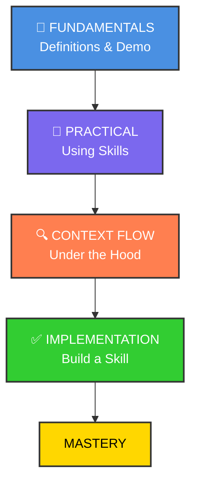

# Claude Code Skill



## Skills Overview

<https://claude.com/blog/equipping-agents-for-the-real-world-with-agent-skills>

## The GIST of skills

<https://github.com/anthropics/skills/tree/main/skills>

```bash
claude
What skills are available? 

/plugin marketplace add anthropics/skills

/plugin
 ❯ ● anthropic-agent-skills
 ❯ Browse plugins (2)
 ❯ ◯ example-skills · 0 installs
 > Install for all collaborators on this repository (project scope)

# Exit claude and check the installed skill files
/exit
ls ~/.claude/plugins/marketplaces/anthropic-agent-skills/skills
```

```bash
claude
which skills are available?

can u make sure that the logo is according to anthropic branding styles for project hookhub in hookhub directory?

    ...
    ● Skill(brand-guidelines)
    ⎿  Successfully loaded skill
    ...

```

### 漸進式揭露（Progressive Disclosure）

Skills 的核心設計原則，分為三個層次：

第一層：僅將每個 Skill 的名稱和描述預載入系統提示，讓 Claude 判斷何時需要使用
第二層：當 Claude 認為某個 Skill 相關時，才讀取完整的 SKILL.md
第三層：Skill 可包含額外檔案，Claude 只在需要時才進一步導航和讀取 (例如 PDF Skill 中的 forms.md)

### Skills 的設計是按需載入的，避免不必要地佔用上下文窗口的空間。

- Agent 啟動時，只會將每個已安裝 Skill 的 name 和 description 預載入系統提示中。 claude這是第一層的漸進式揭露——提供剛好足夠的資訊讓 Claude 判斷何時該使用哪個 Skill，而不會把所有內容都塞進上下文。

- 只有當 Claude 判斷某個 Skill 與當前任務相關時，才會透過 Bash 工具讀取完整的 SKILL.md 到上下文中。而如果 Skill 還包含額外的參考檔案（例如 PDF Skill 中的 forms.md），Claude 也只會在需要時才選擇導航和讀取這些額外檔案。 

- 所以整個設計是按需載入的，避免不必要地佔用上下文窗口的空間。

## Custom Skills with Auxiliary Scripts

<https://github.com/mhattingpete/claude-skills-marketplace/tree/main>
<https://github.com/mhattingpete/claude-skills-marketplace/tree/main/engineering-workflow-plugin/skills>

````bash
cat << 'EOF' > .claude/skills/git-pushing/SKILL.md
---
name: git-pushing
description: Stage, commit, and push git changes with conventional commit messages. Use when user wants to commit and push changes, mentions pushing to remote, or asks to save and push their work. Also activates when user says "push changes", "commit and push", "push this", "push to github", or similar git workflow requests.
---

# Git Push Workflow

Stage all changes, create a conventional commit, and push to the remote branch.

## When to Use

Automatically activate when the user:
- Explicitly asks to push changes ("push this", "commit and push", "push to remote")
- Mentions saving work to remote ("save to github", "push to remote")
- Completes a feature and wants to share it
- Says phrases like "let's push this up" or "commit these changes"

## Workflow

**ALWAYS use the script** - do NOT use manual git commands:

```bash
bash skills/git-pushing/scripts/smart_commit.sh
```

With custom message:
```bash
bash skills/git-pushing/scripts/smart_commit.sh "feat: add feature"
```

Script handles: staging, conventional commit message, Claude footer, push with -u flag.
EOF

cat << 'SCRIPT' > .claude/skills/git-pushing/scripts/smart_commit.sh
#!/bin/bash
# Smart Git Commit Script for git-pushing skill
# Handles staging, commit message generation, and pushing

set -e  # Exit on error

# Colors for output
RED='\033[0;31m'
GREEN='\033[0;32m'
YELLOW='\033[1;33m'
NC='\033[0m' # No Color

# Function to print colored messages
info() { echo -e "${GREEN}→${NC} $1"; }
warn() { echo -e "${YELLOW}⚠${NC} $1"; }
error() { echo -e "${RED}✗${NC} $1" >&2; }

# Get current branch
CURRENT_BRANCH=$(git rev-parse --abbrev-ref HEAD)
info "Current branch: $CURRENT_BRANCH"

# Check if there are changes
if git diff --quiet && git diff --cached --quiet; then
    warn "No changes to commit"
    exit 0
fi

# Stage all changes
info "Staging all changes..."
git add .

# Get staged files for commit message analysis
STAGED_FILES=$(git diff --cached --name-only)
DIFF_STAT=$(git diff --cached --stat)

# Analyze changes to determine commit type
determine_commit_type() {
    local files="$1"

    # Check for specific patterns
    if echo "$files" | grep -q "test"; then
        echo "test"
    elif echo "$files" | grep -qE "\.(md|txt|rst)$"; then
        echo "docs"
    elif echo "$files" | grep -qE "package\.json|requirements\.txt|Cargo\.toml"; then
        echo "chore"
    elif git diff --cached | grep -qE "^[\+].*fix|^[\+].*bug"; then
        echo "fix"
    elif git diff --cached | grep -qE "^[\+].*refactor"; then
        echo "refactor"
    else
        echo "feat"
    fi
}

# Analyze files to determine scope
determine_scope() {
    local files="$1"

    # Extract directory or component name
    local scope=$(echo "$files" | head -1 | cut -d'/' -f1)

    # Check for common patterns
    if echo "$files" | grep -q "plugin"; then
        echo "plugin"
    elif echo "$files" | grep -q "skill"; then
        echo "skill"
    elif echo "$files" | grep -q "agent"; then
        echo "agent"
    elif [ -n "$scope" ] && [ "$scope" != "." ]; then
        echo "$scope"
    else
        echo ""
    fi
}

# Generate commit message if not provided
if [ -z "$1" ]; then
    COMMIT_TYPE=$(determine_commit_type "$STAGED_FILES")
    SCOPE=$(determine_scope "$STAGED_FILES")

    # Get the diff for context
    DIFF_CONTENT=$(git diff --cached)

    # Use Claude CLI to generate a pirate-style commit message
    info "Arrr! Asking Claude to write a pirate commit message..."
    PIRATE_MSG=$(claude -p "You are a pirate! Based on this git diff, write a short conventional commit message (type(scope): description) but make the description sound like a pirate talking. Keep it under 72 chars. Only output the commit message, nothing else.

Commit type: $COMMIT_TYPE
Scope: $SCOPE
Files changed: $STAGED_FILES

Diff:
$DIFF_CONTENT" 2>/dev/null || echo "")

    if [ -n "$PIRATE_MSG" ]; then
        COMMIT_MSG="$PIRATE_MSG"
    else
        # Fallback if Claude CLI fails
        NUM_FILES=$(echo "$STAGED_FILES" | wc -l | xargs)
        if [ -n "$SCOPE" ]; then
            COMMIT_MSG="${COMMIT_TYPE}(${SCOPE}): ahoy! updated $NUM_FILES file(s), arr!"
        else
            COMMIT_MSG="${COMMIT_TYPE}: ahoy! updated $NUM_FILES file(s), arr!"
        fi
    fi

    info "Generated commit message: $COMMIT_MSG"
else
    COMMIT_MSG="$1"
    info "Using provided message: $COMMIT_MSG"
fi

# Create commit with Claude Code footer
git commit -m "$(cat <<EOF
${COMMIT_MSG}

🤖 Generated with [Claude Code](https://claude.com/claude-code)

Co-Authored-By: Claude <noreply@anthropic.com>
EOF
)"

COMMIT_HASH=$(git rev-parse --short HEAD)
info "Created commit: $COMMIT_HASH"

# Push to remote
info "Pushing to origin/$CURRENT_BRANCH..."

# Check if branch exists on remote
if git ls-remote --exit-code --heads origin "$CURRENT_BRANCH" >/dev/null 2>&1; then
    # Branch exists, just push
    if git push; then
        info "Successfully pushed to origin/$CURRENT_BRANCH"
        echo "$DIFF_STAT"
    else
        error "Push failed"
        exit 1
    fi
else
    # New branch, push with -u
    if git push -u origin "$CURRENT_BRANCH"; then
        info "Successfully pushed new branch to origin/$CURRENT_BRANCH"
        echo "$DIFF_STAT"

        # Check if it's GitHub and show PR link
        REMOTE_URL=$(git remote get-url origin)
        if echo "$REMOTE_URL" | grep -q "github.com"; then
            REPO=$(echo "$REMOTE_URL" | sed -E 's/.*github\.com[:/](.*)\.git/\1/')
            warn "Create PR: https://github.com/$REPO/pull/new/$CURRENT_BRANCH"
        fi
    else
        error "Push failed"
        exit 1
    fi
fi

exit 0
SCRIPT

/git-pushing
````

```bash
claude

What skills are available?  

/clear/plugin marketplace add mhattingpete/claude-skills-marketplace --scope project 
/exit
```

## Install the mhattingpete marketplace skills example

<https://github.com/mhattingpete/claude-skills-marketplace/tree/main>

Massive token savings: Process 100 files with **1K** tokens instead of 100K

- ✅ Faster operations: Local execution vs multiple API round-trips
- ✅ Stateful workflows: Resume multi-step refactoring across sessions
- ✅ Auto-secure: PII/secret masking, sandbox execution

```bash
claude 
/plugin marketplace add mhattingpete/claude-skills-marketplace

# Add just the engineering workflow plugin
/plugin install engineering-workflow-skills@mhattingpete-claude-skills

# Add just the visual documentation plugin
/plugin install visual-documentation-skills@mhattingpete-claude-skills 

/exit

claude
which skills are available from marketplace mhattingpete?
Using architecture-diagram-creator skill for the hookhub project in the hookhub directory

Use conversation-analyzer

Use code-auditor for project hookhub in hookhub directory  

    ● Skill(productivity-skills:code-auditor)                                                                      ⎿  Successfully loaded skill 
    
```

```md
...
  Engineering Workflow Skills 🔧

  - engineering-workflow-skills:pr - Create pull requests
  - engineering-workflow-skills:ensemble-solving - Generate multiple solutions in parallel
  - engineering-workflow-skills:feature-planning - Break down features into plans
  - engineering-workflow-skills:git-pushing - Stage, commit, and push changes
  - engineering-workflow-skills:review-implementing - Process code review feedback
  - engineering-workflow-skills:test-fixing - Run and fix failing tests

  ...

  Visual Documentation Skills 📊

  - visual-documentation-skills:architecture-diagram-creator - Create HTML architecture diagrams
  - visual-documentation-skills:dashboard-creator - Create KPI dashboards
  - visual-documentation-skills:flowchart-creator - Create process flowcharts
  - visual-documentation-skills:technical-doc-creator - Create technical documentation
  - visual-documentation-skills:timeline-creator - Create timelines and Gantt charts

  Code Operations Skills 💻

  - code-operations-skills:code-execution - Execute Python code locally with API access
  - code-operations-skills:code-refactor - Bulk code refactoring operations
  - code-operations-skills:code-transfer - Transfer code between files
  - code-operations-skills:file-operations - Analyze files and get metadata

  Productivity Skills 🚀

  - productivity-skills:code-auditor - Comprehensive codebase analysis
  - productivity-skills:codebase-documenter - Generate comprehensive documentation
  - productivity-skills:conversation-analyzer - Analyze conversation history patterns
  - productivity-skills:project-bootstrapper - Set up new projects with best practices
...
```

## Claude Code 中的 Skills 与 MCP Servers 比较

### 核心区别

从 Claude Code 的角度来看，***Skills*** 是教 Claude「**怎么做**」的程序性**知识**，而 ***MCP*** 是给 Claude「**用什么做**」的外部连接能力。打个比方：MCP 就像五金店里的货架（提供工具和材料），而 Skills 就像店里的专业员工（告诉你该买什么、怎么用）。

***Skills*** 本质上是包含 **Markdown 指令**、可选脚本和资源的文件夹，只需要 Markdown 加上少量 YAML 元数据和一些可选脚本。Claude 在执行任务时会自动扫描 Skill 的元数据来判断是否相关，按需加载。

***MCP Servers*** 是一种开放协议标准，让 AI 应用以标准化方式连接到外部系统——数据库、API、SaaS 工具等。

---

### Skills 的优缺点

**优点（Pros）：**

- **极低的上手门槛**：纯文本 Markdown 即可创建，不需要写代码或搭服务器，非常贴近 LLM 的自然语言精神。
- **Token 效率高**：Skills 通过渐进式加载（progressive disclosure），只在需要时才加载完整指令，极大节省了上下文窗口的 token 消耗。实测显示，将 MCP 探索后的知识固化为 Skill，token 用量可以大幅降低。
- **自动触发**：Claude 能根据任务上下文自动识别并加载相关 Skill，无需手动调用。
- **跨平台可复用**：Skills 可在 Claude.ai、Claude Code 和 API 中通用。
- **适合编码流程知识**：如代码审查规范、文档格式要求、部署检查清单等。

**缺点（Cons）：**

- **非确定性**：因为 Skills 是自然语言，Claude 每次的解释和**执行可能略有不同**。对于需要严格一致输出的场景是个隐患。
- **自动触发不够可靠**：有开发者反映 Claude 自动激活 Skill 的成功率大约只有 50%，需要通过精心命名和描述来改善。
- **无法直接访问外部系统**：Skills 本身不能连接数据库、调用 API，必须配合 MCP 或其他工具才能获取外部数据。
- **需要维护**：随着工作流变化，Skill 内容可能过时，需要人工更新。

---

### MCP Servers 的优缺点

**优点（Pros）：**

- **外部连接能力**：MCP 是给 Claude 安全访问 API、数据库和云服务的最佳方式——CRM 查询、Notion 搜索、PostgreSQL 数据拉取等。
- **确定性执行**：MCP 工具包含实际代码，相同输入始终产生相同输出。
- **厂商中立、跨客户端**：MCP 是开放协议，同一个 Postgres MCP Server 可以在 Claude Code、Cursor、ChatGPT 等所有 MCP 客户端中使用。
- **生态成熟**：Notion、GitHub、Atlassian、Sentry 等厂商已推出官方 MCP Server，提供有维护保障的集成。
- **适合数据探索**：当你不清楚外部系统的数据结构时，MCP 非常适合用来探索和发现。

**缺点（Cons）：**

- **Token 消耗大**：MCP 工具定义会占用大量上下文窗口，有的一加载就消耗约 8k tokens。
- **技术门槛高**：开发者需要运行或安装 MCP Server（通常是 Node 或 Python 包），配置 JSON 元数据，学习曲线较陡。
- **安全风险**：第三方社区 MCP Server 质量参差不齐，最坏情况下可能窃取你的数据或凭证。建议优先使用官方 MCP Server 或让 Claude Code 自动生成。
- **API 稳定性差**：MCP Server 的工具描述经常变动，这对依赖外部文档的工作流造成困扰。比如 Sentry 曾将查询语法完全改为自然语言，导致原有的使用说明反而成了障碍。
- **设置复杂**：相比 Skills 的纯文本方式，MCP 需要更多的基础设施配置。

---

### 最佳实践：两者互补

多数资深开发者的结论一致：用 **MCP 来「发现」，用 Skills 来「执行」**。典型工作流是先通过 MCP 探索外部系统，理解数据结构和可用操作，然后将这些知识固化到 Skill 中，以更低的 token 成本高效执行。

简单来说：**MCP 提供「做什么」的能力，Skills 提供「怎么做」的知识**。两者结合才能构建真正强大的 Claude Code 工作流。

## Skills 與 MCP Servers：最佳實踐與使用時機

---

### 一、何時該用 Skills？

***Skills*** 最適合捕捉那些原本只存在你腦中、或每次新人加入團隊都要重新解釋的知識。具體來說，以下場景優先考慮 Skills：

- **多步驟工作流程**：例如會議準備需要從多個來源拉取資料、再生成結構化文件。如季度財務分析必須每次遵循相同方法論，合規審查有強制性檢查點。
- **重複性指令**：如果你發現自己在多個對話中**反覆輸入相同的 prompt**，就該建立一個 Skill 了。比如「**用 OWASP 標準審查這段代碼的安全漏洞**」或「**按照摘要、關鍵發現、建議的格式整理分析報告**」。
- **團隊知識沉澱**：研究方法論、代碼審查標準、寫作指南，以及那些「當團隊成員離開後仍應留存」的制度性知識。
- **教 Claude 如何使用工具**：一個 Skill 知道何時查詢你的 CRM、在結果中尋找什麼、如何格式化輸出、以及哪些邊界情況需要不同處理。

---

### 二、何時該用 MCP Servers？

當你需要即時數據存取——搜尋 Notion 頁面、讀取 Slack 訊息、查詢資料庫時，使用 MCP。

- **外部系統連接**：透過 `claude mcp add` 連接 Notion、Figma 或你的資料庫等外部工具，讓 Claude 能從 issue tracker 實現功能、查詢資料庫、分析監控數據、整合 Figma 設計。
- **數據探索與發現**：當你還**不確定**外部系統的數據結構時，MCP 是最佳的**探索**工具。只有在 agent 理解了系統中有什麼數據、如何結構化、值得問什麼問題之後，才能寫出有效的 Skills。
- **需要確定性執行的操作**：建立 Zendesk 工單、建立 GitHub PR、發送 Slack 通知等需要程式化精確執行的動作。
- **跨平台工具整合**：如果同一個整合需要在 Claude Code、Cursor、ChatGPT 等多個客戶端中使用。

---

### 三、兩者搭配的最佳實踐

#### 1. 「MCP 探索，Skills 執行」的生命週期

這是社群中最廣泛認可的模式。先用 MCP 連接外部系統進行探索，一旦掌握了數據結構和有效查詢方式，就將這些知識固化為 Skill 來高效執行。實測結果顯示，這樣做可以顯著降低 token 消耗。

#### 2. Skill 作為 MCP 的編排者

一個 Skill 可以包含協調多個 MCP Server 的複雜工作流。例如「部署與通知」Skill 包含部署檢查清單、通知模板和回滾程序，然後通過 MCP 存取 GitHub 的代碼、CI/CD 伺服器進行部署、Slack 發送通知。

#### 3. Skill 為 MCP 提供使用規範

組織可以建立 Skills 來教 Claude 使用 MCP 工具的企業標準。例如「GitHub 工作流標準」Skill 包含分支命名規範、PR 審查清單和 commit message 模板，確保 Claude 按照公司最佳實踐使用 GitHub MCP Server。

#### 4. 實際組合範例：會議準備

MCP 連接 Notion，Skill 則負責識別應搜尋的相關頁面（包括項目頁面、以往會議記錄、利害關係人資料）。MCP 負責搜尋和檢索 Notion 內容，Skill 則將結果結構化為兩份文件：內部預讀材料和外部議程，最後 MCP 將文件存回 Notion。

#### 5. 安全與治理建議

定義窄範圍的 Skills、參數化 prompt、限縮憑證範圍、記錄每次工具調用、透過 feature flag 分階段上線、對高風險操作加入人工確認。MCP Server 方面，優先使用官方維護的 Server，或讓 Claude Code 自行生成，避免使用來路不明的社群 Server。

---

### 四、決策流程圖（簡化版）

當你面對一個自動化需求時，可以這樣思考：

- 需要連接外部系統或 API 嗎？→ **用 MCP**。
- 需要教 Claude 遵循特定流程或規範嗎？→ **用 Skill**。
- 需要兩者？→ **用 MCP** 提供連接能力，**用 Skill** 提供程序性知識。
- 需要每次都無例外地執行某動作嗎？→ 考慮用 **Hooks**（確定性，不像 CLAUDE.md 指令是建議性的）。
- 需要手動觸發可**重複的工作流**？→ 用 **Slash Commands**。
- 需要**並行執行或上下文隔離**？→ 用 **Subagents**。

---

### 五、建立 Skills 的實用技巧

在 `.claude/skills/` 目錄下建立 `SKILL.md` 檔案，賦予 Claude 領域知識和可重用工作流。幾個要點：

- **命名和描述要精確**：Claude 通過掃描 Skill 的 frontmatter（名稱和描述）來判斷是否相關，清晰的命名能大幅提高自動觸發率。
- **先從 2-3 個具體使用場景開始**，不要試圖做一個包羅萬象的 Skill。
- **善用 references/ 目錄**：把詳細文檔、大型模式庫、檢查清單、API schema 等放在 references 目錄，用路徑引用即可，避免讓 SKILL.md 本身過於冗長。
- **結合 Hooks 增強可靠性**：對於必須每次都執行的動作（如編輯後自動跑 ESLint），用 Hooks 而非單純依賴 Skill 指令。

總結來說，Skills 和 MCP 不是競爭關係，而是互補的兩層架構——**MCP 是 Claude 的神經系統，Skills 是 Claude 的專業知識**。最強大的工作流往往同時運用兩者。

## Claude Code 中的 Skills 與 Subagents：完整比較與最佳實踐

---

### 一、核心區別

***Subagents*** 適合將**子任務從主任務中分離**（即關注點分離），而 ***Skills*** 則是關於高效載入上下文的分層系統。

簡單來說：**Skills 教 Claude「怎麼做」，Subagents 讓 Claude「分頭做」。**

- **Skills** 是包含 Markdown 指令和可選腳本的文件夾，Claude 根據任務上下文自動識別和載入。Skills 採用漸進式揭露（progressive disclosure）——Claude 先掃描元數據判斷相關性，匹配後才載入完整指令，最後按需載入可執行代碼或參考文件。
- **Subagents** 是獨立的 AI 助手實例，每個 Subagent 在自己的上下文窗口中運行，擁有自定義系統提示、特定工具存取權限和獨立的許可設置。它們獨立工作後將結果返回給主 agent。

---

### 二、Skills 的優缺點

**優點（Pros）：**

- **跨平台可攜性**：Skills 可在 Claude.ai、Claude Code 和 API 中通用，具備可攜帶和可重用性。而 Subagents 僅限 Claude Code 和 Agent SDK。
- **Token 效率極高**：Skills 只在需要時載入，不佔用獨立的上下文窗口。它們作為快速附加組件增強當前對話，而不是開啟全新的上下文。
- **自動觸發，無需手動調用**：Skills 是「永遠在線」的，Claude 根據上下文自動激活。
- **易於創建和分享**：純 Markdown 文件即可創建，門檻極低，適合團隊共享。
- **可堆疊組合**：Claude 可以組合多個 Skills 來處理更複雜的請求。
- **可注入 Subagent**：Skills 可以通過 `skills` 欄位注入到 Subagent 的上下文中，在啟動時就為其提供領域知識。

**缺點（Cons）：**

- **無上下文隔離**：Skills 在主對話上下文中運行，處理大量資料時會污染主上下文。
- **無法並行執行**：Skills 是串行的，不能同時處理多個獨立任務。
- **非確定性**：自然語言指令每次的解釋可能略有不同。
- **自動觸發不穩定**：部分開發者反映自動激活成功率約 50%，需精心設計命名和描述。
- **無工具權限控制**：Skills 無法像 Subagent 那樣限制可用工具（例如只允許讀取不允許寫入）。

---

### 三、Subagents 的優缺點

**優點（Pros）：**

- **上下文隔離**：將產生大量輸出的操作（如跑測試、拉取文檔、處理日誌）委派給 Subagent，冗長輸出留在其上下文中，只有精煉摘要返回主對話。這是最大的優勢。
- **並行執行**：多個 Subagent 可以並行運行，大幅加速複雜工作流。例如代碼審查時同時跑風格檢查、安全掃描和測試覆蓋率。
- **精細的工具權限控制**：你可以創建一個只有 Read、Grep、Glob 權限但沒有 Write 或 Edit 權限的 code-reviewer Subagent，確保審查過程不會意外修改代碼。
- **專業化系統提示**：每個 Subagent 可以有針對性的系統提示，包含特定領域的專業知識和約束條件。
- **防止上下文品質衰退**：讓每個專家使用自己完整的 200k 上下文窗口，確保每個步驟的品質。Product Manager 可以專注於用戶需求，Senior Engineer 可以在全新上下文中專注於實現。
- **可顯式控制**：Claude 可以自動委派，但你也能明確指示使用特定 Subagent。

**缺點（Cons）：**

- **Token 消耗大**：並行使用多個 Subagent 會大量消耗 token，如果你在 Pro 方案上要注意用量。
- **僅限 Claude Code 和 Agent SDK**：Subagents 是 Claude Code 專屬功能，無法在 Claude.ai 網頁版或移動端使用。
- **無法嵌套**：Subagent 無法產生其他 Subagent。如果需要嵌套委派，必須用 Skills 或從主對話串聯 Subagent。
- **缺乏即時可見性**：Subagent 目前不支持逐步計劃或透明的中間輸出，難以在執行完成前監控進度或除錯。
- **調用品質依賴上下文密度**：大多數 Subagent 失敗不是執行失敗，而是調用失敗——主 agent 用模糊指令、不充分的上下文啟動了 Subagent。

---

### 四、使用時機決策指南

#### 選擇 Skills 的場景

- 當模式在多個會話中**重複出現**、**一致性很重要**、**上下文效率至關重要**、**需要團隊標準化**、**行為應可審計**時，選擇 **Skills**。

具體包括：

- 重複性工作流程（代碼審查標準、文檔格式）、
- 需要跨平台共享的專業知識、
- 輕量級的單一任務增強（如檔案轉換、數據查詢格式化）。

#### 選擇 Subagents 的場景

- 當任務是**一次性或獨特的**、**工作可以並行化**、**任務超出單一 agent 的範圍**、**隔離可以防止污染**、**探索結果不確定（丟棄失敗嘗試的成本低）**時，選擇 **Subagents**。

具體包括：

- **大規模代碼庫探索**：讓多個 Subagent 各自探索不同目錄。
- **並行研究**：每個競爭對手分配一個 Subagent 去研究，並行工作比串行快數倍。
- **大規模重構**：需要在 75 個文件中替換一個已棄用函數，讓主 agent grep 所有實例，然後為每個文件產生一個專屬 Subagent。
- **保護主上下文**：跑測試、拉取文檔等高輸出操作。

---

### 五、最佳實踐

#### Skills 最佳實踐

- **一個 Skill 做一件事**：描述要清晰，名稱和描述出現在每次 Claude 交互中。
- **利用 `allowed-tools` 限制工具**：可以創建只讀模式的 Skill，Claude 只能探索文件但不能修改。
- **善用 `context: fork` 在 Subagent 中運行 Skill**：用 `context: fork` 搭配 `agent: Explore`，讓研究型 Skill 在獨立的 Explore agent 中運行，結果摘要返回主對話。
- **用 `disable-model-invocation: true` 控制觸發方式**：對於部署等高風險操作，禁止 Claude 自動觸發，要求手動用 `/skill-name` 調用。

#### Subagents 最佳實踐

- **明確指定數量和範圍**：「使用 5 個並行任務」比「把這個工作並行化」更清晰。明確每個 Subagent 的焦點，防止重疊。
- **要求最後合成結果**：請主 agent 將各 Subagent 的發現合併為統一的摘要、比較或建議。
- **用輕量模型節省成本**：主會話用 Opus 處理複雜推理，Subagent 用 Sonnet 處理聚焦任務，可顯著降低成本。
- **為 Subagent 預載入 Skills**：在 Subagent 定義中使用 `skills` 欄位注入相關 Skill 內容，讓 Subagent 啟動時就具備領域知識。
- **只對不相交的工作並行**：只在不同模組/文件的不相交任務上並行運行 Subagent，避免兩個 Subagent 修改相同目錄造成衝突。

#### 兩者組合的黃金模式

- 大規模重構時，**Skills** 定義標準，**Subagents** 執行各個區塊；多文件變更時，**Skills** 確保一致性，**Subagents** 並行化處理；複雜審查時，**Skills** 編碼檢查清單，**Subagents** 分析各個部分。

例如安全審計工作流：

- 先載入 `security-audit` 和 `code-review` **Skills**，
- 然後並行產生 4 個 **Subagents** 分別審計認證端點、會話管理、密碼處理和 token 生成，
- 最後匯總發現並按嚴重性排序生成修復計劃。

---

### 六、一句話總結

> **Skills 是可重用的專業知識包，Subagents 是可調度的專家團隊。Skills 教 Claude 該遵循什麼標準，Subagents 讓 Claude 分頭並行地執行任務。最強的工作流是讓 Subagent 帶著 Skills 的知識去並行作戰。**

## Subagent 可以使用 Skills，而且有兩種不同的方式

---

### 1. 預載入（Preloaded Skills）

這是最直接的方式。在 Subagent 的定義中使用 `skills` 欄位，Skill 的完整內容會在 Subagent 啟動時就注入到其上下文中，讓它不需要在執行過程中自行發現和載入 Skills。

例如：

```yaml
# .claude/agents/api-developer.md
---
name: api-developer
description: Implement API endpoints following team conventions
skills:
  - api-conventions
  - error-handling-patterns
---
Implement API endpoints. Follow the conventions and patterns
from the preloaded skills.
```

這種方式的好處是 Subagent 啟動即擁有領域知識，不浪費時間探索。缺點是完整 Skill 內容會佔用 Subagent 的上下文窗口。

---

### 2. 用 Skill 的 `context: fork` 反向觸發 Subagent

在 Skill 的 frontmatter 中設定 `context: fork`，Skill 的內容會變成任務指令，在一個獨立的 Subagent 中執行。你還可以指定用哪種 agent 類型：

```yaml
# .claude/skills/deep-research/SKILL.md
---
name: deep-research
description: Research a topic thoroughly
context: fork
agent: Explore
---
Research $ARGUMENTS thoroughly:
1. Find relevant files using Glob and Grep
2. Read and analyze the code
3. Summarize findings with specific file references
```

結果會被摘要後返回主對話。`agent` 欄位可以指定內建 agent（Explore、Plan 等）或 `.claude/agents/` 中的自定義 Subagent。

---

### 簡單理解兩者的關係

把它想成：

- **方式一**：你先定義一個「專家」（Subagent），然後給他塞一本「操作手冊」（Skill）
- **方式二**：你先寫好一份「任務指令」（Skill），然後指定派一個獨立的人（Subagent）去執行

兩種方式都是 Skills 和 Subagents 協作的體現，只是發起的方向不同。實務上最常見的組合模式是：Skills 定義標準和流程，Subagents 帶著這些知識並行執行各個區塊。

---

### 方式一（Subagent 預載 Skill）更適合 Routine 工作

Routine 工作的特徵是：流程固定、標準明確、重複性高。

你會事先定義好一個專門的 Subagent（比如 `code-reviewer`、`api-developer`），然後把團隊規範的 Skills 預載進去。這樣每次觸發時，Subagent 帶著完整的操作手冊啟動，行為一致且可預測。

舉例來說，每次 PR 提交後自動跑一個帶有 `code-review-standards` 和 `security-audit` Skills 的 Subagent，它每次都用相同標準檢查，不會遺漏步驟。這就是 Routine 工作最需要的——**標準化的重複執行**。

---

### 方式二（Skill 用 `context: fork` 派出 Subagent）更適合創意/探索性工作

方式二的本質是「寫一份任務指令，派一個獨立的人去探索，回來報告」。這正是創意和探索性工作的模式：

- 你不確定會找到什麼，需要 Subagent 自由探索
- 探索過程可能產生大量中間資料，用 `context: fork` 隔離後只帶回精煉結果
- 任務是臨時性的、一次性的，不值得為它定義一個長期存在的 Subagent

比如用 `context: fork` 加 `agent: Explore` 去研究一個新的程式庫怎麼用、調查一個你不熟悉的 bug、或者深入分析競品——這些都是非結構化的探索任務。

---

### 關鍵差異在於**誰是長期存在的**

- Routine 工作需要一個**長期存在、反覆使用**的專家配置 → 方式一的 Subagent 定義是持久的
- 創意工作需要一個**臨時派出、用完即棄**的探索者 → 方式二的 fork 是一次性的

當然，這不是絕對的分界。兩種方式可以靈活混用，但如果要選一個主要方向的話，邏輯是這樣的。
