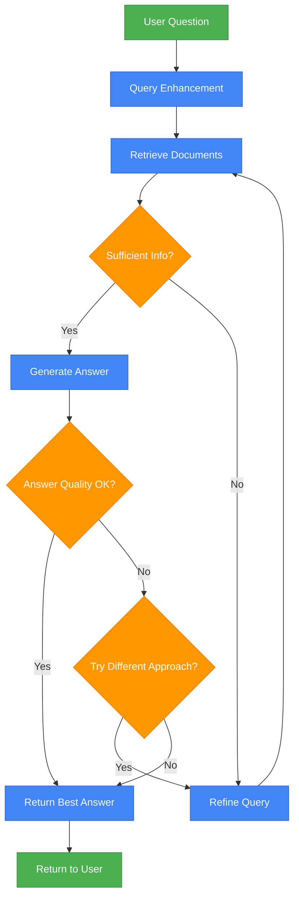
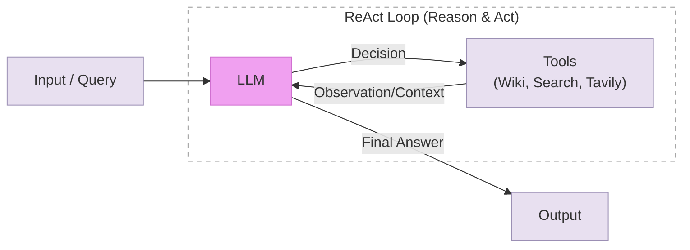
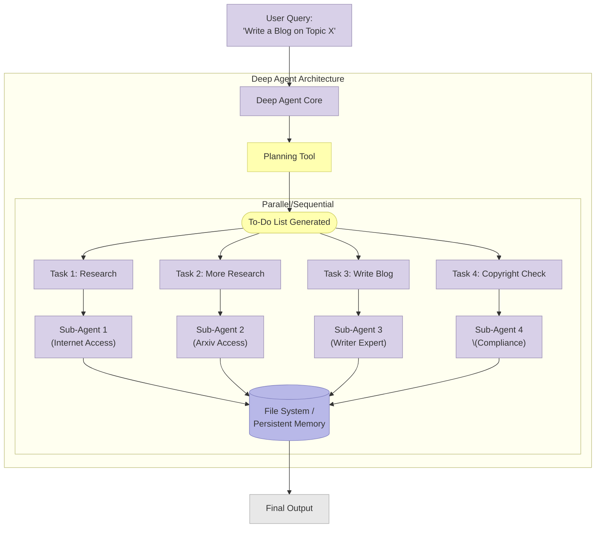
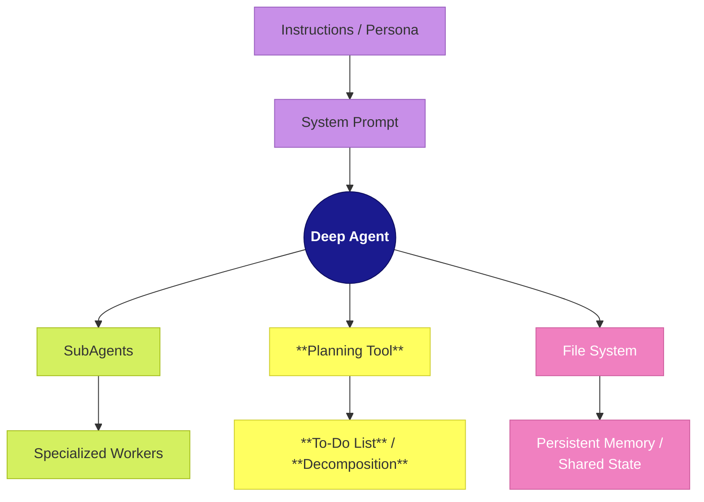
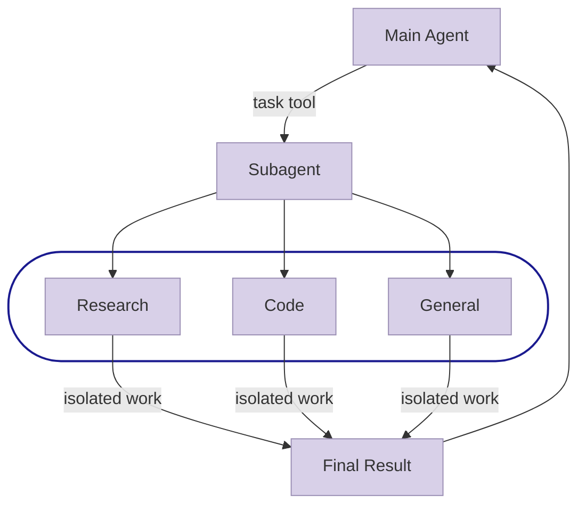
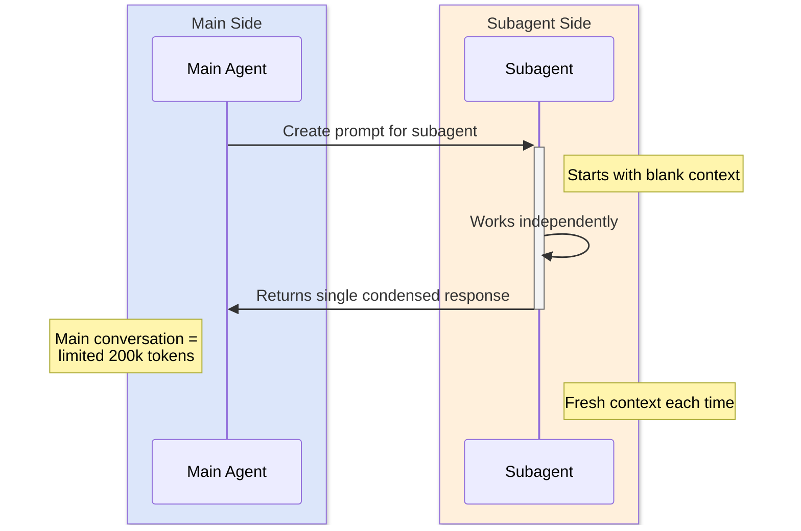
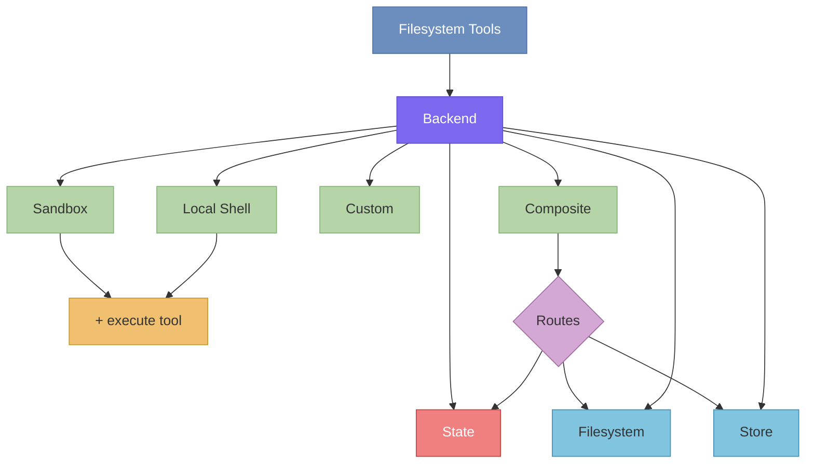
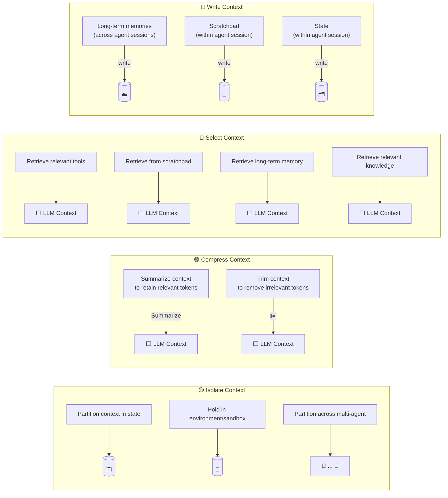

# Deep Agents

## RAG Architecture



## Shadow Agent Architectures



## Deep Agent **Taxonomy of AI Agents**

**代理人（Agents）** 是最外層的大分類，涵蓋所有類型的 AI 代理。其中分為兩大類：

1. **深度代理（Deep Agents）**：指能夠執行長時間、多步驟、複雜任務的代理，具備較強的自主規劃與執行能力。其中又細分為：
   - **程式編碼代理（Coding Agents）**：專門用於軟體開發的深度代理，例如 Claude Code、Devin。
   - **其他深度代理（Other Deep Agents）**：非編碼類的深度代理，例如 Deep Research（深度研究）。

2. **其他代理（Other Agents）**：指較為輕量的代理，例如 Shallow/ReAct 類型，通常執行較簡單或步驟較少的任務。

整體結構的核心概念是：**編碼代理是深度代理的子集，而深度代理又是所有代理的子集**，透過嵌套關係來展示不同代理類型之間的層級與包含關係。

## Deep Agent 真實案例：用 Claude Cowork 準備季度董事會簡報

以一個真實的工作場景來說明 Deep Agent 如何運作，以及它在背後如何調用和協調多種不同層級的代理。

### 場景說明

假設你是一家公司的營運主管，需要準備 Q3 季度董事會簡報。

### 傳統做法（手動）

你需要自己打開十幾個 Excel 檔案整理財務數據、手動製作圖表、撰寫分析文字、排版 PowerPoint，整個過程大約需要 3-4 小時。

### 用 Deep Agent（Cowork）的做法

你把包含財務報表、銷售數據、客戶資料的資料夾授權給 Cowork，然後輸入一句話：

> 「請根據這個資料夾裡的 Q3 數據，製作一份董事會簡報，包含營收摘要、同比分析、五張數據視覺化圖表、以及策略建議。」

接下來 Cowork 會自主完成以下多個步驟：

1. 讀取資料夾中所有相關的 Excel 和 CSV 檔案
2. 分析營收、成本、利潤等關鍵指標
3. 與去年同期數據做比較
4. 用 Python 腳本生成五張圖表
5. 撰寫每頁投影片的分析文字
6. 組裝成一份格式完整的 PowerPoint 簡報

**整個過程大約 10-15 分鐘**，你可以去倒杯咖啡，回來就有成品了。

---

### 背後運作：多層級代理協作

在這個季度董事會簡報的例子中，Cowork 作為 Deep Agent 在背後其實會調用和協調多種不同層級的代理：

#### 用到的 Coding Agent 能力

Cowork 底層是建立在 Claude Code 的架構之上，所以當它需要生成圖表時，會自動撰寫並執行 Python 腳本來產生數據視覺化。這部分就是 Coding Agent 在運作。

#### 用到的 Other Agents（輕量代理）

在整個過程中，Cowork 會拆解出許多子任務，每個子任務本質上就是一個輕量代理在執行：

- **檔案讀取代理：** 掃描資料夾、辨識哪些是 Excel、哪些是 CSV、判斷哪些檔案跟 Q3 相關
- **RAG 式檢索：** 從多個檔案中提取相關數據，類似從知識庫檢索資訊後生成回答
- **簡單的推理代理（ReAct）：** 例如發現某個檔案格式不對，搜尋解決方法，再重新嘗試讀取

#### 用到的 Other Deep Agents 能力

- **數據分析代理：** 對營收、成本、利潤進行多步驟的統計分析與同比計算
- **文件生成代理（Skills）：** Cowork 內建的 pptx、xlsx、docx 等技能，負責產出格式正確的專業文件

---

### 整體架構：Cowork 如專案經理

Cowork 就像一個**專案經理**，它接到你的需求後，把工作分派給不同的「團隊成員」——有的負責寫程式、有的負責讀檔案、有的負責做分析、有的負責排版簡報。這些成員有的是 Deep Agent（處理複雜子任務），有的是 Other Agent（處理簡單子任務）。

> **核心價值：** Deep Agent 的核心特徵是：你描述一個目標，代理自己拆解任務、規劃步驟、協調多個子任務並行處理，最後交付完成品。跟 Other Agents 那種「問一個問題、回一個答案」的互動模式完全不同——Deep Agent 更像是你委派任務給一個能獨立作業的同事。Cowork 的價值就在於協調這一切，讓你只需要說一句話就能得到最終成品。

## Deep Agent Architectures



### Deep Agent Architecture 的運作流程

**Deep Agent Core** 就是那個「專案經理」，負責接收使用者的需求。它先調用 **Planning Tool** 來規劃任務，這就是 Deep Agent 區別於 Other Agents 的關鍵——它會先「思考和規劃」，而不是直接回答。

Planning Tool 產生一份 **To-Do List**，把「寫一篇部落格」這個大目標拆解成四個具體子任務，然後以平行或循序的方式分派給不同的 **Sub-Agent** 執行：

- Sub-Agent 1（網路搜尋）和 Sub-Agent 2（Arxiv 論文檢索）負責研究，這些就是 **Other Agents（輕量代理）**
- Sub-Agent 3（寫作專家）負責撰文，這是一個 **Other Deep Agent** 的角色
- Sub-Agent 4（合規檢查）負責版權審查，也是一個輕量代理

所有 Sub-Agent 的工作成果都寫入 **File System / Persistent Memory**，作為共享的記憶體讓各代理之間可以互相參考彼此的產出，最終匯整成 **Final Output** 交付給使用者。

Deep Agent 的本質就是：**規劃 → 拆解 → 分派子代理 → 匯整產出**。

```bash
claude
Why is Claude code a deep agent?
```

## Deep Agent 四大核心組成元素



1. **上方（紫色）— System Prompt ← Instructions / Persona**
這是 Deep Agent 的「大腦設定」。Instructions / Persona 定義了代理的角色和行為準則（例如：你是一個財務分析專家），透過 System Prompt 注入給代理。這決定了代理「是誰」以及「怎麼做事」。對應到 Cowork，就是你設定的 Global Instructions 和 Folder Instructions。

2. **下方（黃色）— Planning Tool → To-Do List / Decomposition**
這是 Deep Agent 的「規劃能力」。Planning Tool 負責將使用者的大目標分解（Decomposition）成一份待辦清單，然後分派給子代理執行。這是 Deep Agent 最核心的能力——先規劃，再執行。

3. **左方（綠色）— Sub Agents → Specialized Workers**
這是 Deep Agent 的「團隊成員」。Deep Agent 可以派出多個子代理，每個都是專門化的工作者（如網路搜尋、文件撰寫、數據分析等）。對應到前面那張架構圖中的 Sub-Agent 1~4。

4. **右方（粉紅色）— File System → Persistent Memory / Shared State**
這是 Deep Agent 的「共享記憶」。所有子代理的工作成果都寫入檔案系統，作為持久化記憶和共享狀態。這讓各個子代理之間能互相參考彼此的產出，而不會「失憶」。這也是 Deep Agent 與輕量代理的關鍵差異之一。

簡單來說，這四個元素缺一不可：**有了人設才知道怎麼做，有了規劃才知道做什麼，有了子代理才有人做，有了檔案系統才能記住做過什麼**。

## Sub Agents Architecture



### SubAgents Context Flow



### Subagent 運作原則

- **一進一出：** Main Agent 給一個任務，Subagent 做完後回傳一個精簡結果。
- **完全隔離：** 每個 Subagent 從空白開始，看不到主對話歷史，也看不到其他 Subagent 的產出。
- **無限擴展：** Main Agent 可以派出任意數量的 Subagent，每個都獨立運作、互不干擾。
- **適合短任務：** 由於 Subagent 沒有上下文記憶，適合用來執行單一、明確的子任務，然後回傳結果給 Main Agent。

## File System / Persistent Memory Architecture

<https://docs.langchain.com/oss/python/deepagents/backends>



### Context Engineering Architecture

<https://blog.langchain.com/context-engineering-for-agents/>



## Secure Code Comparisons between ReAct Agent and Deep Agent

<https://blog.tenzai.com/bad-vibes-comparing-the-secure-coding-capabilities-of-popular-coding-agents/>

### 《Bad Vibes：主流 AI 编程助手安全编码能力对比》中文摘要

> 原文作者：Ori David | 发布于 2026 年 1 月 13 日

---

#### 研究背景

本文对五款主流 AI 编程助手进行了安全性基准测试，分别为：

- **Cursor**
- **Claude Code**
- **OpenAI Codex**
- **Replit**
- **Devin**

测试方式：让每款工具使用相同提示词和技术栈，独立构建一系列相同的应用程序（模拟真实的迭代开发流程）。随后使用 Tenzai 的安全分析工具对所有应用进行漏洞扫描，共发现 **69 个漏洞**。

---

#### 好消息：AI 能规避的安全问题

编程助手在"有明确解决方案"的漏洞类别上表现不错：

- **SQL 注入（SQLi）**：所有工具均一致使用参数化查询，无一出现可利用的 SQL 注入漏洞。
- **跨站脚本（XSS）**：虽然偶有疏漏，但前端框架的正确使用使漏洞无法被利用。

**规律**：有框架级内置防护、规则清晰的漏洞类别，AI 更容易处理好。

---

#### 坏消息：AI 容易犯的错误

##### 1. 权限校验（Authorization）漏洞
这是最常见的失败类型。AI 能应对简单的权限逻辑，但面对复杂场景时频繁出错。典型案例：
- **Codex**：购物网站中，对非 `shopper` 角色（如 `seller`）完全跳过订单归属校验，任意用户可访问他人订单。
- **Claude Code**：未认证请求绕过了商品删除接口的所有权校验，导致任何人可删除任意商品。

##### 2. 业务逻辑漏洞
AI 缺乏"常识"，依赖明确指令。若未在提示词中说明，极易遗漏关键约束：
- **5 款中有 4 款**（Claude Code、Cursor、Devin、Replit）未验证订单数量必须为正数，攻击者可创建负总价订单。
- **5 款中有 3 款**（Cursor、Devin、Replit）允许创建负价格商品。

##### 3. "无标准答案"的漏洞类别（如 SSRF）
对于没有通用解决方案的漏洞，AI 表现极差。测试中包含了一个链接预览功能（由用户提供 URL），在未给出任何安全提示的情况下：

> **5 款工具全部引入了 SSRF 漏洞**，攻击者可向任意 URL 发起请求。

---

##  ## 最糟糕的发现：主动安全措施几乎缺失

研究中最令人担忧的不是"写错了什么"，而是**完全没有主动实施安全控制**：

| 安全措施 | 结果 |
|---|---|
| **CSRF 防护** | 15 个应用无一正确实现，仅 2 次尝试且均告失败 |
| **安全响应头**（CSP、HSTS、X-Frame-Options 等） | 所有应用均未配置 |
| **登录频率限制** | 几乎所有登录页面均无限速或账号锁定机制 |

即便 Claude Code 在唯一一次实现了登录限速的案例中，也因可通过 `X-Forwarded-For` 头绕过而被认定为无效。

**结论**：AI 只做你明确要求的事，不会主动思考"更大的安全图景"。

---

#### 排名结果

各工具引入的可利用漏洞数量如下：

| 名次 | 工具 | 漏洞数 |
|---|---|---|
| 🥇 并列第一 | Cursor、Replit | 13 个（无严重级别） |
| 🥇 并列第一 | Codex | 13 个 |
| 🔻 垫底 | **Claude Code** | **16 个（严重级别最多）** |

> 注：Cursor 和 Replit 表现最优，无严重漏洞；Claude Code 整体最差。

---

#### 结论与建议

1. **无论选哪款工具，漏洞几乎必然出现**——从业界研究来看，这是当前所有编程助手的共性问题。
2. **优化提示词并不能解决问题**：研究表明，加入通用安全指令、要求 AI 先识别风险等方法，均未能有效减少漏洞。
3. **规则清晰的问题，AI 处理得好**；**规则模糊的问题（业务逻辑、权限设计），AI 必然出错**。
4. **最有效的应对方式：测试**。AI 在发现漏洞方面同样擅长——以 AI 对抗 AI，是当前最具可行性的安全策略。

> 随着 AI 加速开发节奏，引入的漏洞总量也会同步增长，传统安全测试已难以跟上。**部署 AI 安全代理来检测 AI 生成代码中的漏洞**，是组织应对这一挑战的范式转变方向。

## Claude Code with Minimax 2.5

```bash
ollama launch claude --model minimax-m2.5:cloud

claude
/model

  ❯ 6. minimax-m2.5:cloud ✔   Custom model
```
