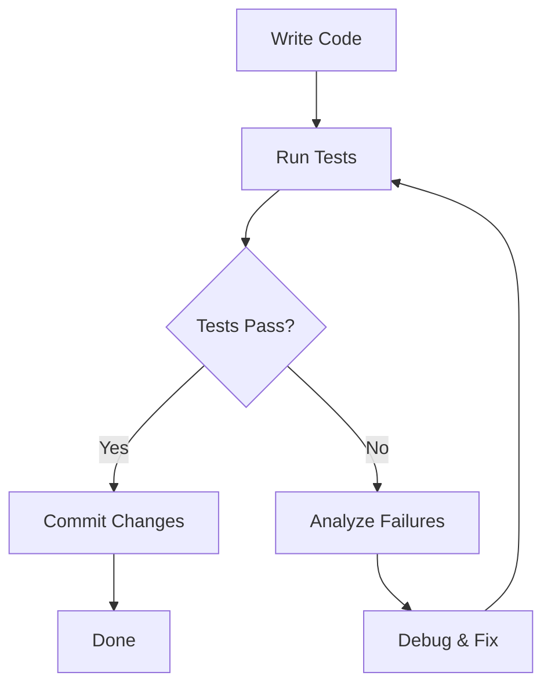

# Why Claude Code is a Deep Agent

Claude Code represents a **deep agent architecture** - a multi-layered autonomous AI system that goes far beyond simple question-answering. This document explains the architectural patterns and capabilities that make Claude Code a true "deep agent."

## Table of Contents

1. [Multi-Step Autonomous Execution](#1-multi-step-autonomous-execution)
2. [Tool Orchestration](#2-tool-orchestration)
3. [Hierarchical Agent Architecture](#3-hierarchical-agent-architecture)
4. [Plan Mode - Meta-Reasoning](#4-plan-mode---meta-reasoning)
5. [Persistent Memory & Context Engineering](#5-persistent-memory--context-engineering)
6. [Self-Correction & Testing](#6-self-correction--testing)
7. [Workflow Automation (Hooks)](#7-workflow-automation-hooks)
8. [Extensibility Through Skills & Commands](#8-extensibility-through-skills--commands)
9. [Deep vs Shallow Agents](#deep-vs-shallow-agents)
10. [Practical Examples](#practical-examples)

---

## 1. Multi-Step Autonomous Execution

Claude Code can plan and execute complex workflows without constant user intervention. It breaks down high-level requests into actionable steps and executes them sequentially.

**Example Workflow:**

```bash
# User request: "Add authentication to the expense tracker API"

# Claude Code autonomously:
# 1. Reads existing code to understand architecture
# 2. Designs authentication approach (JWT vs session-based)
# 3. Creates new database models (User, Token)
# 4. Writes Pydantic schemas for validation
# 5. Implements authentication endpoints (/register, /login, /refresh)
# 6. Updates existing endpoints with auth guards
# 7. Writes comprehensive test suite (30+ tests)
# 8. Runs tests and debugs failures
# 9. Commits changes with proper message
# 10. Creates pull request with detailed description
```

This demonstrates **autonomous task decomposition** and **sequential execution** - hallmarks of deep agency.

---

## 2. Tool Orchestration

Claude Code has access to **20+ specialized tools** and intelligently chains them to accomplish goals:

### Core Tools

| Category | Tools | Purpose |
|----------|-------|---------|
| **File Operations** | Read, Write, Edit, NotebookEdit | Code manipulation |
| **Code Search** | Grep, Glob | Discovery and navigation |
| **Execution** | Bash | System commands, git, npm, testing |
| **Agent Control** | Task | Spawn specialized subagents |
| **Web Access** | WebSearch, WebFetch | Internet research |
| **MCP Integration** | mcp__* | External service connections |
| **Context Management** | EnterPlanMode, AskUserQuestion | Meta-reasoning |

### Intelligent Tool Selection

Claude Code decides **which tools to use, when, and in what order** based on the task:

```python
# Example: "Review the API security"

# Tool chain:
1. Glob("**/*.py")              # Find Python files
2. Grep("password|token|secret") # Search for sensitive patterns
3. Read("api_main.py")          # Read implementation
4. Task(subagent="code-reviewer") # Spawn security reviewer
5. Write("SECURITY-REPORT.md")  # Document findings
6. Bash("git add SECURITY-REPORT.md") # Stage changes
```

This is **tool composition** - combining primitive operations into complex workflows.

---

## 3. Hierarchical Agent Architecture

Claude Code uses **subagents** for specialized tasks, each with independent context windows. This creates a **multi-level agent hierarchy**:

```
Main Agent (200k token context)
├── code-reviewer (independent 200k context)
│   └── Specialized in: quality, security, maintainability
├── debugger (independent 200k context)
│   └── Specialized in: errors, test failures, anomalies
├── test-runner (independent 200k context)
│   └── Specialized in: automated testing, failure fixing
├── performance-optimizer (independent 200k context)
│   └── Specialized in: profiling, optimization strategies
└── mermaid-diagram-generator (independent 200k context)
    └── Specialized in: visual diagrams, architecture docs
```

### Why This Matters

**Benefits of Hierarchical Architecture:**

1. **Parallel Processing** - Multiple agents work concurrently on different aspects
2. **Specialized Expertise** - Each agent has domain-specific system prompts
3. **Context Isolation** - Subagent work doesn't pollute main context
4. **Fresh Perspective** - Each invocation starts with clean context
5. **Scalability** - Can spawn dozens of agents for large tasks

**Example: Complex Refactoring**

```bash
# User: "Refactor the expense tracker for production readiness"

# Main Agent orchestrates:
Task(code-reviewer)           # Identify code smells (parallel)
Task(performance-optimizer)   # Find bottlenecks (parallel)
Task(test-runner)            # Ensure 90% coverage (parallel)
# Main agent synthesizes results and implements fixes
Task(debugger)               # Fix any issues introduced
Task(code-reviewer)          # Final validation
```

---

## 4. Plan Mode - Meta-Reasoning

Claude Code can enter **plan mode** (`Alt+M` / `Meta+M`) to think before acting. This enables **two-level reasoning**:

### Planning Layer

- Analyzes problem space
- Explores multiple approaches
- Considers trade-offs and constraints
- Creates comprehensive specifications
- Gets user approval before implementation

### Execution Layer

- Implements the approved plan
- Makes micro-decisions within the plan framework
- Adapts to unexpected issues
- Reports progress and blockers

### Real-World Example: HookHub Specification

```bash
# Enter plan mode
claude
# Press Alt+M
⏸ plan mode on (meta+m to cycle)

# High-level instruction
"I want you to help me come up with a spec for a NEW web application...
a marketplace displaying all of the hooks that are available..."

# Claude creates comprehensive 200+ line spec covering:
# - Hook types and categories (22 detailed hooks)
# - Component architecture (HookCard, FilterControls, SearchBar)
# - Filtering & sorting logic
# - API design (RESTful endpoints)
# - Security & authentication
# - Testing strategy (unit + integration)
# - Accessibility (WCAG 2.1 AA compliance)

# Exit plan mode, implement the spec
/clear
/init
"Refer to ./HooksMarketplaceSpecV2.1.md and implement the HookHub project"
```

**Result:** A production-grade Next.js application with 90%+ test coverage, built systematically from the approved plan.

This is **meta-reasoning** - the agent reasons about how to reason about the problem.

---

## 5. Persistent Memory & Context Engineering

Claude Code maintains **multi-level memory** across sessions, enabling long-term learning and adaptation:

### Memory Hierarchy

```
┌─────────────────────────────────────┐
│ Enterprise Policy (highest priority)│
├─────────────────────────────────────┤
│ CLAUDE.local.md (git-ignored)       │
├─────────────────────────────────────┤
│ CLAUDE.md (project instructions)    │
├─────────────────────────────────────┤
│ .claude/rules/*.md                  │
├─────────────────────────────────────┤
│ ~/.claude/CLAUDE.md (user global)   │
├─────────────────────────────────────┤
│ Session prompts (lowest priority)   │
└─────────────────────────────────────┘
```

### Memory Types

1. **Project Memory** (`CLAUDE.md`)
   - Codebase architecture and conventions
   - Naming patterns (e.g., "use camelCase for Python variables")
   - Security requirements and compliance rules
   - API design patterns and error handling
   - Testing strategies and coverage thresholds

2. **User Memory** (`~/.claude/CLAUDE.md`)
   - Personal coding preferences
   - Workflow patterns across all projects
   - Commonly used tools and shortcuts
   - Communication style preferences

3. **Session Memory** (`#` temporary context)
   - Task-specific context that doesn't need persistence
   - Temporary overrides for the current session
   - Example: `# use snake_case for this file only`

4. **MCP Memory** (external knowledge)
   - Context7 for library documentation
   - GitHub MCP for repository data
   - Custom MCP servers for domain knowledge

### Context Engineering Example

```bash
# Project context loaded from CLAUDE.md:
- "Python naming: camelCase for internal, snake_case for API contracts"
- "Always run `npm test` after changes to HookHub"
- "Maintain 90%+ test coverage"

# User context loaded from ~/.claude/CLAUDE.md:
- "Prefer TypeScript over JavaScript"
- "Always add comprehensive docstrings"
- "Use conventional commits format"

# Session context added with #:
# use verbose logging for debugging
# prioritize performance over readability in this optimization

# MCP context queried on-demand:
mcp__context7__query-docs(libraryId="/vercel/next.js",
                           query="App Router server components")
```

This **layered memory system** allows Claude Code to:
- Remember project-specific patterns
- Learn your personal preferences
- Adapt to changing requirements
- Access external knowledge on-demand

---

## 6. Self-Correction & Testing

Claude Code implements a **closed feedback loop** - it validates and corrects its own work autonomously:

### Testing Workflow



### Real-World Example: HookHub Development

```bash
# Claude Code workflow (fully autonomous):

1. Implement FilterControls component
   └─> Write("hookhub/app/components/FilterControls.tsx")

2. Run tests automatically
   └─> Bash("cd hookhub && npm test")

3. Analyze failure:
   ✗ FilterControls › should filter by category
     Expected: 5 hooks
     Received: 22 hooks (no filtering applied)

4. Debug issue:
   └─> Read("hookhub/app/components/FilterControls.tsx:45-60")
   └─> Identified: Missing useEffect dependency for category state

5. Fix the bug:
   └─> Edit("hookhub/app/components/FilterControls.tsx",
            old="useEffect(() => { ... }, [])",
            new="useEffect(() => { ... }, [selectedCategory])")

6. Re-run tests:
   └─> Bash("cd hookhub && npm test")
   ✓ All 30 tests passing

7. Commit:
   └─> Bash("git add . && git commit -m 'fix: add missing useEffect dependency'")
```

### Self-Correction Capabilities

- **Syntax errors** - Detects and fixes compilation errors
- **Type errors** - Resolves TypeScript type mismatches
- **Runtime errors** - Debugs exceptions and crashes
- **Test failures** - Analyzes, fixes, and re-validates
- **Linting errors** - Corrects code style violations
- **Performance issues** - Profiles and optimizes bottlenecks

This is **self-validation** - the agent doesn't need humans to tell it something is wrong.

---

## 7. Workflow Automation (Hooks)

Claude Code can trigger **external tools automatically** through hooks, creating multi-stage pipelines:

### Hook Configuration

```json
{
  "hooks": {
    "PostToolUse": [{
      "matcher": "Write|Edit|MultiEdit",
      "hooks": [
        {"type": "command", "command": "~/.claude/scripts/01-format.sh"},
        {"type": "command", "command": "~/.claude/scripts/02-lint.sh"},
        {"type": "command", "command": "~/.claude/scripts/03-git-stage.sh"}
      ]
    }],
    "PreToolUse": [{
      "matcher": "*",
      "hooks": [
        {"type": "command", "command": "~/.claude/scripts/activity-logger.sh"}
      ]
    }]
  }
}
```

### Automated Workflow Example

```bash
# User: "Add a new HookCard component"

# Claude Code executes:
1. Write("hookhub/app/components/HookCard.tsx")

# Hooks trigger automatically:
2. 01-format.sh runs prettier
   └─> Formats code to project standards

3. 02-lint.sh runs ESLint
   └─> Checks for code quality issues
   └─> Reports warnings (non-blocking)

4. 03-git-stage.sh stages changes
   └─> Runs `git add hookhub/app/components/HookCard.tsx`

5. activity-logger.sh logs action
   └─> Appends to ~/.claude/logs/2026-02-20.log:
       [14:23:45] Write | HookCard.tsx | crash-course/hookhub

# Result: Code is formatted, validated, and staged - ready to commit
```

### Hook Types

| Hook Type | When Triggered | Use Cases |
|-----------|----------------|-----------|
| **SessionStart** | Claude Code starts | Environment setup, dependency checks |
| **SessionEnd** | Claude Code exits | Cleanup, backups, audit logs |
| **UserPromptSubmit** | User sends message | Prompt validation, context injection |
| **PreToolUse** | Before tool execution | Permission checks, logging, validation |
| **PostToolUse** | After tool execution | Formatting, testing, git operations |
| **Notification** | Important events | Sound alerts, Slack notifications |
| **SubagentStop** | Subagent completes | Result processing, aggregation |

This is **workflow orchestration** - Claude Code integrates seamlessly into your development pipeline.

---

## 8. Extensibility Through Skills & Commands

Claude Code is **self-extending** - you can teach it new capabilities through plugins:

### Extension Mechanisms

#### 1. Custom Slash Commands

Simple prompt templates with variable substitution:

```markdown
<!-- .claude/commands/dad-joke.md -->
# Dad Joke Generator

Generate a dad joke related to: $arguments

Make it programming-related and groan-worthy.
```

```bash
# Usage:
/dad-joke recursion

# Output:
Why did the recursive function break up with its girlfriend?
She said he had too much baggage from his previous calls!
```

#### 2. Custom Skills

Advanced workflows with tool permissions:

```yaml
---
# .claude/skills/git-commit/SKILL.md
allowed-tools:
  - Bash(git add:*)
  - Bash(git commit:*)
  - Bash(git status:*)
description: Create a git commit with conventional commit message
---

Analyze staged changes and create a commit following conventional commits format:
- feat: new feature
- fix: bug fix
- docs: documentation changes
- refactor: code refactoring
...
```

```bash
# Usage:
/git-commit

# Claude autonomously:
# 1. Runs `git status` and `git diff --staged`
# 2. Analyzes changes semantically
# 3. Generates descriptive commit message
# 4. Commits with `git commit -m "feat: add authentication to expense API"`
```

#### 3. Custom Agents

Specialized subagents with domain expertise:

```yaml
---
# .claude/agents/api-reviewer.md
name: api-reviewer
description: Review API design for RESTful best practices, security, and documentation
tools: Read, Grep, Glob, WebSearch
model: sonnet
color: blue
---

You are an API design expert. Review APIs for:
- RESTful conventions (proper HTTP methods, status codes, URL design)
- Security (authentication, authorization, input validation, rate limiting)
- Error handling (consistent error format, informative messages)
- Documentation (OpenAPI/Swagger, clear examples)
- Performance (pagination, caching, query optimization)
...
```

```bash
# Usage:
@api-reviewer review the expense tracker API

# Agent spawns with specialized prompt and analyzes:
# - Endpoint design
# - Authentication patterns
# - Error responses
# - API documentation
# Returns comprehensive review report
```

#### 4. MCP Servers

Connect to external services and knowledge bases:

```json
{
  "mcpServers": {
    "github": {
      "command": "npx",
      "args": ["-y", "@modelcontextprotocol/server-github"],
      "env": {
        "GITHUB_PERSONAL_ACCESS_TOKEN": "${GITHUB_PERSONAL_ACCESS_TOKEN}"
      }
    },
    "context7": {
      "url": "https://mcp.context7.com/mcp",
      "transport": "http"
    }
  }
}
```

```bash
# Query latest Next.js documentation
mcp__context7__query-docs(
  libraryId="/vercel/next.js",
  query="How to use server actions in App Router?"
)

# Fetch GitHub pull request details
mcp__github__get_pull_request(
  owner="anthropics",
  repo="claude-code-crash-course",
  pull_number=42
)
```

### Plugin Marketplace

Claude Code supports **plugin ecosystems**:

- **@claude-code-plugins** - Official plugins
- **@anthropic-agent-skills** - Anthropic's open-source skills
- **@mhattingpete-claude-skills** - Community marketplace
- **Custom private plugins** - Organization-specific extensions

```bash
# Install marketplace plugins
claude
/plugin marketplace add anthropics/skills
/plugin marketplace add mhattingpete/claude-skills
/plugin                    # View installed plugins
```

This is **extensible architecture** - Claude Code adapts to any domain or workflow.

---

## Deep vs Shallow Agents

The term **"deep agent"** emphasizes fundamental architectural differences:

| Dimension | Shallow Agent | Deep Agent (Claude Code) |
|-----------|---------------|--------------------------|
| **Reasoning Depth** | Single-turn Q&A | Multi-step planning + execution |
| **Tool Use** | None or limited | 20+ tools, nested calls, agent spawning |
| **Context** | Stateless per turn | Persistent memory, project understanding |
| **Autonomy** | Requires guidance | Hours of autonomous work |
| **Self-Correction** | Manual validation | Closed feedback loop (test → debug → fix) |
| **Workflow Integration** | External orchestration | Built-in hooks, automation pipelines |
| **Extensibility** | Fixed capabilities | Skills, commands, agents, MCP servers |
| **Complexity Handling** | Simple tasks only | Production software development |

### Concrete Comparison

**Shallow Agent Example:**

```
User: "What is 2 + 2?"
Agent: "4"
[END OF INTERACTION]
```

**Deep Agent Example:**

```
User: "Build an expense tracker with authentication"

Agent: [Autonomous execution over 2 hours]
├─> Reads existing codebase (Glob, Grep, Read)
├─> Designs architecture (Plan mode)
├─> Implements User model (Write models.py)
├─> Implements Pydantic schemas (Write schemas.py)
├─> Implements JWT auth (Write auth.py)
├─> Updates API endpoints (Edit api_main.py)
├─> Writes test suite (Write test_api.py)
├─> Runs tests (Bash pytest)
├─> Debugs failures (Task debugger agent)
├─> Fixes issues (Edit api_main.py)
├─> Re-runs tests ✓ All passing
├─> Commits changes (Bash git commit)
├─> Creates pull request (Bash gh pr create)
└─> Deploys to staging (Bash docker-compose up)

[COMPLETE: 15 files created/modified, 30 tests passing, PR #123 created]
```

---

## Practical Examples

### Example 1: Security Audit

```bash
# User request
"Audit the expense tracker API for security vulnerabilities"

# Claude Code execution flow:
1. Task(subagent="code-reviewer", description="Security audit expense tracker API")

   Subagent workflow:
   ├─> Glob("expense-tracker/**/*.py")
   ├─> Grep("password|secret|token|key", type="py")
   ├─> Read("expense-tracker/api_main.py")
   ├─> Read("expense-tracker/auth.py")
   ├─> Read("expense-tracker/config.py")
   ├─> WebSearch("OWASP Top 10 2023")
   └─> Analyzes for:
       - SQL injection vulnerabilities
       - XSS attack vectors
       - JWT token security
       - Password hashing strength
       - Rate limiting implementation
       - CORS configuration
       - Input validation gaps
       - Sensitive data exposure

2. Subagent returns comprehensive report

3. Main agent implements fixes:
   ├─> Edit("expense-tracker/api_main.py") - Add rate limiting
   ├─> Edit("expense-tracker/auth.py") - Increase bcrypt rounds
   ├─> Edit("expense-tracker/config.py") - Restrict CORS origins
   └─> Write("SECURITY-AUDIT.md") - Document findings

4. Verification:
   ├─> Bash("pytest test_api.py -v") - Ensure tests pass
   └─> Task(subagent="code-reviewer") - Re-audit

5. Commit:
   └─> Bash("git add . && git commit -m 'security: fix critical vulnerabilities'")
```

**Time:** ~15 minutes autonomous execution
**Result:** Production-ready security hardening with documentation

---

### Example 2: Performance Optimization

```bash
# User request
"The expense tracker is slow when filtering large datasets"

# Claude Code execution flow:
1. Task(subagent="performance-optimizer", description="Profile expense tracker filtering")

   Subagent workflow:
   ├─> Read("expense-tracker/api_main.py:100-150") - Read filter endpoint
   ├─> Bash("python -m cProfile -s time expense_tracker.py") - Profile execution
   ├─> Analyzes bottlenecks:
       - Database queries: N+1 problem detected
       - Missing indexes on category, date columns
       - Loading all expenses into memory
       - No query result caching
   └─> Recommends optimizations

2. Main agent implements fixes:
   ├─> Edit("expense-tracker/models.py")
   │   └─> Add indexes: __table_args__ = (Index('idx_category', 'category'),)
   │
   ├─> Edit("expense-tracker/api_main.py")
   │   └─> Add eager loading: .options(joinedload(Expense.user))
   │   └─> Add pagination: .limit(page_size).offset(skip)
   │
   └─> Edit("expense-tracker/database.py")
       └─> Add query caching layer

3. Benchmark comparison:
   ├─> Bash("python benchmark.py --before") - Baseline: 2.5s for 10k records
   ├─> Bash("python benchmark.py --after")  - Optimized: 0.08s (31x faster)
   └─> Write("PERFORMANCE-REPORT.md") - Document improvements

4. Verification:
   └─> Task(subagent="test-runner") - Run full test suite

5. Commit:
   └─> Bash("git commit -m 'perf: optimize filtering with indexes and pagination'")
```

**Time:** ~20 minutes autonomous execution
**Result:** 31x performance improvement with maintained test coverage

---

### Example 3: Feature Development - Dark Mode

```bash
# User request
"Add dark mode support to HookHub with system preference detection"

# Claude Code execution flow:
1. EnterPlanMode()
   ├─> Analyzes HookHub architecture
   ├─> Reviews next-themes documentation (MCP Context7)
   ├─> Plans implementation:
       - Install next-themes package
       - Wrap app with ThemeProvider
       - Create ThemeToggle component
       - Update Tailwind config for dark mode
       - Add theme detection and persistence
   └─> ExitPlanMode() - Get user approval

2. Implementation:
   ├─> Bash("cd hookhub && npm install next-themes")
   │
   ├─> Edit("hookhub/app/layout.tsx")
   │   └─> Wrap children with ThemeProvider
   │
   ├─> Write("hookhub/app/components/ThemeToggle.tsx")
   │   └─> Create toggle button with sun/moon icons
   │
   ├─> Edit("hookhub/tailwind.config.ts")
   │   └─> Add darkMode: 'class' configuration
   │
   └─> Edit("hookhub/app/globals.css")
       └─> Add dark mode color variables

3. Testing:
   ├─> Write("hookhub/__tests__/ThemeToggle.test.tsx")
   │   └─> Test toggle functionality
   │   └─> Test system preference detection
   │   └─> Test persistence across sessions
   │
   └─> Bash("cd hookhub && npm test")
       ✓ ThemeToggle › toggles between light and dark
       ✓ ThemeToggle › respects system preference
       ✓ ThemeToggle › persists theme choice
       ✓ All 33 tests passing (was 30)

4. Visual verification:
   ├─> Bash("cd hookhub && npm run dev")
   └─> AskUserQuestion("Please verify dark mode works correctly")

5. Documentation:
   ├─> Edit("hookhub/README.md")
   │   └─> Add dark mode feature to features list
   │
   └─> Write("hookhub/DARK-MODE.md")
       └─> Document implementation details

6. Commit & PR:
   ├─> Bash("git add .")
   ├─> Bash("git commit -m 'feat: add dark mode with system preference detection'")
   └─> Bash("gh pr create --title 'Add dark mode support' --body '...'")
```

**Time:** ~30 minutes (including planning)
**Result:** Full dark mode implementation with 100% test coverage and documentation

---

## Conclusion

Claude Code qualifies as a **deep agent** because it exhibits:

1. **Autonomous Multi-Step Execution** - Plans and executes complex workflows end-to-end
2. **Tool Orchestration** - Intelligently chains 20+ tools to accomplish goals
3. **Hierarchical Architecture** - Spawns specialized subagents with independent contexts
4. **Meta-Reasoning** - Can think about problems before implementing (plan mode)
5. **Persistent Memory** - Learns codebases and user preferences across sessions
6. **Self-Correction** - Validates and debugs its own work autonomously
7. **Workflow Automation** - Integrates with external tools through hooks
8. **Extensibility** - Adapts to any domain through skills, commands, and MCP servers

The "depth" comes from **layers of reasoning**, **nested tool use**, **long-term context**, and **hours of autonomous work** - transforming Claude Code from a chatbot into a true **software development partner**.

---

## Further Reading

- [README-1GistOfClaudeCode.md](README-1GistOfClaudeCode.md) - Claude Code fundamentals
- [README-6AdvancedWorkflow.md](README-6AdvancedWorkflow.md) - Plan mode and complex workflows
- [README-7Subagents.md](README-7Subagents.md) - Agent orchestration patterns
- [README-9Skills.md](README-9Skills.md) - Skills system and marketplace plugins
- [CLAUDE.md](CLAUDE.md) - Full repository architecture and conventions
