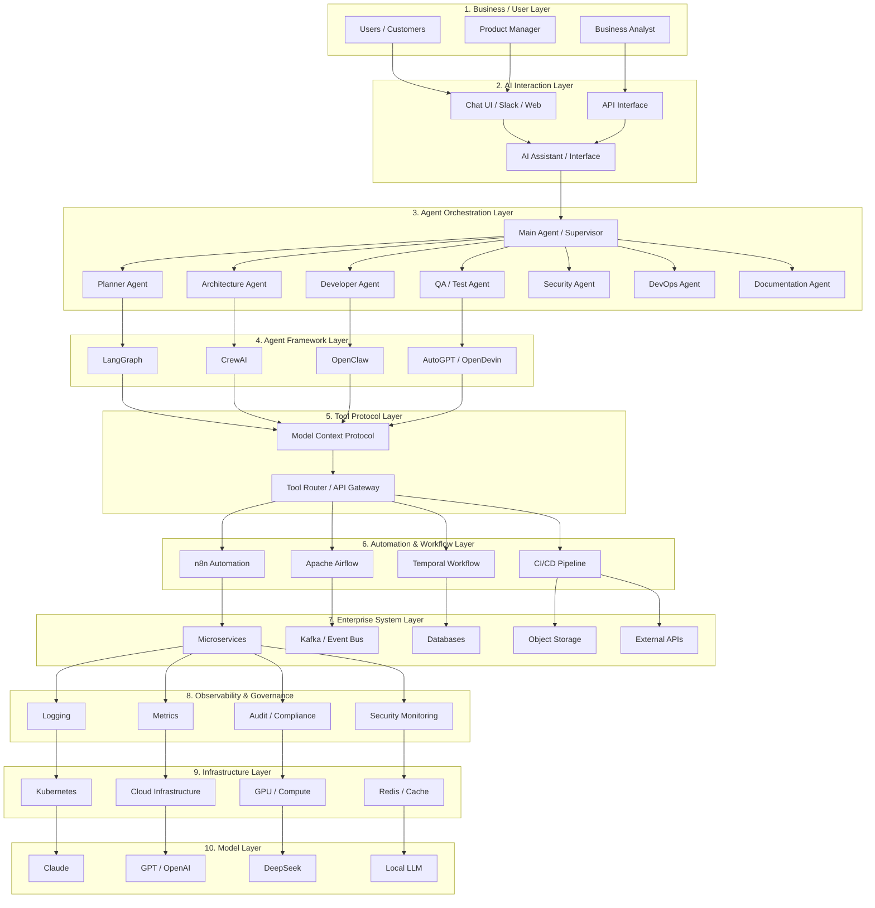
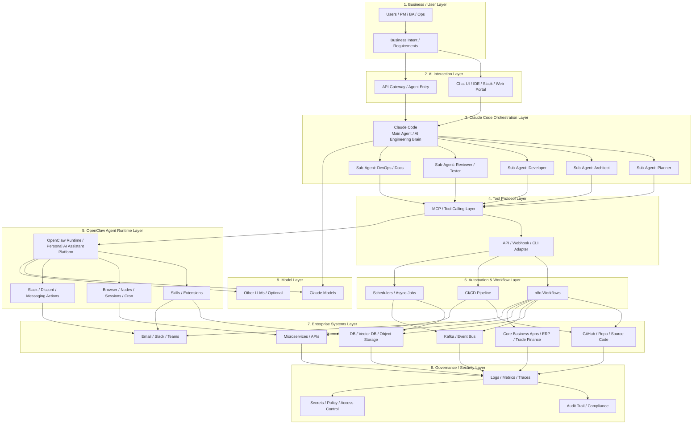

# AI Stages：從 Chatbot 到 Multi-Agent Systems

## **Claude Code 已原生支持啟動子代理（sub-agents）**

> **一個 AI Agent（主代理）可以自動建立並管理多個 AI 子代理，每個子代理負責不同任務，協同完成複雜工作。**

簡單說就是：

**AI 不再只是「一個助手」，而是可以「組建一個 AI 團隊」。**

---

### 一、什麼是 Sub-Agent（子代理）

**Sub-Agent = 專門負責某一任務的 AI Agent** 架構：

```md
User
  │
Main Agent (Claude Code)
  │
 ├── Sub-Agent 1 : Planner
 ├── Sub-Agent 2 : Developer
 ├── Sub-Agent 3 : Reviewer
 └── Sub-Agent 4 : Tester
```

每個 agent：

- 有自己的 **context**
- 有自己的 **工具**
- 有自己的 **任務**

---

### 二、以前 AI 的限制, 以前

```md
User → AI → Answer
```

或

```md
User → AI → Tool → Result
```

只有 **一個 AI**

所以遇到複雜任務：

```md
Build system
Review code
Write tests
Deploy
```

AI 的 context 很容易：

- 爆掉（context bloat）
- 混亂
- 推理能力下降

---

### 三、Sub-Agents 的做法

Claude Code 現在可以：**主代理自動 spawn agents**

例如：

```md
User: Build a REST API
```

Claude：

```md
1 Create planner agent
2 Create coding agent
3 Create test agent
4 Create review agent
```

然後流程：

```md
Planner → 設計架構
Developer → 寫 code
Reviewer → Code review
Tester → 生成 test
```

最後：

```md
Main agent → 整合結果
```

---

### 四、為什麼這很重要

因為複雜任務需要：

```md
專家分工
```

就像公司：

| 角色        | 工作   |
| --------- | ---- |
| Architect | 系統設計 |
| Developer | 寫程式  |
| QA        | 測試   |
| Security  | 安全審查 |

Sub-agents 就是：**AI 分工合作**

---

### 五、Claude Code 的 Sub-Agent 能做什麼

常見 AI team：

#### 1 Code team

```md
planner-agent
coder-agent
reviewer-agent
test-agent
```

---

#### 2 DevOps team

```md
infra-agent
docker-agent
k8s-agent
security-agent
```

---

#### 3 Product team

```md
product-agent
design-agent
ux-agent
doc-agent
```

---

### 六、舉例：修復漏洞

以前：

```md
AI → fix vulnerability
```

現在：

```md
Main Agent
   │
   ├─ Security Agent → 找漏洞
   ├─ Dev Agent → 修 code
   ├─ Review Agent → code review
   └─ Test Agent → regression test
```

這就是你之前提到的流程：

```md
Engineer → Review → Test → Fix
```

現在： **全部都是 AI agent**

---

### 七、為什麼文章會提到這件事

因為如果把：

```md
Claude Code sub-agents
+
MCP
+
n8n
```

組合起來：

AI 就可以：

```md
設計 workflow
建立 workflow
部署 workflow
測試 workflow
監控 workflow
```

變成：**AI 自動化架構師**

---

### 八、為什麼這是 AI 的重要里程碑

AI 發展的階段：

#### Stage 1

```md
Chatbot
```

#### Stage 2

```md
AI + Tools
```

#### Stage 3

```md
AI Agents
```

#### Stage 4

```md
Multi-Agent Systems
```

Claude Code 現在已經進入： **Stage 4**

---

### 九、為什麼企業很關注

因為它能做到：

```md
AI **team** instead of single AI
```

例如：以前：

```md
1 engineer
```

現在：

```md
AI Architect
AI Developer
AI Tester
AI DevOps
```

所以 productivity 可能：

```md
10x ~ 50x
```

---

這其實就是現在很多 AI 公司正在做的 **AI Software Factory**。

## AI Agents Architectures：從 Sub-Agents 到 Multi-Agent Systems



下面是一個 **2026 年典型 AI Agent 公司架構圖**（很多 AI-native 公司正在採用的結構）。
它描述的是 **從使用者需求 → AI Agents → 工具 → 自動化 → 企業系統 → 基礎模型** 的完整鏈條。

---

# 2026 AI Agent 公司架構圖（Mermaid）


---

## 各層的核心作用

### 1️⃣ Business / User Layer

需求來源：

- 客戶
- Product Manager
- Business Analyst

用自然語言描述需求，例如：

```md
建立一個付款處理 workflow
```

---

### 2️⃣ AI Interaction Layer

使用者與 AI 的入口：

- Chat UI
- Slack
- Web portal
- API

例如：

- AI Dev Assistant
- AI Ops Assistant

---

### 3️⃣ Agent Orchestration Layer

AI 代理團隊。

典型 AI team：

| Agent         | 角色     |
| ------------- | ------ |
| Planner       | 拆解任務   |
| Architect     | 設計系統   |
| Developer     | 寫 code |
| QA            | 測試     |
| Security      | 安全檢查   |
| DevOps        | 部署     |
| Documentation | 生成文件   |

這就是：**AI software team**

---

### 4️⃣ Agent Framework Layer

Agent orchestration 系統。

常見框架：

- LangGraph
- CrewAI
- OpenClaw
- AutoGPT

負責：

```md
task planning
memory
agent collaboration
```

---

### 5️⃣ Tool Protocol Layer

AI 操作工具的標準。

核心： **Model Context Protocol**

作用：

```md
AI → tools
```

例如：

```md
Claude → GitHub
Claude → n8n
Claude → DB
```

---

### 6️⃣ Automation / Workflow Layer

真正執行工作。

常見：

- n8n
- Airflow
- Temporal
- CI/CD

---

### 7️⃣ Enterprise System Layer

企業核心系統：

```md
microservices
Kafka
databases
core systems
```

例如：

- Core Banking
- Trade Finance
- Payment systems

---

### 8️⃣ Observability / Governance

企業必須要有：

```md
logs
metrics
audit
security monitoring
```

確保：

- SOC2
- compliance
- security

---

### 9️⃣ Infrastructure Layer

底層平台：

```md
Kubernetes
Cloud
GPU
Redis
```

---

### 🔟 Model Layer

AI 推理模型：

- Claude
- GPT
- DeepSeek
- Local LLM

---

### 這張圖最重要的核心概念

整個 AI 公司其實是：

```md
Human Intent
      ↓
AI Agents
      ↓
Tools
      ↓
Automation
      ↓
Enterprise Systems
```

也就是： **Intent → Execution**

---

### 為什麼這是 2026 公司架構

因為 AI 已經從：

```md
AI assistant
```

變成：

```md
AI workforce
```

公司內會有：

```md
AI developer
AI tester
AI architect
AI ops
```

---

### 這個架構與你目前研究的事情其實完全一致

你最近提到：

- Claude Code
- MCP
- n8n
- DevOps automation
- AI agents
- microservices / Kafka

其實就是這個 stack 的核心三層：

```md
Agent layer
Tool layer
Workflow layer
```

---

那其實是 **銀行軟體公司未來 5 年最可能的架構**。


