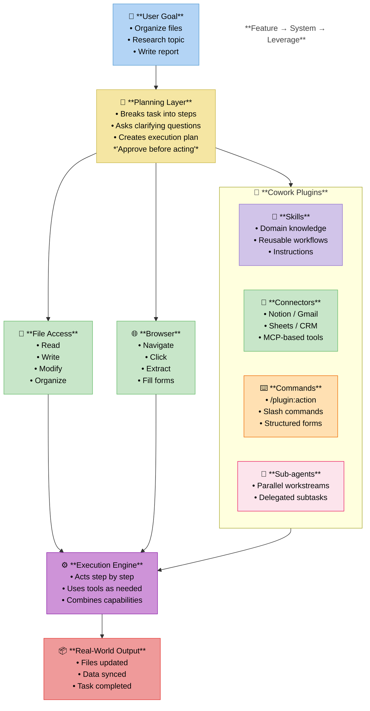
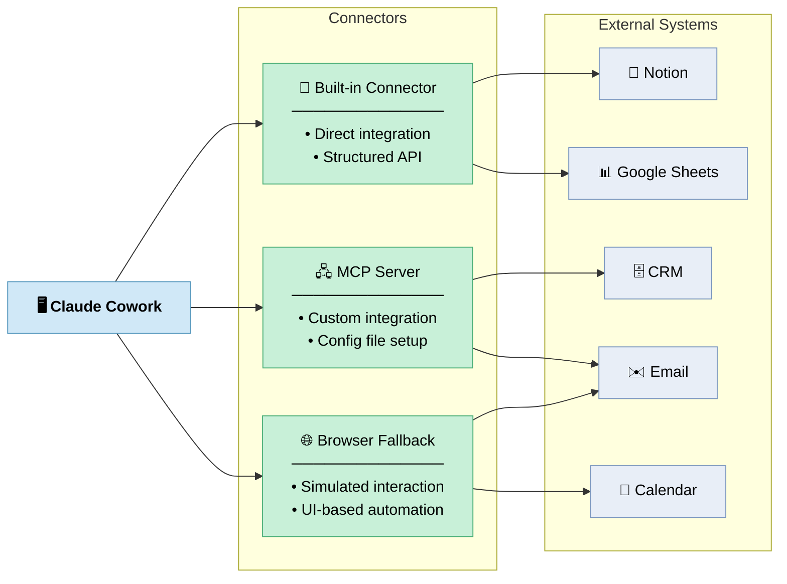
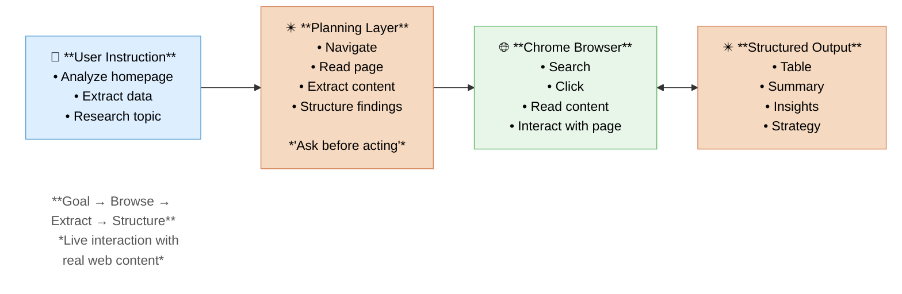
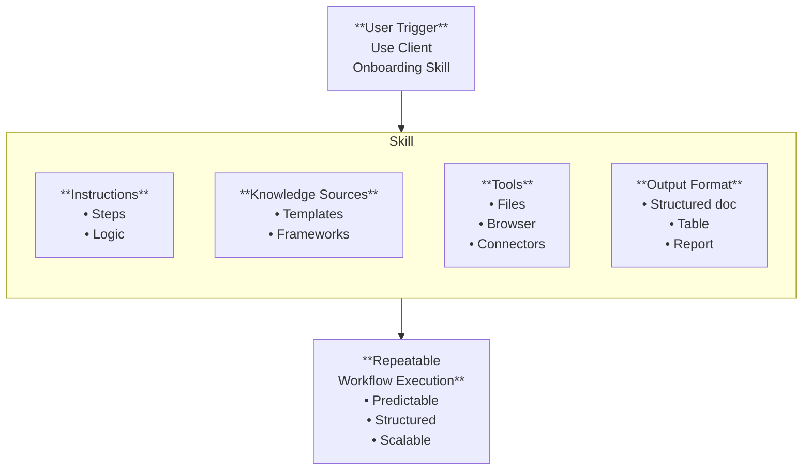

# Claude Cowork

## Claude Chrome Extension

- Claude
- Open Extensions in Chrome

```md
Go to the website: https://zapier.com
Analyze the homepage and extract:

1. Target audience
2. Core value proposition
3. Primary pain points addressed
4. Main call-to-action
5. Social proof elements used

Show your plan before navigating.
```

=> Click 'Approve plan'

```md
Go to my email on gmail, see the latest one in inbox and create a draft reply.
```

=> Click 'Approve plan'

## How Claude Cowork Works



## Cowork Connectors



```md
can you draft a reply on the latest one by searching via chrome all the latest AI news.
```

## Claude Code Browser Capabilities



## Claude Cowork Skills Architecture



```md
Use the canvas design skill to create a small canvas explaining claude ecosystem.
Please don't make it complex, keep it simple.
```

## Types of Claude Cowork Skills

<!DOCTYPE html>
<html lang="en">
<head>
<meta charset="UTF-8">
<style>
  body {
    font-family: 'Georgia', serif;
    background: #f9f9f9;
    display: flex;
    justify-content: center;
    padding: 40px 20px;
  }
  .container {
    max-width: 680px;
    width: 100%;
  }
  h1 {
    text-align: center;
    font-size: 2em;
    margin-bottom: 32px;
    color: #222;
    font-weight: 700;
  }
  .level {
    border-radius: 14px;
    padding: 22px 28px;
    margin-bottom: 24px;
    position: relative;
  }
  .level h2 {
    margin: 0 0 12px 0;
    font-size: 1.25em;
    font-weight: 700;
    color: #222;
  }
  .level-content {
    display: flex;
    justify-content: space-between;
    align-items: flex-start;
    gap: 20px;
  }
  .level ul {
    margin: 0;
    padding-left: 20px;
    color: #333;
    line-height: 1.8;
  }
  .level .tags {
    text-align: right;
    color: #444;
    font-size: 0.92em;
    line-height: 1.9;
    white-space: nowrap;
  }
  .caption {
    text-align: center;
    font-style: italic;
    color: #666;
    font-size: 0.88em;
    margin-top: -16px;
    margin-bottom: 20px;
  }

  /* Level colors */
  .level-1 { background-color: #f7b8b8; border: 2px solid #e88080; }
  .level-2 { background-color: #fde9b0; border: 2px solid #e0bb60; }
  .level-3 { background-color: #c9e8b0; border: 2px solid #7aba50; }
</style>
</head>
<body>

<div class="container">

  <h1>Types of Claude Cowork Skills</h1>

  <!-- Level 1 -->
  <div class="level level-1">
    <h2>Level 1 — Built-in Skills</h2>
    <div class="level-content">
      <ul>
        <li>Use directly</li>
        <li>Pre-configured</li>
        <li>Quick activation</li>
      </ul>
      <div class="tags">
        Canva<br>Docx<br>Slides<br>Browser
      </div>
    </div>
  </div>
  <p class="caption">Ready to use</p>

  <!-- Level 2 -->
  <div class="level level-2">
    <h2>Level 2 — Community Skills</h2>
    <div class="level-content">
      <ul>
        <li>Import from marketplace</li>
        <li>Uploaded skill files</li>
        <li>Pre-built workflows</li>
      </ul>
      <div class="tags">
        Skill marketplaces<br>Shared skill packs
      </div>
    </div>
  </div>
  <p class="caption">Extended capability</p>

  <!-- Level 3 -->
  <div class="level level-3">
    <h2>Level 3 — Custom Skills</h2>
    <div class="level-content">
      <ul>
        <li>Built from your workflow</li>
        <li>Uses your knowledge</li>
        <li>Repeatable process</li>
      </ul>
      <div class="tags">
        From chat process<br>From system prompts<br>From frameworks
      </div>
    </div>
  </div>
  <p class="caption">System-level automation</p>

</div>
</body>
</html>

---

### 🔴 Level 1 — Built-in Skills

> *Ready to use*

- Use directly
- Pre-configured
- Quick activation

**Examples:** Canva · Docx · Slides · Browser

---

### 🟡 Level 2 — Community Skills

<https://skillhub.club/>
<https://skillsmp.com/>

> *Extended capability*

- Import from marketplace
- Uploaded skill files
- Pre-built workflows

**Examples:** Skill marketplaces · Shared skill packs

---

### 🟢 Level 3 — Custom Skills

Cowork => Settings => Capabilities => Skills => Go to Customize =>

- Skills => '+' => Upload a skill
- Personal plugins => '+' => Browse plugins

> *System-level automation*

- Built from your workflow
- Uses your knowledge
- Repeatable process

**Examples:** From chat process · From system prompts · From frameworks

## **Sub-Agents（子代理）**

> **一個 AI Agent（主代理）可以自動建立並管理多個 AI 子代理，每個子代理負責不同任務，協同完成複雜工作。**

簡單說就是：

**AI 不再只是「一個助手」，而是可以「組建一個 AI 團隊」。**

---

### 一、什麼是 Sub-Agent（子代理）

**Sub-Agent = 專門負責某一任務的 AI Agent** 架構：

```md
User
  │
Main Agent (Claude Code)
  │
 ├── Sub-Agent 1 : Planner
 ├── Sub-Agent 2 : Developer
 ├── Sub-Agent 3 : Reviewer
 └── Sub-Agent 4 : Tester
```

每個 agent：

- 有自己的 **context**
- 有自己的 **工具**
- 有自己的 **任務**

---

### 二、以前 AI 的限制, 以前

```md
User → AI → Answer
```

或

```md
User → AI → Tool → Result
```

只有 **一個 AI**

所以遇到複雜任務：

```md
Build system
Review code
Write tests
Deploy
```

AI 的 context 很容易：

- 爆掉（context bloat）
- 混亂
- 推理能力下降

---

### 三、Sub-Agents 的做法

Claude Code 現在可以：**主代理自動 spawn agents**

例如：

```md
User: Build a REST API
```

Claude：

```md
1 Create planner agent
2 Create coding agent
3 Create test agent
4 Create review agent
```

然後流程：

```md
Planner → 設計架構
Developer → 寫 code
Reviewer → Code review
Tester → 生成 test
```

最後：

```md
Main agent → 整合結果
```

---

### 四、為什麼這很重要

因為複雜任務需要：

```md
專家分工
```

就像公司：

| 角色        | 工作   |
| --------- | ---- |
| Architect | 系統設計 |
| Developer | 寫程式  |
| QA        | 測試   |
| Security  | 安全審查 |

Sub-agents 就是：**AI 分工合作**

---

### 五、Claude Code 的 Sub-Agent 能做什麼

常見 AI team：

#### 1 Code team

```md
planner-agent
coder-agent
reviewer-agent
test-agent
```

---

#### 2 DevOps team

```md
infra-agent
docker-agent
k8s-agent
security-agent
```

---

#### 3 Product team

```md
product-agent
design-agent
ux-agent
doc-agent
```

---

### 六、舉例：修復漏洞

以前：

```md
AI → fix vulnerability
```

現在：

```md
Main Agent
   │
   ├─ Security Agent → 找漏洞
   ├─ Dev Agent → 修 code
   ├─ Review Agent → code review
   └─ Test Agent → regression test
```

這就是你之前提到的流程：

```md
Engineer → Review → Test → Fix
```

現在： **全部都是 AI agent**

---

### 七、為什麼文章會提到這件事

因為如果把：

```md
Claude Code sub-agents
+
MCP
+
n8n
```

組合起來：

AI 就可以：

```md
設計 workflow
建立 workflow
部署 workflow
測試 workflow
監控 workflow
```

變成：**AI 自動化架構師**

---

### 八、為什麼這是 AI 的重要里程碑

AI 發展的階段：

#### Stage 1

```md
Chatbot
```

#### Stage 2

```md
AI + Tools
```

#### Stage 3

```md
AI Agents
```

#### Stage 4

```md
Multi-Agent Systems
```

Claude Code 現在已經進入： **Stage 4**

---

### 九、為什麼企業很關注

因為它能做到：

```md
AI **team** instead of single AI
```

例如：以前：

```md
1 engineer
```

現在：

```md
AI Architect
AI Developer
AI Tester
AI DevOps
```

所以 productivity 可能：

```md
10x ~ 50x
```

---

這其實就是現在很多 AI 公司正在做的 **AI Software Factory**。
