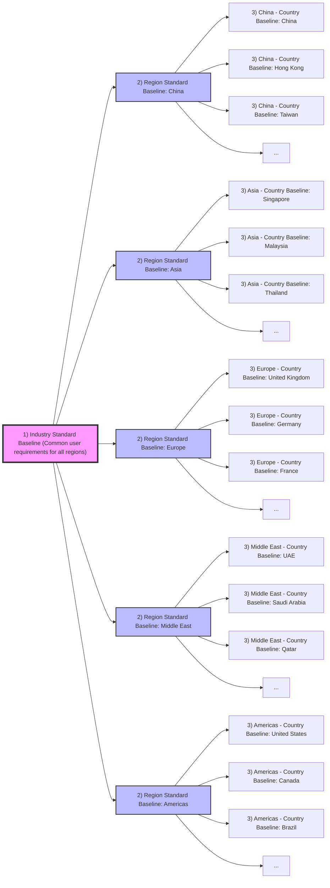
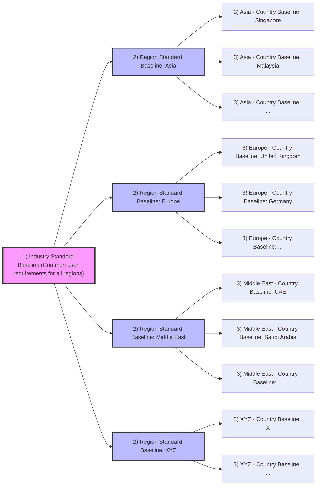
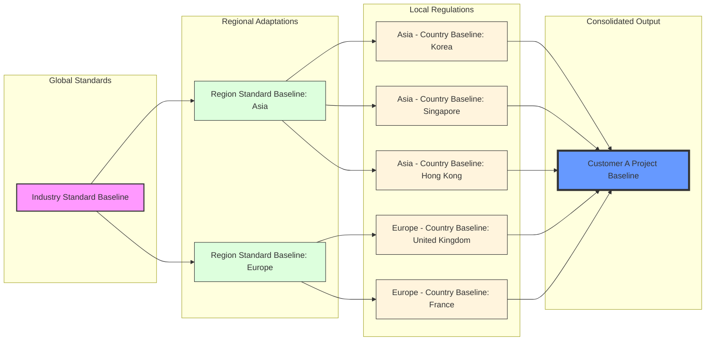

# Baseline Architecture

## By Industry Standard/Regions Standard/Region's Countries Standard

```mermaid
graph LR
    A["1) Industry Standard Baseline (Common user requirements for all regions)"]

    A --> R1["2) Region Standard Baseline: China"]
    A --> R2["2) Region Standard Baseline: Asia"]
    A --> R3["2) Region Standard Baseline: Europe"]
    A --> R4["2) Region Standard Baseline: Middle East"]
    A --> R5["2) Region Standard Baseline: Americas"]

    R1 --> CN1["3) China - Country Baseline: China"]
    R1 --> CN2["3) China - Country Baseline: Hong Kong"]
    R1 --> CN3["3) China - Country Baseline: Taiwan"]
    R1 --> CNX["..."]

    R2 --> AS1["3) Asia - Country Baseline: Singapore"]
    R2 --> AS2["3) Asia - Country Baseline: Malaysia"]
    R2 --> AS3["3) Asia - Country Baseline: Thailand"]
    R2 --> ASX["..."]

    R3 --> EU1["3) Europe - Country Baseline: United Kingdom"]
    R3 --> EU2["3) Europe - Country Baseline: Germany"]
    R3 --> EU3["3) Europe - Country Baseline: France"]
    R3 --> EUX["..."]

    R4 --> ME1["3) Middle East - Country Baseline: UAE"]
    R4 --> ME2["3) Middle East - Country Baseline: Saudi Arabia"]
    R4 --> ME3["3) Middle East - Country Baseline: Qatar"]
    R4 --> MEX["..."]

    R5 --> AM1["3) Americas - Country Baseline: United States"]
    R5 --> AM2["3) Americas - Country Baseline: Canada"]
    R5 --> AM3["3) Americas - Country Baseline: Brazil"]
    R5 --> AMX["..."]

    style A fill:#f9f,stroke:#333,stroke-width:4px
    style R1 fill:#bbf,stroke:#333,stroke-width:2px
    style R2 fill:#bbf,stroke:#333,stroke-width:2px
    style R3 fill:#bbf,stroke:#333,stroke-width:2px
    style R4 fill:#bbf,stroke:#333,stroke-width:2px
    style R5 fill:#bbf,stroke:#333,stroke-width:2px

```

### Simplified Version (Without China and Americas)

```mermaid
graph LR
    A["1) Industry Standard Baseline (Common user requirements for all regions)"]

    A --> R2["2) Region Standard Baseline: Asia"]
    A --> R3["2) Region Standard Baseline: Europe"]
    A --> R4["2) Region Standard Baseline: Middle East"]
    A --> R5["2) Region Standard Baseline: XYZ"]

    R2 --> AS1["3) Asia - Country Baseline: Singapore"]
    R2 --> AS2["3) Asia - Country Baseline: Malaysia"]
    R2 --> ASX["3) Asia - Country Baseline: ..."]

    R3 --> EU1["3) Europe - Country Baseline: United Kingdom"]
    R3 --> EU2["3) Europe - Country Baseline: Germany"]
    R3 --> EUX["3) Europe - Country Baseline: ..."]

    R4 --> ME1["3) Middle East - Country Baseline: UAE"]
    R4 --> ME2["3) Middle East - Country Baseline: Saudi Arabia"]
    R4 --> MEX["3) Middle East - Country Baseline: ..."]

    R5 --> XY1["3) XYZ - Country Baseline: X"]
    R5 --> XYX["3) XYZ - Country Baseline: ..."]    

    style A fill:#f9f,stroke:#333,stroke-width:4px
    style R2 fill:#bbf,stroke:#333,stroke-width:2px
    style R3 fill:#bbf,stroke:#333,stroke-width:2px
    style R4 fill:#bbf,stroke:#333,stroke-width:2px
    style R5 fill:#bbf,stroke:#333,stroke-width:2px
```

## Customer Example

```mermaid
graph LR
    subgraph IndustryLevel [Global Standards]
        A[Industry Standard Baseline]
    end

    subgraph RegionalLevel [Regional Adaptations]
        R2[Region Standard Baseline: Asia]
        R3[Region Standard Baseline: Europe]
    end

    subgraph CountryLevel [Local Regulations]
        AS1[Asia - Country Baseline: Korea]
        AS2[Asia - Country Baseline: Singapore]
        AS3[Asia - Country Baseline: Hong Kong]
        EU1[Europe - Country Baseline: United Kingdom]
        EU2[Europe - Country Baseline: France]
    end

    subgraph ProjectLevel [Consolidated Output]
        P[Customer A Project Baseline]
    end

    A --> R2
    A --> R3

    R2 --> AS1
    R2 --> AS2
    R2 --> AS3

    R3 --> EU1
    R3 --> EU2

    AS1 --> P
    AS2 --> P
    AS3 --> P
    EU1 --> P
    EU2 --> P

    style A fill:#f9f,stroke:#333,stroke-width:2px
    style P fill:#69f,stroke:#333,stroke-width:4px
    style R2 fill:#dfd,stroke:#333
    style R3 fill:#dfd,stroke:#333
    style AS1 fill:#fff4dd,stroke:#333
    style AS2 fill:#fff4dd,stroke:#333
    style AS3 fill:#fff4dd,stroke:#333
    style EU1 fill:#fff4dd,stroke:#333
    style EU2 fill:#fff4dd,stroke:#333

```
