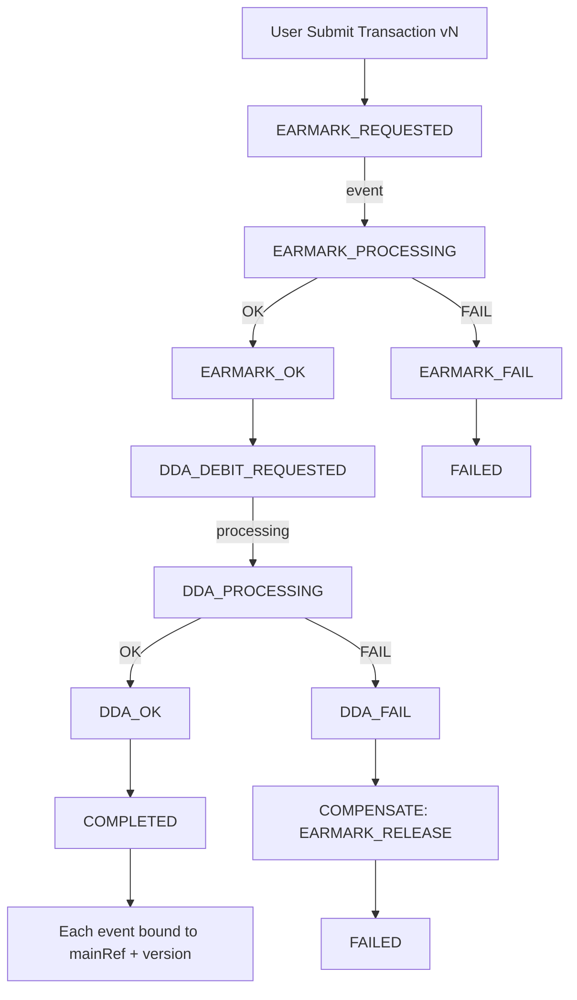

# 把 Java EE（原本用 JMS/MQ）改成 Kafka ，保證交易一致性

**如何在「假同步 + 非同步處理」下仍然保證交易一致性（transactional consistency）**

Kafka 的模型跟傳統 MQ/JMS 差很多，所以要特別注意幾個點與設計模式。

> 💡 **文檔目的**：本文檔專為從傳統 JMS/MQ 架構遷移到 Kafka 的團隊設計，特別關注金融交易系統（如 Trade Finance）中的一致性保證。重點涵蓋實戰中最常見的坑與可落地的標準解法。

---

## 目錄

- [零、先把「一致性期待」講清楚](#零先把一致性期待講清楚)
- [一、從 JMS → Kafka 最大的差異](#一從-jms--kafka-最大的差異先抓住)
- [二、交易一致性要注意的關鍵事項](#二交易一致性要注意的關鍵事項)
- [三、推薦可遵循的設計模式](#三推薦可遵循的設計模式最常用也最穩)
- [四、常見安全做法](#四常見安全做法)
- [五、針對 Trade Finance / 扣帳 EARMARK 類場景的建議](#五針對-trade-finance--扣帳-earmark-類場景的建議)
- [六、最小可落地的「必做清單」](#六最小可落地的必做清單)
- [七、監控與可觀測性](#七監控與可觀測性production-ready-必備)
- [八、測試策略](#八測試策略從-jms-遷移到-kafka-必須改變測試思維)
- [九、從 JMS 遷移到 Kafka 的實戰路線圖](#九從-jms-遷移到-kafka-的實戰路線圖)
- [十、快速參考指南](#十快速參考指南quick-reference)
- [十一、事件驅動交易一致性設計的核心難題區](#十一事件驅動交易一致性設計的核心難題區)
- [十二、Kafka Saga 交易引擎標準藍圖](#十二kafka-saga-交易引擎標準藍圖)
- [十三、Timeout / 卡單治理](#十三timeout--卡單治理必備)
- [十四、對帳與稽核 Reconciliation](#十四對帳與稽核-reconciliation金融必備)
- [十五、DLQ 分類與處置策略](#十五dlq-分類與處置策略避免把-dlq-當垃圾桶)

---

## 零、先把「一致性期待」講清楚

Kafka 遷移最大的踩坑不是技術，而是「期待錯誤」。

### 0.1 Consistency Guarantee Model（建議寫進架構規範）

| Layer        | Guarantee                | 說明                                            |
| ------------ | ------------------------ | ----------------------------------------------- |
| Kafka broker | At-least-once            | 重複/重播一定會發生                             |
| Application  | Exactly-once effect      | 靠冪等 + 去重 + Inbox/Outbox 達成「效果上一次」 |
| Business     | Eventual consistency     | 允許延遲，需可追溯、可補償                      |
| Financial    | Zero double/missing debit| 不能重複扣款、不能漏扣，必要時人工介入          |

> ✅ **結論**：Kafka 不是 XA；金融一致性來自「設計 + 稽核 + 對帳」，不是 broker 魔法。

### 0.2 Event Immutability（強制規範，避免 replay 爆帳）

Once published, an event is **immutable**.

❌ 禁止：

- 修改既有事件語意（同 eventType 卻換業務含義）
- 回補歷史事件 payload
- 用「重送舊事件」當修正手段

✅ 正確方式：

- 發送 **新事件**（新的 eventType / 新 schema version）
- 用 **補償事件** 修正結果
- 如需修正資料：走「新版本交易」或「補正事件」

---

## 一、從 JMS → Kafka 最大的差異（先抓住）

### 1. Kafka 是 log / stream

同一筆訊息可能被重播（replay），所以消費端必須**可重入/冪等**。

> 📝 **實戰提示**：與 JMS 的「消費後即刪」不同，Kafka 訊息會保留（預設 7 天），允許多次消費和重播。這對災難恢復有利，但要求所有消費邏輯必須冪等。

### 2. Kafka 沒有 JMS 那種 per-message broker transaction 語意

你可以做到 exactly-once 的「producer→topic→consumer offset」層面，但**跨 DB 的一致性仍要靠設計**。

> 📝 **關鍵理解**：JMS 可以把訊息接收和資料庫更新放在同一 XA transaction 中，Kafka 不行。這是架構設計最大的改變點。

### 3. 順序是 partition 級

同一筆交易相關事件一定要落在同一 partition（靠 key），不然順序會亂。

> ⚡ **效能考量**：合理的 partition key 設計不僅保證順序，也影響吞吐量。建議使用業務主鍵（mainRef）而非隨機值，但要避免熱點 partition（某些 key 過度集中）。

✅ **規範**：Partition key **必須**使用 `mainRef/dealNo`（禁止 random UUID）。

### 4. 消費語意通常是 at-least-once

所以「重複處理」一定會發生，設計要能扛。

> 📝 **Exactly-once 誤區**：Kafka 的 exactly-once 僅限於 Kafka 生態內（producer → broker → consumer offset），不包括外部系統（DB、API）。對外部系統的寫入必須靠應用層冪等設計。

---

## 二、交易一致性要注意的關鍵事項

### 2.1 冪等（Idempotency）是第一優先

**必備要素**：

- 每個事件一定要有 **eventId / businessKey（例如 mainRef、dealNo）**
- 消費端要做「去重/防重」：
  - DB 建一張 `processed_events(event_id unique, processed_at, status...)`
  - 或在業務表加 unique constraint（例如同一 mainRef 的同一動作只能成功一次）

✅ 這是 Kafka 世界最重要的保命設計。

#### 💡 實作範例：去重表設計

```sql
CREATE TABLE processed_events (
  event_id VARCHAR(50) PRIMARY KEY,        -- UUID 或業務流水號
  aggregate_id VARCHAR(50) NOT NULL,       -- mainRef/dealNo，方便查詢
  event_type VARCHAR(50) NOT NULL,         -- EARMARK_OK, DDA_DEBIT 等
  processed_at TIMESTAMP DEFAULT NOW(),
  status VARCHAR(20),                      -- SUCCESS, FAILED, PROCESSING
  retry_count INT DEFAULT 0,
  error_message TEXT,
  INDEX idx_aggregate (aggregate_id, event_type)
);
```

#### 處理邏輯

```java
// 先嘗試插入去重記錄（atomic check-and-set）
try {
    insertProcessedEvent(eventId, mainRef, eventType);
    // 插入成功，執行業務邏輯
    processBusinessLogic(event);
    updateEventStatus(eventId, "SUCCESS");
} catch (DuplicateKeyException e) {
    // 重複事件，直接忽略或檢查狀態
    log.info("Duplicate event {}, skipping", eventId);
}
```

⚠️ **注意**：插入去重表和業務處理必須在同一 DB transaction 中，否則可能出現「已去重但業務未處理」的問題。

---

### 2.2 Partition Key 決定順序與一致性邊界

同一交易（同一筆 LC / 同一筆付款 / 同一個 mainRef）的所有事件：

- producer 必須用 **同一個 key**（例如 `mainRef`）
- 確保都進同一 partition → 才能保序

⚠️ 如果 key 亂用，你會看到「先扣帳後驗額度」這種災難。

---

### 2.3 DB 更新與 Kafka 發事件不能用「兩段式幻想」

**典型錯誤**：

- 先 update DB
- 再 send Kafka
- 中間任何一步失敗就不一致（DB 成功但事件沒發 / 事件發了但 DB rollback）

✅ 解法是「**Outbox Pattern**」（下面會講）

---

### 2.4 消費端 commit offset 的時機

**錯誤做法**：

- 先 commit offset
- 再寫 DB / 呼叫外部系統
  → 失敗時訊息不會再來，資料漏掉

**✅ 正確做法**：

- **先處理成功（DB commit / side-effect done）**
- 再 commit offset（或用 transactional consume 處理）

#### 💡 三種 Offset Commit 策略比較

1. **策略一：Auto Commit（❌ 不推薦生產環境）**

```properties
enable.auto.commit=true
auto.commit.interval.ms=5000
```

- Kafka 每 5 秒自動 commit offset
- **問題**：消費到訊息但處理失敗，offset 已提交，訊息遺失

2. **策略二：Manual Commit After Processing（✅ 推薦）**

```java
@KafkaListener(topics = "earmark-events")
public void consume(ConsumerRecord<String, Event> record,
                    Acknowledgment ack) {
    try {
        // 1. 先處理業務邏輯（含 DB commit）
        processEvent(record.value());

        // 2. 業務成功後才 commit offset
        ack.acknowledge();
    } catch (Exception e) {
        // 失敗不 commit，下次重新消費
        log.error("Processing failed, will retry", e);
        // 可選：達到重試上限後送 DLQ
    }
}
```

3. **策略三：Exactly-Once with Kafka Transactions（⚡ 最強但複雜）**

```java
// Producer 端啟用事務
props.put("transactional.id", "my-transactional-id");

// Consumer 端
props.put("isolation.level", "read_committed");

// 在一個 transaction 中：consume → process → produce → commit offset
kafkaTemplate.executeInTransaction(ops -> {
    ConsumerRecords<String, Event> records = consumer.poll(Duration.ofMillis(100));
    for (ConsumerRecord<String, Event> record : records) {
        processEvent(record.value());
        // 發送結果事件
        ops.send("result-topic", resultEvent);
    }
    // commit offset 也在 transaction 中
    consumer.commitSync();
});
```

**選擇建議**：

- 一般應用：策略二 **（Manual Commit）+ 冪等設計**
- 金融核心：策略二 ✅ + **Outbox/Inbox 模式**（最可靠）
- Kafka-to-Kafka 管道：策略三（純 Kafka 生態內 exactly-once）

⚠️ **重要**：即使用 exactly-once transaction，對外部系統（DB、API）的寫入仍要靠冪等設計保證。

---

### 2.5 事件版本與 Schema 演進

Kafka 事件一旦發出去會被重播、留存很久：

- event schema 要有 `version`
- 盡量 backward compatible（加欄位可以，改語意要小心）
- 建議搭配 Schema Registry（Avro/Protobuf/JSON Schema）

---

### 2.6 Version Gatekeeper（強制：集中化，不可散落各服務）

在 consumer 寫 DB 前必須做版本守門，且應該做成共用框架/攔截器，避免漏做。

**規則：**

```text
if event.version < current.version → ignore（或轉補償/記錄）
if event.version > current.version → error（表示資料不同步/缺事件）
if event.version == current.version → process
```

---

## 三、推薦可遵循的設計模式（最常用也最穩）

### 3.1 Transactional Outbox Pattern（最推薦）

**目的：保證 DB 狀態改了，就一定會有事件；事件發了就對應 DB 狀態。**

**做法**：

1. 業務交易內：更新業務表 + 插入 outbox 表（同一個 DB transaction）
2. Outbox publisher（背景程序/CDC）把 outbox 事件發到 Kafka
3. 發送成功後標記 outbox 已發送

**優點**：

- 不用 2PC（兩階段提交）
- 最能穩定落地在 Java EE/傳統系統

#### 💡 實作細節：Outbox Publisher 有兩種常見方式

**方式一：Polling Publisher（簡單可靠）**

```java
@Scheduled(fixedDelay = 1000)  // 每秒執行一次
public void publishOutboxEvents() {
    List<OutboxEvent> events = outboxRepo.findByStatus("NEW", limit=100);

    for (OutboxEvent event : events) {
        try {
            kafkaTemplate.send(event.getTopic(), event.getKey(), event.getPayload());
            outboxRepo.updateStatus(event.getId(), "SENT");
        } catch (Exception e) {
            outboxRepo.incrementRetry(event.getId());
            if (event.getRetryCount() > MAX_RETRY) {
                outboxRepo.updateStatus(event.getId(), "FAILED");
                alerting.sendAlert("Outbox event failed", event);
            }
        }
    }
}
```

**方式二：CDC (Change Data Capture)（效能最佳）**

- 使用 Debezium 監聽 outbox 表的 INSERT
- 自動轉換成 Kafka 事件
- 零延遲，但需要額外基礎設施

**選擇建議**：

- 小型系統（< 1000 TPS）：Polling 足夠，簡單可靠
- 大型系統（> 1000 TPS）：CDC，低延遲高吞吐

⚠️ **常見陷阱**：

1. **Outbox 表會持續增長**：需要定期清理已發送的舊事件（保留 30 天供審計）
2. **順序性**：同一 aggregate_id 的事件必須按順序發送（加排序 `ORDER BY id ASC`）
3. **冪等 key**：Kafka producer 要啟用 `enable.idempotence=true` 避免網路重試造成重複

---

### 3.2 Saga Pattern（跨多服務一致性）

用事件驅動把大交易拆成多步：

- 每一步成功就發下一步事件
- 失敗就發補償（compensation）事件回滾

**適合**：

- EARMARK（先凍結、再扣款、再入帳）
- 多系統協作（授信、核心、費用、總帳）

Saga 有兩種常見方式：

- **Choreography**：各服務靠事件自己接力
- **Orchestration**：有一個 Saga orchestrator（流程引擎/服務）統一指揮

#### 💡 Choreography vs Orchestration 如何選擇？

**Choreography（編舞模式）**

```text
[授信服務] → (CREDIT_RESERVED) → [扣帳服務]
                                     ↓
                                (DDA_DEBITED) → [總帳服務]
                                     ↓ (失敗)
                                (COMPENSATE_CREDIT) → [授信服務]
```

✅ 優點：

- 服務解耦，各自獨立
- 無單點故障
- 擴展性好

❌ 缺點：

- 流程分散在各服務，難追蹤
- 循環依賴風險（A→B→C→A）
- 測試複雜

**Orchestration（編排模式）**

```text
                   [Saga Orchestrator]
                          |
         +----------------+----------------+
         ↓                ↓                ↓
   [授信服務]        [扣帳服務]        [總帳服務]
         ↓                ↓                ↓
   (回報狀態)        (回報狀態)        (回報狀態)
```

✅ 優點：

- 流程集中管理，易理解易測試
- 補償邏輯清晰
- 容易加監控和日誌

❌ 缺點：

- Orchestrator 成為單點（需高可用）
- 服務對 orchestrator 有耦合

**選擇建議**：

- **簡單流程**（2-3 步）：Choreography
- **複雜流程**（4+ 步，多分支）：Orchestration
- **金融交易**：**強烈建議 Orchestration**（易審計、易追溯、補償邏輯清晰）

**Orchestrator 可用框架**：

- Temporal (推薦，原生支援 Saga)
- Camunda (BPMN 流程引擎)
- Netflix Conductor
- 自建狀態機（適合簡單場景）

---

### 3.3 Inbox Pattern（消費端防重 + 可追蹤）

Outbox 解決「發送端一致性」，Inbox 解決「消費端一致性」。

**做法**：

- 消費到事件先寫 inbox 表（帶 eventId 唯一鍵）
- 同一 eventId 第二次來直接跳過
- 然後執行業務更新

---

### 3.4 CQRS（讀寫分離）+ Event Sourcing（可選）

如果你們要做「事件為真相」，可以走 Event Sourcing，但對傳統 Java EE 改造成本高。

**更常見落地**：

- 寫入仍走交易 DB
- 讀模型用 Kafka 投影（projection）去建 cache / 查詢庫（OpenSearch / Redis / OLAP）

---

## 四、常見安全做法

你說的「假同步」通常是：

- UI/上游希望像同步一樣立刻知道結果
- 但內部其實是非同步流程（Kafka）

### 4.1 Command → Event 分離

- UI 送 command（HTTP）
- 服務立即回 `202 Accepted + correlationId`
- 後續結果用 webhook / polling / SSE 推送

### 4.2 同步回覆只回"已受理"

不要回"已完成"，完成狀態由事件流程保證

### 4.3 需要同步結果時，用 request/reply（慎用）

- Kafka 可做，但複雜、延遲與 timeout 很難控
- 多數企業改用：HTTP + workflow state + async notify

---

## 五、針對 Trade Finance / 扣帳 EARMARK 類場景的建議

如果你場景是：

- 原 EMS：非同步 CENTRAL 額度 + 同步 DDA 扣帳（EARMARK）
- 改 Kafka 後要一致性

**我會建議**：

1. 用 `mainRef/dealNo` 做 key 保序
2. 用 **Saga** 拆成：
   - Reserve/CreditHold（凍結授信）
   - Debit/Earmark（扣帳）
   - Confirm/Commit（確認）
   - Fail/Compensate（補償解凍）
3. 事件全程帶 `correlationId` + `eventId` + `step`
4. 發送端用 Outbox；消費端用 Inbox + 冪等

---

## 六、最小可落地的「必做清單」

如果只能做最小集合，我會選這 8 個：

1. **Outbox Pattern**（發送端一致性）
2. **Consumer 冪等 + 去重表**（消費端一致性）
3. **Partition key = mainRef/dealNo**（同交易保序）
4. **清楚的 offset commit 策略**（成功後才 commit）
5. **correlationId + trace**（可審計、可追查）
6. **錯誤重試 + DLQ**（可控失敗）
7. **Event immutability 規範**（強制）
8. **Version Gatekeeper**（集中化，強制）

---

## 七、監控與可觀測性（Production Ready 必備）

⚠️ **生產環境警告**：沒有監控的 Kafka 系統就像盲飛的飛機！

### 必須監控的關鍵指標

#### Kafka Broker 層

```text
- Consumer Lag（消費延遲）⚡ 最重要
  Alert: lag > 10000 或持續增長
- Partition Leader 分布
- Under-replicated Partitions（副本同步延遲）
  Alert: > 0 表示有風險
- Disk Usage（磁碟使用率）
  Alert: > 80%
```

#### Application 層

```text
- 事件處理成功率（按 eventType）
  Alert: < 99.9%
- 處理延遲（P50, P95, P99）
  Alert: P99 > SLA
- DLQ 訊息數量
  Alert: 任何新訊息進 DLQ
- Outbox 積壓數量
  Alert: NEW status 事件 > 1000
- 重複事件數量（從去重表統計）
- Saga 補償比率
  Alert: > 5% 需人工介入
```

#### 業務層

```text
- 交易完成時間（端到端）
  Metric: submit → COMPLETED 的時間
- 版本衝突數量
- 補償操作成功率
```

### 推薦監控堆疊

```yaml
監控工具組合:
  Metrics:
    - Prometheus + Grafana
    - Kafka Exporter（broker metrics）
    - JMX Exporter（consumer/producer metrics）

  Tracing:
    - Jaeger / Zipkin
    - 在每個事件加 traceId 串連整個 Saga

  Logging:
    - ELK Stack (Elasticsearch + Logstash + Kibana)
    - 結構化日誌（JSON 格式）
    - 必須包含：correlationId, eventId, mainRef, step

  Alerting:
    - PagerDuty / OpsGenie
    - Alert 分級：P1（金融交易卡住）、P2（效能劣化）、P3（資訊）
```

### 實戰監控範例

#### Consumer Lag 告警（Prometheus Rules）

```yaml
groups:
  - name: kafka_consumer
    rules:
      - alert: HighConsumerLag
        expr: kafka_consumergroup_lag{topic="earmark-events"} > 10000
        for: 5m
        labels:
          severity: critical
        annotations:
          summary: "Consumer lag too high"
          description: "{{ $labels.consumergroup }} lag is {{ $value }}"
```

#### Saga 失敗率告警

```java
// 在應用程式中埋點
@Timed(value = "saga.execution", histogram = true)
@Counted(value = "saga.status", extraTags = {"status", "#result"})
public SagaResult executeSaga(String mainRef) {
    // Saga 執行邏輯
}
```

#### 日誌結構化範例

```json
{
  "timestamp": "2026-02-09T10:30:45.123Z",
  "level": "INFO",
  "service": "earmark-service",
  "traceId": "abc-123-def",
  "correlationId": "corr-456",
  "eventId": "evt-789",
  "mainRef": "TX-20260209-001",
  "version": 3,
  "eventType": "EARMARK_OK",
  "step": "CREDIT_RESERVE",
  "duration_ms": 45,
  "message": "Earmark processed successfully"
}
```

### Dashboard 建議

**必備 Dashboard 清單**：

1. **Kafka 健康總覽**：broker 狀態、partition 分布、replica lag
2. **Consumer 效能**：lag、throughput、error rate（按 consumer group）
3. **業務交易監控**：各步驟耗時、成功率、補償率
4. **錯誤分析**：DLQ、失敗原因分布、重試統計
5. **Outbox/Inbox 狀態**：待處理數量、處理速度、積壓趨勢

💡 **Pro Tip**：建立「交易追蹤頁面」，輸入 mainRef 可查看：

- 完整事件流（時間軸）
- 當前狀態
- 所有重試記錄
- 相關日誌連結

這在生產問題排查時價值極高！

---

## 八、測試策略（從 JMS 遷移到 Kafka 必須改變測試思維）

> 💡 **測試哲學轉變**：JMS 時代測「單一訊息處理」，Kafka 時代要測「事件流和重播」。

### 單元測試（隔離邏輯）

#### 測試冪等性

```java
@Test
public void testIdempotency() {
    Event event = createEarmarkEvent("evt-123", "TX-001");

    // 第一次處理
    service.processEvent(event);
    assertEquals("EARMARK_OK", getTransactionState("TX-001"));

    // 重複處理（模擬 Kafka 重播）
    service.processEvent(event);

    // 狀態不變，且無副作用（如重複扣款）
    assertEquals("EARMARK_OK", getTransactionState("TX-001"));
    verify(ddaService, times(1)).debit(any()); // 只扣一次款
}
```

#### 測試版本隔離

```java
@Test
public void testVersionIsolation() {
    // v1 事件
    Event eventV1 = createEvent("TX-001", version=1, "EARMARK_OK");
    service.processEvent(eventV1);

    // v2 事件（使用者修改後）
    Event eventV2 = createEvent("TX-001", version=2, "EARMARK_REQUESTED");
    service.processEvent(eventV2);

    // v1 事件延遲到達（應被忽略）
    Event lateEventV1 = createEvent("TX-001", version=1, "DDA_OK");
    service.processEvent(lateEventV1);

    // 確認 v2 狀態未被污染
    assertEquals(2, getTransaction("TX-001").getVersion());
}
```

### 整合測試（Embedded Kafka）

```java
@SpringBootTest
@EmbeddedKafka(partitions = 3, topics = {"earmark-events", "dda-events"})
public class SagaIntegrationTest {

    @Autowired
    private KafkaTemplate<String, Event> kafkaTemplate;

    @Test
    public void testFullSagaFlow() {
        String mainRef = "TX-" + UUID.randomUUID();

        // 發送初始事件
        kafkaTemplate.send("earmark-events",
                           mainRef,  // key（保證順序）
                           createEarmarkRequest(mainRef, 100000));

        // 等待 Saga 完成
        await().atMost(10, SECONDS)
               .until(() -> getTransactionState(mainRef).equals("COMPLETED"));

        // 驗證每一步都正確執行
        List<Event> events = getEventHistory(mainRef);
        assertThat(events).extracting("eventType")
            .containsExactly(
                "EARMARK_REQUESTED",
                "EARMARK_OK",
                "DDA_REQUESTED",
                "DDA_OK"
            );
    }

    @Test
    public void testCompensationFlow() {
        String mainRef = "TX-FAIL-" + UUID.randomUUID();

        // 模擬 DDA 失敗
        mockDdaService.willFail();

        kafkaTemplate.send("earmark-events",
                           mainRef,
                           createEarmarkRequest(mainRef, 100000));

        // 等待補償完成
        await().atMost(10, SECONDS)
               .until(() -> getTransactionState(mainRef).equals("FAILED"));

        // 驗證補償事件
        List<Event> events = getEventHistory(mainRef);
        assertThat(events).extracting("eventType")
            .contains("EARMARK_RELEASE"); // 額度已釋放
    }
}
```

### 混沌測試（Chaos Engineering）

#### 模擬常見故障

```java
@Test
public void testNetworkPartition() {
    // 模擬 consumer 處理到一半時斷線
    simulateConsumerCrash(afterProcessing=0.5);

    // 重新啟動 consumer
    restartConsumer();

    // 驗證：事件重新消費，但因為冪等不會重複處理
    assertEquals(1, getDdaDebitCount(mainRef));
}

@Test
public void testOutboxPublisherFailure() {
    // 模擬 outbox publisher crash
    killOutboxPublisher();

    // 執行業務操作（寫入 outbox）
    service.createTransaction(mainRef, amount);

    // 等待 5 秒後重啟 publisher
    Thread.sleep(5000);
    startOutboxPublisher();

    // 驗證：事件最終被發送
    await().atMost(10, SECONDS)
           .until(() -> kafkaReceived("earmark-events", mainRef));
}
```

### 效能測試（Load Testing）

```java
@Test
public void testThroughput() {
    int totalEvents = 10000;
    String topicName = "earmark-events";

    // 發送大量事件
    long startTime = System.currentTimeMillis();
    for (int i = 0; i < totalEvents; i++) {
        kafkaTemplate.send(topicName,
                           "TX-" + i,
                           createEvent("TX-" + i));
    }

    // 等待全部處理完成
    await().atMost(60, SECONDS)
           .until(() -> getProcessedCount() >= totalEvents);

    long duration = System.currentTimeMillis() - startTime;
    double tps = totalEvents * 1000.0 / duration;

    System.out.println("Throughput: " + tps + " TPS");
    assertThat(tps).isGreaterThan(1000); // 至少 1000 TPS
}

@Test
public void testConsumerLagUnderLoad() {
    // 模擬高負載
    produceEventsAtRate(5000); // 5000 TPS

    // 監控 consumer lag
    await().atMost(30, SECONDS)
           .until(() -> getConsumerLag("earmark-consumer-group") < 10000);
}
```

### 契約測試（Contract Testing）

```java
// 使用 Pact 測試 event schema
@PactConsumer("earmark-service")
public class EarmarkEventContractTest {

    @Test
    @PactVerification
    public void testEarmarkEventSchema() {
        Event event = consumeFromKafka("earmark-events");

        // 驗證 schema 必須欄位
        assertNotNull(event.getEventId());
        assertNotNull(event.getCorrelationId());
        assertNotNull(event.getMainRef());
        assertNotNull(event.getVersion());
        assertNotNull(event.getEventType());
        assertNotNull(event.getTimestamp());

        // 驗證版本相容性
        assertCompatibleWithVersion(event, "v2.1");
    }
}
```

### 端對端測試清單

✅ **必測場景**：

1. ✔ 正常流程（Happy Path）
2. ✔ 補償流程（Compensation）
3. ✔ 冪等性（重複事件）
4. ✔ 順序性（亂序事件）
5. ✔ 版本隔離（並發修改）
6. ✔ Consumer 重啟（offset 正確性）
7. ✔ Outbox 積壓處理
8. ✔ DLQ 處理
9. ✔ 效能測試（吞吐量、延遲）
10. ✔ 故障恢復（crash recovery）

### 測試環境建議

```yaml
環境配置:
  Dev: Embedded Kafka (單元 + 整合測試)
  QA: Docker Compose Kafka cluster (3 brokers)
  UAT: 生產級 Kafka（模擬真實負載）
  Prod: 完整監控 + Canary deployment

關鍵測試資料:
  - 保留生產環境的事件樣本（去敏化）
  - 建立「毒藥訊息」測試集（malformed JSON、超大 payload 等）
  - 準備版本演進測試資料（v1, v2, v3 events 混合）
```

> ⚠️ **遷移測試策略**：
>
> 1. **Shadow Mode**：JMS 和 Kafka 並行，比對結果
> 2. **Canary Release**：先遷移 5% 流量到 Kafka
> 3. **Full Cutover**：完全切換到 Kafka
> 4. 每個階段都要有回滾計畫

---

## 九、從 JMS 遷移到 Kafka 的實戰路線圖

⚠️ **重要**：直接切換（Big Bang）是災難的開始。務必採用漸進式遷移策略。

### 遷移階段規劃

#### 階段一：基礎建設準備（2-4 週）

```yaml
任務清單:
  Infrastructure:
    ✔ 建立 Kafka cluster（至少 3 broker，生產環境建議 5+）
    ✔ 配置 Schema Registry
    ✔ 設置監控堆疊（Prometheus + Grafana）
    ✔ 建立 CI/CD pipeline（自動化測試 + 部署）

  Development:
    ✔ 定義事件 Schema（Avro/Protobuf）
    ✔ 建立 Outbox/Inbox 表結構
    ✔ 實作冪等處理框架
    ✔ 開發 Outbox publisher
    ✔ 建立測試環境（Embedded Kafka + Docker Compose）

  Training:
    ✔ 團隊培訓（Kafka 基礎、事件驅動架構）
    ✔ 建立 Runbook（故障處理手冊）
```

#### 階段二：雙寫模式（Shadow Mode，4-6 週）

```text
                 [Application]
                      |
              +-------+-------+
              |               |
         JMS (主)         Kafka (影子)
              |               |
         [Consumer]      [Consumer]
              |               |
         實際執行          僅記錄/驗證
```

##### 實作範例

```java
@Service
public class DualWriteService {
    @Autowired private JmsTemplate jmsTemplate;
    @Autowired private KafkaTemplate kafkaTemplate;
    @Autowired private OutboxRepository outboxRepo;

    @Value("${migration.kafka.enabled:false}")
    private boolean kafkaEnabled;

    @Value("${migration.kafka.percentage:0}")
    private int kafkaTrafficPercentage;

    @Transactional
    public void publishEarmarkEvent(EarmarkEvent event) {
        // 1. 主流程仍走 JMS（保證穩定）
        jmsTemplate.convertAndSend("EARMARK_QUEUE", event);

        // 2. 同時寫 Kafka（透過 Outbox）
        if (kafkaEnabled && shouldSendToKafka(event)) {
            OutboxEvent outboxEvent = OutboxEvent.builder()
                .eventId(event.getEventId())
                .aggregateId(event.getMainRef())
                .eventType("EARMARK_REQUESTED")
                .payload(toJson(event))
                .topic("earmark-events")
                .status("NEW")
                .build();

            outboxRepo.save(outboxEvent);
        }
    }

    private boolean shouldSendToKafka(EarmarkEvent event) {
        // 用 mainRef hash 決定是否發到 Kafka（流量百分比控制）
        int hash = Math.abs(event.getMainRef().hashCode());
        return (hash % 100) < kafkaTrafficPercentage;
    }
}
```

##### 驗證工作

```java
@Component
public class ShadowModeValidator {
    @KafkaListener(topics = "earmark-events")
    public void validateKafkaEvent(EarmarkEvent kafkaEvent) {
        // 從 JMS 結果資料庫查詢
        JmsResult jmsResult = jmsResultRepo.findByMainRef(
            kafkaEvent.getMainRef()
        );

        // 比對結果
        if (!Objects.equals(jmsResult.getFinalState(),
                            kafkaEvent.getExpectedState())) {
            // 記錄差異
            reportDiscrepancy(kafkaEvent.getMainRef(),
                              jmsResult, kafkaEvent);
        } else {
            // 記錄一致性
            metricsService.recordConsistency("earmark", true);
        }
    }
}
```

##### 階段二成功標準

- ✔ Kafka 與 JMS 結果一致性 > 99.9%
- ✔ Kafka consumer lag < 1000
- ✔ 無生產事故（P1/P2）
- ✔ 監控和告警正常運作

#### 階段三：金絲雀發布（Canary Release，2-4 週）

```text
Request → [Load Balancer]
              |
        +-----+-----+
        |           |
    95% JMS     5% Kafka (實際執行)
        |           |
    [舊 Consumer] [新 Consumer]
```

##### 配置範例（使用 Feature Toggle）

```java
@Configuration
public class MigrationConfig {
    @Bean
    public FeatureToggle earmarkMigrationToggle() {
        return FeatureToggle.builder()
            .name("earmark-kafka-migration")
            .percentage(5)  // 從 5% 開始
            .whitelist(List.of("TX-TEST-001", "TX-TEST-002"))  // 測試交易
            .enabled(true)
            .build();
    }
}

@Service
public class EarmarkService {
    @Autowired private FeatureToggle earmarkMigrationToggle;

    public void processEarmark(String mainRef, BigDecimal amount) {
        if (earmarkMigrationToggle.isEnabled(mainRef)) {
            // Kafka 流程
            kafkaEarmarkService.process(mainRef, amount);
        } else {
            // JMS 流程（舊）
            jmsEarmarkService.process(mainRef, amount);
        }
    }
}
```

##### 金絲雀階段進度

| 週次 | Kafka 流量 | JMS 流量 | 決策                       |
| ---- | ---------- | -------- | -------------------------- |
| W1   | 5%         | 95%      | 觀察指標                   |
| W2   | 10%        | 90%      | 若無異常則提升             |
| W3   | 25%        | 75%      | 持續監控                   |
| W4   | 50%        | 50%      | 達到一半時重點評估         |
| W5   | 75%        | 25%      | 準備完全切換               |
| W6   | 100%       | 0%       | ✅ 完成遷移               |

##### 關鍵監控指標

```yaml
技術指標:
  - Error rate: Kafka vs JMS
  - Latency (P50, P95, P99): 不能劣化超過 20%
  - Throughput: 至少持平
  - Consumer lag: < 5000

業務指標:
  - 交易成功率: 不能下降
  - 補償比率: 不能上升
  - 客戶投訴: 不能增加
  - 對帳差異: = 0

財務指標:
  - 帳務不平: = 0（金融系統紅線）
  - 重複扣款: = 0
  - 漏扣: = 0
```

#### 階段四：完全切換 + JMS 下線（2 週）

```java
// 1. 停止雙寫，100% 走 Kafka
@Value("${jms.enabled:false}")  // 改為 false
private boolean jmsEnabled;

// 2. 保留 JMS consumer 一段時間（處理積壓）
@ConditionalOnProperty("jms.consumer.enabled")
@JmsListener(destination = "EARMARK_QUEUE")
public void handleLegacyJmsMessage(EarmarkEvent event) {
    log.warn("Receiving legacy JMS message: {}", event.getMainRef());
    // 轉發到 Kafka
    kafkaTemplate.send("earmark-events", event);
}

// 3. 確認 JMS queue 清空後下線
```

##### 回滾計畫（必備）

```yaml
回滾觸發條件:
  - Error rate 增加 > 50%
  - P99 延遲 > SLA 2 倍
  - Consumer lag 持續增長超過 1 小時
  - 任何 P1 生產事故
  - 帳務不平

回滾步驟:
  1. 立即調整 Feature Toggle 回 0%（< 5 分鐘）
  2. 停止 Kafka consumer（避免重複處理）
  3. 清空 Outbox 積壓（或標記為 CANCELLED）
  4. 驗證 JMS 流程恢復正常
  5. 事後分析（Post-mortem）
```

### 遷移檢查清單（Go/No-Go Checklist）

#### 基礎設施

- [ ] Kafka cluster 健康（所有 broker online）
- [ ] Schema Registry 正常
- [ ] 監控告警配置完成
- [ ] 備份和災難恢復計畫就緒

#### 應用程式

- [ ] Outbox/Inbox pattern 實作完成
- [ ] 冪等處理已測試
- [ ] 版本隔離機制就緒
- [ ] 補償流程已驗證
- [ ] 所有單元測試通過
- [ ] 整合測試涵蓋率 > 80%
- [ ] 效能測試達標

#### 團隊準備

- [ ] On-call 人員培訓完成
- [ ] Runbook 已建立（故障排查手冊）
- [ ] 回滾計畫已演練
- [ ] 監控 Dashboard 已建立

#### 業務準備

- [ ] 利害關係人已通知
- [ ] 維護窗口已協調（若需要）
- [ ] 客服團隊已準備

> 💡 **Pro Tips**：
>
> 1. **週五不遷移**：避開週末，選擇週二/週三執行（有充裕時間觀察）
> 2. **業務低峰期**：選擇交易量較低的時段（凌晨 2-5 AM）
> 3. **小步快跑**：每次只遷移一個業務流程（先 EARMARK，再 DDA）
> 4. **保留證據**：遷移前後的所有指標都要留存（對比分析）
> 5. **慶祝里程碑**：成功遷移後要表彰團隊（士氣很重要！）

---

## 十、快速參考指南（Quick Reference）

### 核心原則速查表

| 原則            | JMS 時代                 | Kafka 時代                     |
| --------------- | ------------------------ | ------------------------------ |
| **消費語意**    | Exactly-once (via XA)    | At-least-once + 應用層冪等     |
| **一致性保證**  | 2PC / XA Transaction     | Outbox/Inbox Pattern           |
| **訊息順序**    | Queue 級別               | Partition 級別（需正確設計 key） |
| **錯誤處理**    | DLQ + Rollback           | DLQ + Compensation (Saga)      |
| **訊息保留**    | 消費後刪除               | 可配置保留期（預設 7 天）      |
| **交易模型**    | 單一記錄 CRUD            | 版本化狀態機 + 事件流          |
| **擴展方式**    | 增加 consumer 實例       | 增加 partition + consumer 實例 |
| **Schema 管理** | 鬆散（XML/JSON）         | 強制（Schema Registry 推薦）   |
| **監控重點**    | Queue depth, MDB 池      | Consumer lag, partition skew   |
| **測試重點**    | 單一訊息處理             | 冪等性 + 重播 + 版本衝突       |

### 常見問題速查（FAQ）

**Q1: Kafka 能做到 exactly-once 嗎？**
A: 在 Kafka 生態內可以（producer → topic → consumer offset），但對外部系統（DB、API）需要應用層冪等設計。金融系統務必使用 Outbox/Inbox Pattern。

**Q2: 如何保證事件順序？**
A: 使用業務主鍵（mainRef/dealNo）作為 partition key，確保同一交易的所有事件進入同一 partition。

**Q3: Consumer 處理失敗怎麼辦？**
A: 不要立即 commit offset，重試 N 次後送 DLQ，並告警人工介入。絕不能 commit 後再處理。

**Q4: 如何處理使用者在處理中修改資料？**
A: 使用版本化交易模型，每次修改產生新版本，舊版本流程繼續或補償，新版本重新送流程。

**Q5: Schema 演進如何管理？**
A: 使用 Schema Registry，採用 Avro/Protobuf，遵循 backward/forward compatible 原則，新增欄位必須有 default 值。

**Q6: Consumer lag 過高怎麼辦？**
A: 短期：增加 consumer 實例；中期：優化處理邏輯；長期：增加 partition 數（需重建 topic）。

**Q7: 如何測試冪等性？**
A: 單元測試重複發送同一事件，驗證副作用只發生一次；整合測試模擬 consumer 重啟和重播。

**Q8: Outbox 表持續增長怎麼辦？**
A: 定期清理已發送且超過保留期（建議 30 天）的事件，使用定時任務或 TTL。

**Q9: 生產環境最重要的監控指標是什麼？**
A: Consumer lag（技術）、交易成功率（業務）、帳務不平（財務）。這三個必須 24/7 監控。

**Q10: 遷移時最大的風險是什麼？**
A: 直接切換（Big Bang）、忘記冪等設計、沒有回滾計畫。務必採用 Shadow → Canary → Full 的漸進式遷移。

### 設計決策樹

```text
需要保證交易一致性？
  ↓ Yes
發送端需要一致性？
  ↓ Yes
  ✅ 使用 Outbox Pattern

消費端需要防重？
  ↓ Yes
  ✅ 使用 Inbox Pattern + 冪等設計

跨多服務協作？
  ↓ Yes
  ✅ 使用 Saga Pattern
    |
    ├─ 流程簡單（2-3 步）？ → Choreography
    └─ 流程複雜（4+ 步）？ → Orchestration

使用者可能在處理中修改？
  ↓ Yes
  ✅ 使用版本化交易模型

需要追蹤整條流程？
  ↓ Yes
  ✅ 使用 correlationId + 分散式追蹤

Schema 會演進？
  ↓ Yes
  ✅ 使用 Schema Registry (Avro/Protobuf)
```

### 故障排查速查表

| 症狀                   | 可能原因                   | 排查步驟                                                                 |
| ---------------------- | -------------------------- | ------------------------------------------------------------------------ |
| Consumer lag 持續增長  | 處理速度 < 生產速度        | 1. 檢查處理邏輯效能<br>2. 增加 consumer 實例<br>3. 增加 partition       |
| 重複處理               | offset commit 時機錯誤     | 1. 檢查是否先 commit 再處理<br>2. 確認冪等邏輯正確                      |
| 順序錯亂               | partition key 設計錯誤     | 1. 檢查 key 是否為 mainRef<br>2. 確認同交易事件 key 一致                |
| 事件遺失               | auto commit + 處理失敗     | 1. 改為 manual commit<br>2. 檢查 DLQ                                     |
| Outbox 積壓            | publisher 故障或效能不足   | 1. 檢查 publisher 狀態<br>2. 增加 polling 頻率                           |
| 版本衝突               | 未正確處理版本號           | 1. 檢查版本比對邏輯<br>2. 確認事件包含正確版本號                         |
| Saga 補償失敗          | 補償邏輯未實作或有 bug     | 1. 檢查補償事件是否發送<br>2. 手動介入修正                               |
| Schema 不相容          | 破壞性變更                 | 1. 檢查 Schema Registry<br>2. 回滾到舊版本或發新版相容 schema            |
| Consumer 無法啟動      | Partition rebalance 失敗   | 1. 檢查 consumer group 狀態<br>2. 清理過期 consumer                      |
| 交易狀態不一致         | DB 和事件不同步            | 1. 檢查 Outbox 是否在同一 transaction<br>2. 人工對帳                     |

### 生產環境檢查清單

**每日檢查**：

- [ ] Consumer lag < 5000
- [ ] Error rate < 0.1%
- [ ] DLQ 無新訊息
- [ ] Outbox 積壓 < 1000

**每週檢查**：

- [ ] Partition 分布均勻
- [ ] Disk usage < 70%
- [ ] Schema Registry 健康
- [ ] 清理舊 Outbox/Inbox 資料

**每月檢查**：

- [ ] 效能測試（吞吐量、延遲）
- [ ] 災難恢復演練
- [ ] 容量規劃評估
- [ ] On-call runbook 更新

### 最佳實踐總結（TL;DR）

**必做（Must Have）**：

1. ✅ Outbox Pattern（發送端一致性）
2. ✅ Inbox Pattern + 冪等（消費端一致性）
3. ✅ 業務主鍵作為 partition key（順序保證）
4. ✅ Manual commit after processing（不遺失訊息）
5. ✅ Schema Registry（schema 管理）
6. ✅ 監控 + 告警（Consumer lag, error rate）

**強烈建議（Should Have）**：

1. ✅ Saga Pattern（跨服務一致性）
2. ✅ 版本化交易模型（並發修改處理）
3. ✅ 分散式追蹤（correlationId + traceId）
4. ✅ DLQ + 告警（錯誤處理）
5. ✅ 漸進式遷移（Shadow → Canary → Full）
6. ✅ 回滾計畫（Go-live 保險）

**可選（Nice to Have）**：

1. ⭕ Event Sourcing（完整事件歷史）
2. ⭕ CQRS（讀寫分離）
3. ⭕ CDC（Change Data Capture）
4. ⭕ Kafka Streams（實時處理）

🎯 **終極建議**：

- 從小處著手（先遷移一個非核心流程）
- 保持簡單（KISS 原則）
- 持續監控（You can't improve what you don't measure）
- 記錄文檔（未來的你會感謝現在的你）
- 團隊協作（一個人走得快，一群人走得遠）

---

## 十一、事件驅動交易一致性設計的核心難題區

在 Trade Finance / 額度凍結 + DDA 扣帳這種「一半同步一半非同步」場景裡是**一定會踩到的坑**。我先給你結論，再拆設計方式。

### 🎯 核心原則先講（非常重要）

❗ 在「已有非同步流程進行中」時，**使用者不能直接覆寫同一筆業務狀態**

必須透過「版本化狀態機 + 事件補償」處理

否則 Kafka/JMS 轉型一定會出現：

⚠️ 額度凍結對舊資料
⚠️ 扣帳對新資料
⚠️ 狀態亂跳
⚠️ 財務不一致

### 🧠 正確模型：交易一定要變成「狀態機 + 版本」

不是一張交易表任你 update。

**你需要**：

```text
Transaction
- mainRef
- version
- businessData
- state
- lastEventId
```

每一次 Add to Pending / Modify：

👉 都產生「新版本」

#### 💡 實作範例：交易表設計

```sql
CREATE TABLE transactions (
  id BIGINT AUTO_INCREMENT PRIMARY KEY,
  main_ref VARCHAR(50) NOT NULL,           -- 業務主鍵
  version INT NOT NULL,                    -- 版本號（從 1 開始）
  state VARCHAR(50) NOT NULL,              -- 當前狀態
  business_data JSON NOT NULL,             -- 業務資料（金額、幣別等）
  last_event_id VARCHAR(50),               -- 最後處理的事件 ID
  parent_version INT,                      -- 父版本（用於追溯）
  created_at TIMESTAMP DEFAULT NOW(),
  updated_at TIMESTAMP DEFAULT NOW() ON UPDATE NOW(),
  created_by VARCHAR(50),

  UNIQUE KEY uk_mainref_version (main_ref, version),  -- 確保版本唯一
  INDEX idx_mainref_state (main_ref, state),          -- 查詢優化
  INDEX idx_state_updated (state, updated_at)         -- 監控用
);
```

#### 狀態更新邏輯

```java
public Transaction updateState(String mainRef, int version,
                               String eventId, String newState) {
    // 1. 樂觀鎖更新（防止並發問題）
    int updated = jdbcTemplate.update(
        "UPDATE transactions " +
        "SET state = ?, last_event_id = ?, updated_at = NOW() " +
        "WHERE main_ref = ? AND version = ? AND state != ?",  // 防止重複更新
        newState, eventId, mainRef, version, newState
    );

    if (updated == 0) {
        // 檢查是否已處理過此事件（冪等）
        Transaction tx = findByMainRefAndVersion(mainRef, version);
        if (tx.getLastEventId().equals(eventId)) {
            log.info("Event {} already processed, skipping", eventId);
            return tx; // 冪等處理
        }
        throw new ConcurrentModificationException("Version conflict");
    }

    return findByMainRefAndVersion(mainRef, version);
}
```

#### 版本創建邏輯

```java
public Transaction createNewVersion(String mainRef,
                                    Transaction baseTransaction) {
    Transaction newVersion = new Transaction();
    newVersion.setMainRef(mainRef);

    // 獲取當前最大版本號
    Integer maxVersion = jdbcTemplate.queryForObject(
        "SELECT COALESCE(MAX(version), 0) FROM transactions WHERE main_ref = ?",
        Integer.class, mainRef
    );

    newVersion.setVersion(maxVersion + 1);
    newVersion.setParentVersion(baseTransaction.getVersion());
    newVersion.setState("DRAFT");
    newVersion.setBusinessData(baseTransaction.getBusinessData());
    newVersion.setCreatedBy(getCurrentUser());

    transactionRepo.save(newVersion);

    log.info("Created version {} for transaction {}",
             newVersion.getVersion(), mainRef);

    return newVersion;
}
```

⚠️ **常見陷阱**：

1. **忘記加版本到 unique constraint**：可能導致重複版本
2. **直接 UPDATE 不檢查版本**：會污染資料
3. **沒有 parent_version 追溯**：難以理解版本分支歷史

### 📊 標準狀態流（簡化）

```text
DRAFT
  ↓ submit(v1)
PENDING_EARMARK_REQUESTED
  ↓
EARMARK_PROCESSING
  ↓
EARMARK_OK / EARMARK_FAIL
  ↓
DDA_PROCESSING
  ↓
COMPLETED / FAILED
```

### 🚦 關鍵問題：使用者在處理中修改怎麼辦？

這裡有三種安全設計模式（企業常用）

#### ✅ 模式一（最安全，銀行最愛）：版本分支法

**流程**：

1. 使用者提交 v1 → 進入 EARMARK + DDA 流程
2. 使用者修改 → 建立 v2（新版本）
3. v1 繼續跑完（或被補償取消）
4. v2 重新送流程

**狀態長這樣**：

```text
mainRef  version  state
A123     v1       PROCESSING
A123     v2       DRAFT / PENDING
```

**好處**：

✔ 不會打斷在跑的非同步交易
✔ 可審計
✔ 不會狀態錯亂

#### ✅ 模式二：鎖定 + 變更佇列（受控修改）

1. 一旦進入 EARMARK_PROCESSING：
   - 業務資料鎖定
2. 使用者改資料：
   - 先存成 pending change
3. 等流程完成後：
   - 自動 apply change → 再跑新流程

**好處**：

✔ 使用者體驗像同步

**缺點**：

⚠️ 系統邏輯較複雜

#### ⚠️ 模式三（不建議）：直接覆寫同一筆資料

會產生：

- EARMARK 對舊資料
- DDA 對新資料
- 回傳狀態對不上

👉 實務上遲早爆帳。

### 🔁 異步回來時怎麼對應正確版本？

每個事件一定帶：

```json
{
  "mainRef": "A123",
  "version": 1,
  "eventId": "...",
  "step": "EARMARK_OK"
}
```

消費端：

✔ 只更新對應 version
✔ 若版本已被 superseded → 觸發補償或忽略

### 🧩 若修改與額度/扣帳「無關」怎麼辦？

仍建議：

👉 邏輯上當新版本處理

**原因**：

- audit 要清楚
- 回放事件要可重現
- 未來一定會遇到邏輯關聯變更

很多銀行初期想區分「無關欄位」，最後都統一走版本化（最乾淨）。

### 🧨 若修改「影響金額、幣別、帳戶」？

必須：

❗ 中止舊流程（補償）
❗ 建新版本重跑

否則必然財務錯亂。

### 🏗 建議的最佳實務架構

#### 發送端

✔ Outbox 發事件（含 version）

#### 消費端

✔ Inbox 去重
✔ 狀態機校驗
✔ 版本比對

#### 流程層

✔ Saga orchestration

### 📐 簡化事件流（概念）

```text
User Submit v1
  → EARMARK_REQUEST(v1)
      → EARMARK_OK(v1)
          → DDA_DEBIT(v1)
              → COMPLETED(v1)

User Modify → create v2
  → EARMARK_REQUEST(v2)
```

兩條流程永不互相污染。

### ✅ 直接回答核心問題（重點）

> 用戶在等待 EARMARK + DDA 時修改資料怎麼處理？

#### ✔ 不要覆寫

#### ✔ 用版本化交易

#### ✔ 非同步流程永遠綁定版本

#### ✔ 必要時補償舊流程

這是唯一能長期穩定跑 Kafka 架構的方式。

### 🏁 一句話總結（記住這句）

👉 在事件驅動世界裡，「交易不是一筆資料，而是一條版本化狀態機流程」。

只要接受這個模型，Kafka + 假同步 + 非同步一致性問題幾乎都能解。

---

## 十二、Kafka Saga 交易引擎標準藍圖

### 📊 一、完整 EARMARK + DDA Saga 流程（Mermaid）



### 🔑 關鍵特性

✔ 每步都是事件
✔ 失敗一定補償
✔ 流程可重播
✔ 可審計

### 📑 二、標準事件 Schema（Kafka Message）

```json
{
  "eventId": "uuid",
  "correlationId": "uuid",
  "causationId": "uuid-prev",
  "mainRef": "TX123456",
  "version": 3,

  "eventType": "EARMARK_OK",
  "step": "CREDIT_RESERVE",

  "businessData": {
    "amount": 100000,
    "currency": "USD",
    "accountNo": "123-456"
  },

  "status": "SUCCESS",
  "timestamp": "2026-02-09T10:15:30Z",

  "schemaVersion": "3.0.0",
  "producerVersion": "1.5.3",
  "traceId": "a1b2c3d4",
  "spanId": "e5f6g7h8",

  "source": "credit-service",
  "metadata": {
    "channel": "web",
    "clientIp": "10.0.1.5"
  }
}
```

#### 必備欄位意義

| 欄位          | 用途                      |
| ------------- | ------------------------- |
| eventId       | 防重處理                  |
| correlationId | 一整條 Saga trace         |
| causationId   | 前一個事件 ID（形成鏈）   |
| mainRef       | 交易主鍵                  |
| version       | 版本隔離                  |
| eventType     | 狀態推進                  |
| step          | 業務語意                  |
| status        | OK / FAIL                 |
| schemaVersion | Schema 版本               |
| traceId       | 分散式追蹤                |

#### 💡 Schema 演進最佳實踐

##### 1. 使用 Schema Registry（強烈建議）

```yaml
# Confluent Schema Registry 配置
schema.registry.url: http://localhost:8081
value.subject.name.strategy: TopicRecordNameStrategy

# Avro Schema 範例
{
  "type": "record",
  "name": "EarmarkEvent",
  "namespace": "com.bank.events",
  "version": "2.0",
  "fields": [
    {"name": "eventId", "type": "string"},
    {"name": "correlationId", "type": "string"},
    {"name": "mainRef", "type": "string"},
    {"name": "version", "type": "int"},
    {"name": "eventType", "type": "string"},
    {"name": "status", "type": "string"},
    {"name": "timestamp", "type": "long", "logicalType": "timestamp-millis"},
    {"name": "businessData", "type": {
      "type": "record",
      "name": "BusinessData",
      "fields": [
        {"name": "amount", "type": "double"},
        {"name": "currency", "type": "string"},
        {"name": "accountNo", "type": "string"},
        {"name": "customerName", "type": ["null", "string"], "default": null}
      ]
    }},
    {"name": "metadata", "type": ["null", "map"], "default": null}
  ]
}
```

##### 2. 版本演進策略

✅ **允許的變更**（Backward Compatible）：

- 新增**可選**欄位（有 default 值）
- 刪除可選欄位
- 擴大 enum 值

❌ **禁止的變更**（Breaking Change）：

- 刪除必填欄位
- 修改欄位型別（string → int）
- 重命名欄位
- 縮小 enum 值範圍

##### 3. Schema 版本管理

```java
// Producer 自動註冊 schema
props.put("value.serializer", "io.confluent.kafka.serializers.KafkaAvroSerializer");
props.put("schema.registry.url", "http://localhost:8081");

// Consumer 自動驗證 schema
props.put("value.deserializer", "io.confluent.kafka.serializers.KafkaAvroDeserializer");
props.put("specific.avro.reader", "true");  // 使用 specific record
```

##### 4. 處理 Schema 演進的實作

```java
public void processEvent(GenericRecord event) {
    // 檢查 schema 版本
    Schema schema = event.getSchema();
    String schemaVersion = schema.getProp("version");

    switch (schemaVersion) {
        case "1.0":
            // 舊版處理邏輯（不含 customerName）
            processV1Event(event);
            break;

        case "2.0":
            // 新版處理邏輯（含 customerName）
            processV2Event(event);
            break;

        default:
            // 未知版本，記錄但不中斷
            log.warn("Unknown schema version: {}", schemaVersion);
            processEventGeneric(event);
    }
}
```

⚠️ **Schema Registry 的坑**：

1. **相容性模式選擇**：預設是 BACKWARD，金融系統建議用 FULL（前後相容）
2. **Schema ID cache**：consumer 會 cache schema，重啟才會拿到新版
3. **Subject 命名策略**：TopicNameStrategy vs TopicRecordNameStrategy，選錯會很痛苦

### 🗄 三、Outbox / Inbox 表結構（實戰可用）

#### ✅ Outbox（發送端）

```sql
CREATE TABLE outbox_event (
  id BIGINT AUTO_INCREMENT PRIMARY KEY,
  event_id VARCHAR(50) UNIQUE NOT NULL,
  aggregate_id VARCHAR(50) NOT NULL,
  version INT NOT NULL,
  event_type VARCHAR(50) NOT NULL,
  payload JSON NOT NULL,
  topic VARCHAR(100) NOT NULL,
  partition_key VARCHAR(100) NOT NULL,
  status VARCHAR(20) NOT NULL,
  created_at TIMESTAMP DEFAULT NOW(),
  sent_at TIMESTAMP NULL,
  retry_count INT DEFAULT 0,
  INDEX idx_status_created (status, created_at),
  INDEX idx_aggregate (aggregate_id)
);
```

👉 與業務交易同一 DB transaction commit

#### ✅ Inbox（消費端）

```sql
CREATE TABLE inbox_event (
  event_id VARCHAR(50) PRIMARY KEY,
  aggregate_id VARCHAR(50) NOT NULL,
  version INT NOT NULL,
  event_type VARCHAR(50) NOT NULL,
  received_at TIMESTAMP DEFAULT NOW(),
  processed_at TIMESTAMP NULL,
  status VARCHAR(20) NOT NULL,
  INDEX idx_aggregate (aggregate_id, event_type)
);
```

👉 unique(event_id) 防重

### 🚦 四、狀態轉移規則表（State Machine）

| Current State      | Event        | Next State        | Action             |
| ------------------ | ------------ | ----------------- | ------------------ |
| DRAFT              | SUBMIT       | EARMARK_REQUESTED | Send earmark event |
| EARMARK_PROCESSING | EARMARK_OK   | DDA_REQUESTED     | Send debit event   |
| EARMARK_PROCESSING | EARMARK_FAIL | FAILED            | End                |
| DDA_PROCESSING     | DDA_OK       | COMPLETED         | Commit             |
| DDA_PROCESSING     | DDA_FAIL     | EARMARK_RELEASE   | Compensate         |
| EARMARK_RELEASE    | RELEASE_OK   | FAILED            | End                |

### 🧠 加一個你一定會用到的「版本守門規則」

在消費端處理事件前先驗證：

```text
if event.version < current.version → ignore
if event.version > current.version → error
if event.version == current.version → process
```

👉 永遠不會亂更新

### 🎯 為什麼這套能完美解原本問題？

| 問題              | 解法            |
| ----------------- | --------------- |
| 使用者修改中      | 新版本流程      |
| Kafka 重播        | 冪等處理        |
| 同步+非同步混合   | Saga            |
| 狀態錯亂          | State machine   |
| DB/事件不一致     | Outbox          |
| 重複消費          | Inbox           |

### 🏁 超精簡結論（工程真理）

👉 Kafka 世界沒有「單筆交易」
👉 只有「事件狀態機流程」
👉 一致性來自設計，不是 broker

---

## 十三、Timeout / 卡單治理（必備）

在金融場景，最常見不是「失敗」，而是「沒回來」。

### 13.1 每個 step 必須定義 timeout 策略

- **SLA**：例如 30s / 2min / 5min
- **Timeout 行為**：retry / compensate / manual intervention
- **卡單狀態**：必須可查（dashboard + API）

### 13.2 建議加一個 watchdog job

- 掃描 `PROCESSING` 超過 SLA 的交易
- 觸發：補償 / 升級告警 / 轉人工處理隊列

**實作範例**：

```java
@Scheduled(cron = "0 */5 * * * *")  // 每 5 分鐘執行一次
public void detectStuckTransactions() {
    LocalDateTime timeout = LocalDateTime.now().minusMinutes(10);

    List<Transaction> stuckTxs = txRepo.findByStateAndUpdatedAtBefore(
        "PROCESSING", timeout
    );

    for (Transaction tx : stuckTxs) {
        log.warn("Stuck transaction detected: {}", tx.getMainRef());

        // 觸發補償或人工介入
        if (tx.getRetryCount() < MAX_RETRY) {
            retryService.retryTransaction(tx);
        } else {
            escalationService.createManualInterventionTask(tx);
            alertService.sendAlert("Stuck transaction", tx);
        }
    }
}
```

---

## 十四、對帳與稽核 Reconciliation（金融必備）

Kafka 不是 System of Record。
**權威來源仍然是：交易 DB + 核心帳/總帳（ledger）。**

### 14.1 每日/日終對帳至少做三件事

1. **DB 交易狀態 vs 事件歷史**（缺事件/多事件）
2. **扣帳/入帳 totals vs ledger**（不能有差異）
3. **Saga 完成/失敗/補償比例趨勢**（異常需解釋）

**實作範例**：

```java
@Scheduled(cron = "0 0 2 * * *")  // 每天凌晨 2 點執行
public void dailyReconciliation() {
    LocalDate yesterday = LocalDate.now().minusDays(1);

    // 1. 統計交易狀態
    Map<String, Long> txStatsByDb = txRepo.countByStateAndDate(yesterday);
    Map<String, Long> txStatsByEvents = eventRepo.countByTypeAndDate(yesterday);

    // 2. 比對金額
    BigDecimal totalDebitDb = txRepo.sumAmountByStatusAndDate("COMPLETED", yesterday);
    BigDecimal totalDebitLedger = ledgerService.sumDebits(yesterday);

    if (!totalDebitDb.equals(totalDebitLedger)) {
        alertService.sendCriticalAlert(
            "Reconciliation mismatch",
            String.format("DB: %s, Ledger: %s, Diff: %s",
                         totalDebitDb, totalDebitLedger,
                         totalDebitDb.subtract(totalDebitLedger))
        );
        // 生成對帳工單
        ticketService.createReconciliationTicket(yesterday, totalDebitDb, totalDebitLedger);
    }

    // 3. Saga 補償率分析
    long totalSagas = txRepo.countByDate(yesterday);
    long compensatedSagas = txRepo.countByStateAndDate("FAILED", yesterday);
    double compensationRate = (double) compensatedSagas / totalSagas * 100;

    if (compensationRate > THRESHOLD) {
        alertService.sendAlert(
            "High compensation rate",
            String.format("Rate: %.2f%%, Threshold: %.2f%%",
                         compensationRate, THRESHOLD)
        );
    }
}
```

### 14.2 對帳差異處理

- 差異一律生成「稽核工單」
- 不允許用「改舊事件」修正
- 用補正事件 / 新版本交易 / 人工沖正流程處理

---

## 十五、DLQ 分類與處置策略（避免把 DLQ 當垃圾桶）

| 類型              | 例子                    | 是否自動重試 | 是否需要人工          |
| ----------------- | ----------------------- | ------------ | --------------------- |
| Transient         | 網路抖動、下游暫時不可用| ✅           | 否                    |
| Business rule     | 餘額不足、授信拒絕      | ❌           | ✅（業務判斷/客戶通知）|
| Schema/Contract   | 欄位缺失、版本不相容    | ❌           | ✅（回滾/升級 consumer）|
| Poison message    | 無法反序列化、超大 payload | ❌        | ✅（隔離+修正來源）   |

> ✅ DLQ 必須配套：告警、工單、Runbook、重放策略（re-drive）與審計記錄。

**實作範例**：

```java
@KafkaListener(topics = "earmark-events")
public void consume(ConsumerRecord<String, Event> record, Acknowledgment ack) {
    try {
        processEvent(record.value());
        ack.acknowledge();
    } catch (TransientException e) {
        // 暫時性錯誤，不 ack，等待重試
        log.warn("Transient error, will retry", e);
        // 可選：延遲後重試
        Thread.sleep(RETRY_DELAY_MS);
    } catch (BusinessRuleException e) {
        // 業務規則錯誤，送 DLQ + 通知客戶
        sendToDlq(record, "BUSINESS_RULE_VIOLATION", e);
        notifyCustomer(record.value());
        ack.acknowledge();
    } catch (SchemaException e) {
        // Schema 錯誤，送 DLQ + 告警開發
        sendToDlq(record, "SCHEMA_ERROR", e);
        alertDevelopers("Schema incompatibility detected", e);
        ack.acknowledge();
    } catch (Exception e) {
        // 未預期錯誤，送 DLQ + 人工介入
        sendToDlq(record, "UNKNOWN_ERROR", e);
        createIncidentTicket(record, e);
        ack.acknowledge();
    }
}

private void sendToDlq(ConsumerRecord<String, Event> record,
                       String errorType, Exception e) {
    DlqEvent dlqEvent = DlqEvent.builder()
        .originalTopic(record.topic())
        .originalPartition(record.partition())
        .originalOffset(record.offset())
        .originalKey(record.key())
        .originalValue(record.value())
        .errorType(errorType)
        .errorMessage(e.getMessage())
        .stackTrace(getStackTrace(e))
        .timestamp(Instant.now())
        .build();

    kafkaTemplate.send("dlq-earmark-events", dlqEvent);

    // 記錄 DLQ metrics
    meterRegistry.counter("dlq.messages",
                         "topic", record.topic(),
                         "error_type", errorType)
                 .increment();
}
```

---

**文檔版本**: v3.0
**最後更新**: 2026-02-09
**適用對象**: Java EE → Kafka 遷移團隊、金融交易系統架構師、事件驅動架構實作者
