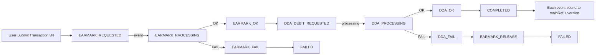

# **把 Java EE（原本用 JMS/MQ）改成 Kafka 

後，如何在「假同步 + 非同步處理」下仍然保證交易一致性（transactional consistency）**。Kafka 的模型跟傳統 MQ/JMS 差很多，所以要特別注意幾個點與設計模式。

## 下面我用「注意事項」＋「可遵循的模式」整理。

---

### 一、從 JMS → Kafka 最大的差異（先抓住）

1. **Kafka 是 log / stream**：同一筆訊息可能被重播（replay），所以消費端必須**可重入/冪等**。
2. **Kafka 沒有 JMS 那種 per-message broker transaction 語意**（你可以做到 exactly-once 的「producer→topic→consumer offset」層面，但**跨 DB 的一致性仍要靠設計**）。
3. **順序是 partition 級**：同一筆交易相關事件一定要落在同一 partition（靠 key），不然順序會亂。
4. **消費語意通常是 at-least-once**：所以「重複處理」一定會發生，設計要能扛。

---

### 二、交易一致性要注意的關鍵事項

#### 1 冪等（Idempotency）是第一優先

* 每個事件一定要有 **eventId / businessKey（例如 mainRef、dealNo）**
* 消費端要做「去重/防重」：

  * DB 建一張 `processed_events(event_id unique, processed_at, status...)`
  * 或在業務表加 unique constraint（例如同一 mainRef 的同一動作只能成功一次）

✅ 這是 Kafka 世界最重要的保命設計。

---

#### 2 Partition Key 決定順序與一致性邊界

* 同一交易（同一筆 LC / 同一筆付款 / 同一個 mainRef）的所有事件：

  * producer 必須用 **同一個 key**（例如 `mainRef`）
  * 確保都進同一 partition → 才能保序

⚠️ 如果 key 亂用，你會看到「先扣帳後驗額度」這種災難。

---

#### 3 DB 更新與 Kafka 發事件不能用「兩段式幻想」

典型錯誤：

* 先 update DB
* 再 send Kafka
* 中間任何一步失敗就不一致（DB 成功但事件沒發 / 事件發了但 DB rollback）

✅ 解法是「**Outbox Pattern**」（下面會講）

---

#### 4 消費端 commit offset 的時機

若你：

* 先 commit offset
* 再寫 DB / 呼叫外部系統
  → 失敗時訊息不會再來，資料漏掉

✅ 正確：

* **先處理成功（DB commit / side-effect done）**
* 再 commit offset（或用 transactional consume 處理）

---

#### 5 事件版本與 Schema 演進

Kafka 事件一旦發出去會被重播、留存很久：

* event schema 要有 `version`
* 盡量 backward compatible（加欄位可以，改語意要小心）
* 建議搭配 Schema Registry（Avro/Protobuf/JSON Schema）

---

### 三、推薦可遵循的設計模式（最常用也最穩）

#### ✅ 1 Transactional Outbox Pattern（最推薦）

**目的：保證 DB 狀態改了，就一定會有事件；事件發了就對應 DB 狀態。**

做法：

1. 業務交易內：更新業務表 + 插入 outbox 表（同一個 DB transaction）
2. Outbox publisher（背景程序/CDC）把 outbox 事件發到 Kafka
3. 發送成功後標記 outbox 已發送

優點：

* 不用 2PC
* 最能穩定落地在 Java EE/傳統系統

---

#### ✅ 2 Saga Pattern（跨多服務一致性）

用事件驅動把大交易拆成多步：

* 每一步成功就發下一步事件
* 失敗就發補償（compensation）事件回滾

適合：

* EARMARK（先凍結、再扣款、再入帳）
* 多系統協作（授信、核心、費用、總帳）

Saga 有兩種常見方式：

* **Choreography**：各服務靠事件自己接力
* **Orchestration**：有一個 Saga orchestrator（流程引擎/服務）統一指揮

---

#### ✅ 3 Inbox Pattern（消費端防重 + 可追蹤）

Outbox 解決「發送端一致性」，Inbox 解決「消費端一致性」。

做法：

* 消費到事件先寫 inbox 表（帶 eventId 唯一鍵）
* 同一 eventId 第二次來直接跳過
* 然後執行業務更新

---

#### ✅ 4 CQRS（讀寫分離）+ Event Sourcing（可選）

如果你們要做「事件為真相」，可以走 Event Sourcing，但對傳統 Java EE 改造成本高。

更常見落地：

* 寫入仍走交易 DB
* 讀模型用 Kafka 投影（projection）去建 cache / 查詢庫（OpenSearch / Redis / OLAP）

---

### 四、常見安全做法

你說的「假同步」通常是：

* UI/上游希望像同步一樣立刻知道結果
* 但內部其實是非同步流程（Kafka）

1. **Command → Event** 分離

   * UI 送 command（HTTP）
   * 服務立即回 `202 Accepted + correlationId`
   * 後續結果用 webhook / polling / SSE 推送

2. **同步回覆只回“已受理”**，不要回“已完成”

   * 完成狀態由事件流程保證

3. **需要同步結果時，用 request/reply（慎用）**

   * Kafka 可做，但複雜、延遲與 timeout 很難控
   * 多數企業改用：HTTP + workflow state + async notify

---

### 五、針對你們 Trade Finance / 扣帳 EARMARK 類場景的建議

如果你場景是：

* 原 EMS：非同步 CENTRAL 額度 + 同步 DDA 扣帳（EARMARK）
* 改 Kafka 後要一致性

我會建議：

1. 用 `mainRef/dealNo` 做 key 保序
2. 用 **Saga** 拆成：

   * Reserve/CreditHold（凍結授信）
   * Debit/Earmark（扣帳）
   * Confirm/Commit（確認）
   * Fail/Compensate（補償解凍）
  
3. 事件全程帶 `correlationId` + `eventId` + `step`
4. 發送端用 Outbox；消費端用 Inbox + 冪等

---

### 六、最小可落地的「必做清單」

如果只能做最小集合，我會選這 6 個：

1. **Outbox Pattern**（發送端一致性）
2. **Consumer 冪等 + 去重表**（消費端一致性）
3. **Partition key = mainRef/dealNo**（同交易保序）
4. **清楚的 offset commit 策略**（成功後才 commit）
5. **correlationId + trace**（可審計、可追查）
6. **錯誤重試 + DLQ**（可控失敗）

---

## **事件驅動交易一致性設計的核心難題區** 

而且在 Trade Finance / 額度凍結 + DDA 扣帳這種「一半同步一半非同步」場景裡是**一定會踩到的坑**。
我先給你結論，再拆設計方式。

---

### 🎯 核心原則先講（非常重要）

> ❗ 在「已有非同步流程進行中」時，**使用者不能直接覆寫同一筆業務狀態**
>
> 必須透過「版本化狀態機 + 事件補償」處理

否則 Kafka/JMS 轉型一定會出現：

⚠️ 額度凍結對舊資料
⚠️ 扣帳對新資料
⚠️ 狀態亂跳
⚠️ 財務不一致

---

### 🧠 正確模型：交易一定要變成「狀態機 + 版本」

不是一張交易表任你 update。

你需要：

```flow
Transaction
- mainRef
- version
- businessData
- state
- lastEventId
```

每一次 Add to Pending / Modify：

👉 都產生「新版本」

---

### 📊 標準狀態流（簡化）

```flow
DRAFT
  ↓ submit(v1)
PENDING_EARMARK_REQUESTED
  ↓
EARMARK_PROCESSING
  ↓
EARMARK_OK / EARMARK_FAIL
  ↓
DDA_PROCESSING
  ↓
COMPLETED / FAILED
```

---

### 🚦 關鍵問題：使用者在處理中修改怎麼辦？

這裡有三種安全設計模式（企業常用）

---

#### ✅ 模式一（最安全，銀行最愛）：版本分支法

流程：

1. 使用者提交 v1 → 進入 EARMARK + DDA 流程
2. 使用者修改 → 建立 v2（新版本）
3. v1 繼續跑完（或被補償取消）
4. v2 重新送流程

狀態長這樣：

```stateDiagram
mainRef  version  state
A123     v1       PROCESSING
A123     v2       DRAFT / PENDING
```

好處

✔ 不會打斷在跑的非同步交易
✔ 可審計
✔ 不會狀態錯亂

---

#### ✅ 模式二：鎖定 + 變更佇列（受控修改）

1. 一旦進入 EARMARK_PROCESSING：

   * 業務資料鎖定
2. 使用者改資料：

   * 先存成 pending change
3. 等流程完成後：

   * 自動 apply change → 再跑新流程

好處：

✔ 使用者體驗像同步
缺點：

⚠️ 系統邏輯較複雜

---

#### ⚠️ 模式三（不建議）：直接覆寫同一筆資料

會產生：

* EARMARK 對舊資料
* DDA 對新資料
* 回傳狀態對不上

👉 實務上遲早爆帳。

---

### 🔁 異步回來時怎麼對應正確版本？

每個事件一定帶：

```json
{
  "mainRef": "A123",
  "version": 1,
  "eventId": "...",
  "step": "EARMARK_OK"
}
```

消費端：

✔ 只更新對應 version
✔ 若版本已被 superseded → 觸發補償或忽略

---

### 🧩 若修改與額度/扣帳「無關」怎麼辦？

仍建議：

👉 邏輯上當新版本處理

原因：

• audit 要清楚
• 回放事件要可重現
• 未來一定會遇到邏輯關聯變更

很多銀行初期想區分「無關欄位」
最後都統一走版本化（最乾淨）。

---

### 🧨 若修改「影響金額、幣別、帳戶」？

必須：

❗ 中止舊流程（補償）
❗ 建新版本重跑

否則必然財務錯亂。

---

### 🏗 建議你的最佳實務架構

#### 發送端

✔ Outbox 發事件（含 version）

#### 消費端

✔ Inbox 去重
✔ 狀態機校驗
✔ 版本比對

#### 流程層

✔ Saga orchestration

---

### 📐 我幫你畫一個簡化事件流（概念）

```flow
User Submit v1
  → EARMARK_REQUEST(v1)
      → EARMARK_OK(v1)
          → DDA_DEBIT(v1)
              → COMPLETED(v1)

User Modify → create v2
  → EARMARK_REQUEST(v2)
```

兩條流程永不互相污染。

---

### ✅ 直接回答你的問題（重點）

> 用戶在等待 EARMARK + DDA 時修改資料怎麼處理？

#### ✔ 不要覆寫

#### ✔ 用版本化交易

#### ✔ 非同步流程永遠綁定版本

#### ✔ 必要時補償舊流程

這是唯一能長期穩定跑 Kafka 架構的方式。

---

### 🏁 一句話總結（記住這句）

👉 在事件驅動世界裡，「交易不是一筆資料，而是一條版本化狀態機流程」。

只要接受這個模型，
Kafka + 假同步 + 非同步一致性問題幾乎都能解。

---

## 把你們現有 JMS + 同步扣帳流程，升級成「可控 Kafka Saga 交易引擎」的標準藍圖

### 📊 一、完整 EARMARK + DDA Saga 流程（Mermaid）



### 🔑 關鍵特性

✔ 每步都是事件
✔ 失敗一定補償
✔ 流程可重播
✔ 可審計

---

### 📑 二、標準事件 Schema（Kafka Message）

```json
{
  "eventId": "uuid",
  "correlationId": "uuid",
  "mainRef": "TX123456",
  "version": 3,

  "eventType": "EARMARK_OK",
  "step": "CREDIT_RESERVE",

  "businessData": {
    "amount": 100000,
    "currency": "USD",
    "accountNo": "123-456"
  },

  "status": "SUCCESS",
  "timestamp": "2026-02-09T10:15:30Z",

  "source": "credit-service"
}
```

#### 必備欄位意義

| 欄位            | 用途             |
| ------------- | -------------- |
| eventId       | 防重處理           |
| correlationId | 一整條 Saga trace |
| mainRef       | 交易主鍵           |
| version       | 版本隔離           |
| eventType     | 狀態推進           |
| step          | 業務語意           |
| status        | OK / FAIL      |

---

### 🗄 三、Outbox / Inbox 表結構（實戰可用）

---

#### ✅ Outbox（發送端）

```sql
OUTBOX_EVENT
------------
id (PK)
event_id (unique)
aggregate_id (mainRef)
version
event_type
payload (JSON)
status (NEW, SENT, FAILED)
created_at
sent_at
```

👉 與業務交易同一 DB transaction commit

---

## ✅ Inbox（消費端）

```sql
INBOX_EVENT
-----------
event_id (PK)
aggregate_id
version
event_type
received_at
processed_at
status (PROCESSED, FAILED)
```

👉 unique(event_id) 防重

---

### 🚦 四、狀態轉移規則表（State Machine）

| Current State      | Event        | Next State        | Action             |
| ------------------ | ------------ | ----------------- | ------------------ |
| DRAFT              | SUBMIT       | EARMARK_REQUESTED | Send earmark event |
| EARMARK_PROCESSING | EARMARK_OK   | DDA_REQUESTED     | Send debit event   |
| EARMARK_PROCESSING | EARMARK_FAIL | FAILED            | End                |
| DDA_PROCESSING     | DDA_OK       | COMPLETED         | Commit             |
| DDA_PROCESSING     | DDA_FAIL     | EARMARK_RELEASE   | Compensate         |
| EARMARK_RELEASE    | RELEASE_OK   | FAILED            | End                |

---

### 🧠 加一個你一定會用到的「版本守門規則」

在消費端處理事件前先驗證：

```text
if event.version < current.version → ignore
if event.version > current.version → error
if event.version == current.version → process
```

👉 永遠不會亂更新

---

### 🎯 為什麼這套能完美解你原本問題？

| 問題       | 解法            |
| -------- | ------------- |
| 使用者修改中   | 新版本流程         |
| Kafka 重播 | 冪等處理          |
| 同步+非同步混合 | Saga          |
| 狀態錯亂     | State machine |
| DB/事件不一致 | Outbox        |
| 重複消費     | Inbox         |

---

### 🏁 超精簡結論（工程真理）

👉 Kafka 世界沒有「單筆交易」
👉 只有「事件狀態機流程」
👉 一致性來自設計，不是 broker

---
