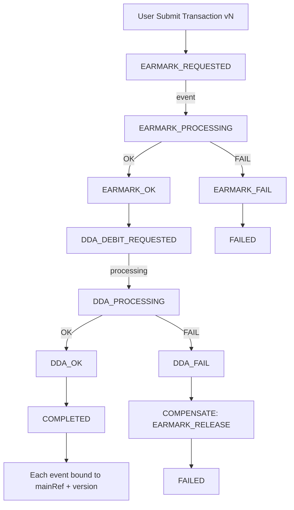

````md
# 把 Java EE（原本用 JMS/MQ）改成 Kafka 後，如何保證交易一致性（升級版）

**如何在「假同步 + 非同步處理」下仍然保證交易一致性（transactional consistency）**

Kafka 的模型跟傳統 MQ/JMS 差很多，所以要特別注意幾個點與設計模式。

> 💡 **文檔目的**：本文檔專為從傳統 JMS/MQ 架構遷移到 Kafka 的團隊設計，特別關注金融交易系統（如 Trade Finance）中的一致性保證。重點涵蓋實戰中最常見的坑與可落地的標準解法。

---

## 目錄

- [零、先把「一致性期待」講清楚](#零先把一致性期待講清楚)
- [一、從 JMS → Kafka 最大的差異](#一從-jms--kafka-最大的差異先抓住)
- [二、交易一致性要注意的關鍵事項](#二交易一致性要注意的關鍵事項)
- [三、推薦可遵循的設計模式](#三推薦可遵循的設計模式最常用也最穩)
- [四、常見安全做法](#四常見安全做法)
- [五、針對 Trade Finance / 扣帳 EARMARK 類場景的建議](#五針對你們-trade-finance--扣帳-earmark-類場景的建議)
- [六、最小可落地的「必做清單」](#六最小可落地的必做清單)
- [七、監控與可觀測性](#七監控與可觀測性production-ready-必備)
- [八、測試策略](#八測試策略從-jms-遷移到-kafka-必須改變測試思維)
- [九、從 JMS 遷移到 Kafka 的實戰路線圖](#九從-jms-遷移到-kafka-的實戰路線圖)
- [十、快速參考指南](#十快速參考指南quick-reference)
- [十一、事件驅動交易一致性設計的核心難題區](#十一事件驅動交易一致性設計的核心難題區)
- [十二、Kafka Saga 交易引擎標準藍圖](#十二把你們現有-jms--同步扣帳流程升級成可控-kafka-saga-交易引擎的標準藍圖)
- [十三、Timeout / 卡單治理（必備）](#十三timeout--卡單治理必備)
- [十四、對帳與稽核 Reconciliation（金融必備）](#十四對帳與稽核-reconciliation金融必備)
- [十五、DLQ 分類與處置策略（避免把 DLQ 當垃圾桶）](#十五dlq-分類與處置策略避免把-dlq-當垃圾桶)

---

## 零、先把「一致性期待」講清楚

Kafka 遷移最大的踩坑不是技術，而是「期待錯誤」。

### 0.1 Consistency Guarantee Model（建議寫進架構規範）

| Layer | Guarantee | 說明 |
|------|----------|------|
| Kafka broker | At-least-once | 重複/重播一定會發生 |
| Application | Exactly-once effect | 靠冪等 + 去重 + Inbox/Outbox 達成「效果上一次」 |
| Business | Eventual consistency | 允許延遲，需可追溯、可補償 |
| Financial | Zero double debit / zero missing debit | 不能重複扣款、不能漏扣，必要時人工介入 |

> ✅ **結論**：Kafka 不是 XA；金融一致性來自「設計 + 稽核 + 對帳」，不是 broker 魔法。

### 0.2 Event Immutability（強制規範，避免 replay 爆帳）

Once published, an event is **immutable**.

❌ 禁止：
- 修改既有事件語意（同 eventType 卻換業務含義）
- 回補歷史事件 payload
- 用「重送舊事件」當修正手段

✅ 正確方式：
- 發送 **新事件**（新的 eventType / 新 schema version）
- 用 **補償事件** 修正結果
- 如需修正資料：走「新版本交易」或「補正事件」

---

## 一、從 JMS → Kafka 最大的差異（先抓住）

### 1. Kafka 是 log / stream
同一筆訊息可能被重播（replay），所以消費端必須 **可重入/冪等**。

### 2. Kafka 沒有 JMS 那種 per-message broker transaction 語意
你可以做到 exactly-once 的「producer→topic→consumer offset」層面，但 **跨 DB 的一致性仍要靠設計**。

### 3. 順序是 partition 級
同一筆交易相關事件一定要落在同一 partition（靠 key），不然順序會亂。

> ✅ **規範**：Partition key **必須**使用 `mainRef/dealNo`（禁止 random UUID）。

### 4. 消費語意通常是 at-least-once
所以「重複處理」一定會發生，設計要能扛。

---

## 二、交易一致性要注意的關鍵事項

### 2.1 冪等（Idempotency）是第一優先
**必備要素**：
- 每個事件一定要有 `eventId` + `businessKey(mainRef/dealNo)`  
- 消費端要做「去重/防重」：Inbox/processed_events 或 unique constraint

#### 💡 去重表設計（示例）

```sql
CREATE TABLE processed_events (
  event_id VARCHAR(50) PRIMARY KEY,
  aggregate_id VARCHAR(50) NOT NULL,
  event_type VARCHAR(50) NOT NULL,
  processed_at TIMESTAMP DEFAULT NOW(),
  status VARCHAR(20),
  retry_count INT DEFAULT 0,
  error_message TEXT,
  INDEX idx_aggregate (aggregate_id, event_type)
);
````

⚠️ **注意**：插入去重表與業務處理必須在同一個 DB transaction，否則會出現「已去重但未處理」的假成功。

---

### 2.2 Partition Key 決定順序與一致性邊界

* 同一交易所有事件 producer 必須用同一 key（`mainRef/dealNo`）
* 才能保序與可推導狀態

---

### 2.3 DB 更新與 Kafka 發事件不能用「兩段式幻想」

典型錯誤：

* 先 update DB，再 send Kafka
  任何一步失敗就不一致。

✅ 解法：**Transactional Outbox**

---

### 2.4 消費端 commit offset 的時機

✅ 正確做法：**先處理成功（DB commit/side-effect done）再 commit offset**
（或 pure Kafka pipeline 才考慮 EOS transaction）

---

### 2.5 事件版本與 Schema 演進

* 事件必須帶 `schemaVersion`（或 schema registry）
* 盡量 backward compatible
* 事件保留很久，不能用「改舊事件」的方式修正

---

### 2.6 Version Gatekeeper（強制：集中化，不可散落各服務）

在 consumer 寫 DB 前必須做版本守門，且應該做成共用框架/攔截器，避免漏做。

**規則：**

```text
if event.version < current.version → ignore（或轉補償/記錄）
if event.version > current.version → error（表示資料不同步/缺事件）
if event.version == current.version → process
```

---

## 三、推薦可遵循的設計模式（最常用也最穩）

### 3.1 Transactional Outbox Pattern（最推薦）

**目的：DB 改了 → 一定有事件；事件發了 → 必有對應 DB 狀態。**

做法：

1. 同一 DB transaction：更新業務表 + 寫 outbox
2. outbox publisher（polling / CDC）送 Kafka
3. 成功後標記 SENT（可保留 30 天做稽核）

---

### 3.2 Inbox Pattern（消費端防重 + 可追蹤）

Outbox 解決「發送端一致性」，Inbox 解決「消費端一致性」。

---

### 3.3 Saga Pattern（跨多服務一致性）

金融交易建議 **Orchestration**（流程集中、可審計、可追溯、補償清晰）。

---

### 3.4 CQRS（讀寫分離）+ Event Sourcing（可選）

多數 Java EE 遷移建議先 CQRS 投影（OpenSearch/OLAP）而非全面 Event Sourcing。

---

## 四、常見安全做法

### 4.1 Command → Event 分離

* UI 送 command（HTTP）
* 立即回 `202 Accepted + correlationId`
* 結果用 webhook / polling / SSE

### 4.2 同步回覆只回「已受理」

不要回「已完成」。

### 4.3 request/reply（慎用）

Kafka 可做，但 timeout/重試/成本複雜；通常採「workflow state + async notify」。

---

## 五、針對你們 Trade Finance / 扣帳 EARMARK 類場景的建議

建議：

1. key = `mainRef/dealNo` 保序
2. 用 Saga 拆：Reserve/CreditHold → Debit/Earmark → Confirm/Commit → Compensate
3. 全程帶 `correlationId + eventId + step + version`
4. 發送端 Outbox；消費端 Inbox + 冪等

---

## 六、最小可落地的「必做清單」

1. Outbox（發送端一致性）
2. Inbox/processed_events（消費端一致性）
3. Partition key = mainRef/dealNo（保序）
4. 成功後才 commit offset（不漏訊）
5. correlationId/traceId（可審計追查）
6. 重試 + DLQ + 告警（可控失敗）
7. **Event immutability 規範（強制）**
8. **Version Gatekeeper（集中化，強制）**

---

## 七、監控與可觀測性（Production Ready 必備）

核心指標：

* Consumer lag（最重要）
* DLQ 新增訊息（必告警）
* Outbox 積壓
* 事件成功率/延遲（P95/P99）
* Saga 補償比率
* 交易端到端耗時（submit → COMPLETED）
* 版本衝突數

---

## 八、測試策略（從 JMS 遷移到 Kafka 必須改變測試思維）

必測：

* 冪等（重播/重複事件）
* 順序性（亂序事件）
* 版本隔離（並發修改）
* consumer 重啟/再平衡
* outbox publisher crash/recover
* DLQ 分類與手動處置流程
* 壓力測試 + lag 控制

---

## 九、從 JMS 遷移到 Kafka 的實戰路線圖

強烈建議：Shadow → Canary → Full Cutover
並且每階段都要：

* 成功標準（SLO）
* 回滾條件
* 回滾演練（不是寫在文件裡就算）

---

## 十、快速參考指南（Quick Reference）

### 10.1 核心原則速查表

| 原則    | JMS 時代            | Kafka 時代                   |
| ----- | ----------------- | -------------------------- |
| 消費語意  | Exactly-once (XA) | At-least-once + 冪等         |
| 一致性保證 | 2PC/XA            | Outbox/Inbox + 補償          |
| 順序    | Queue             | Partition（key 必須正確）        |
| 修正方式  | rollback          | compensation / new version |
| 事件存留  | 消費後刪              | 留存可 replay（需 immutability） |

---

## 十一、事件驅動交易一致性設計的核心難題區

### 核心原則（金融必守）

在「已有非同步流程進行中」時，使用者 **不能直接覆寫同一筆業務狀態**。
必須透過 **版本化狀態機 + 事件補償** 處理。

---

## 十二、把你們現有 JMS + 同步扣帳流程升級成可控 Kafka Saga 交易引擎的標準藍圖

### 12.1 完整 EARMARK + DDA Saga（Mermaid）



### 12.2 標準事件 Schema（建議加入 causationId + schemaVersion）

```json
{
  "eventId": "uuid",
  "correlationId": "uuid",
  "causationId": "uuid-prev",
  "mainRef": "TX123456",
  "version": 3,

  "eventType": "EARMARK_OK",
  "step": "CREDIT_RESERVE",
  "status": "SUCCESS",

  "schemaVersion": "3.0.0",
  "producerVersion": "1.5.3",

  "businessData": {
    "amount": 100000,
    "currency": "USD",
    "accountNo": "123-456"
  },

  "traceId": "a1b2c3d4",
  "spanId": "e5f6g7h8",

  "timestamp": "2026-02-09T10:15:30Z",
  "source": "credit-service",
  "metadata": {
    "channel": "web",
    "clientIp": "10.0.1.5"
  }
}
```

---

## 十三、Timeout / 卡單治理（必備）

在金融場景，最常見不是「失敗」，而是「沒回來」。

### 13.1 每個 step 必須定義 timeout 策略

* SLA：例如 30s / 2min / 5min
* timeout 行為：retry / compensate / manual intervention
* 卡單狀態：必須可查（dashboard + API）

### 13.2 建議加一個 watchdog job

* 掃描 `PROCESSING` 超過 SLA 的交易
* 觸發：補償 / 升級告警 / 轉人工處理隊列

---

## 十四、對帳與稽核 Reconciliation（金融必備）

Kafka 不是 System of Record。
**權威來源仍然是：交易 DB + 核心帳/總帳（ledger）。**

### 14.1 每日/日終對帳至少做三件事

1. DB 交易狀態 vs 事件歷史（缺事件/多事件）
2. 扣帳/入帳 totals vs ledger（不能有差異）
3. Saga 完成/失敗/補償比例趨勢（異常需解釋）

### 14.2 對帳差異處理

* 差異一律生成「稽核工單」
* 不允許用「改舊事件」修正
* 用補正事件 / 新版本交易 / 人工沖正流程處理

---

## 十五、DLQ 分類與處置策略（避免把 DLQ 當垃圾桶）

| 類型              | 例子                | 是否自動重試 |            是否需要人工 |
| --------------- | ----------------- | -----: | ----------------: |
| Transient       | 網路抖動、下游暫時不可用      |      ✅ |                 否 |
| Business rule   | 餘額不足、授信拒絕         |      ❌ |      ✅（業務判斷/客戶通知） |
| Schema/Contract | 欄位缺失、版本不相容        |      ❌ | ✅（回滾/升級 consumer） |
| Poison message  | 無法反序列化、超大 payload |      ❌ |        ✅（隔離+修正來源） |

> ✅ DLQ 必須配套：告警、工單、Runbook、重放策略（re-drive）與審計記錄。

---

**文檔版本**: v3.0
**最後更新**: 2026-02-09
**適用對象**: Java EE → Kafka 遷移團隊、金融交易系統架構師、事件驅動架構實作者
